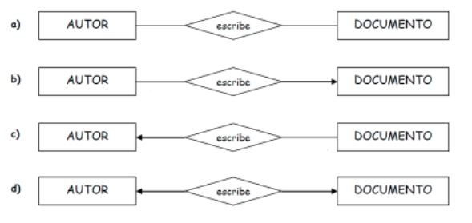
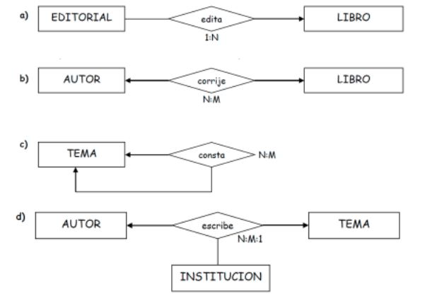
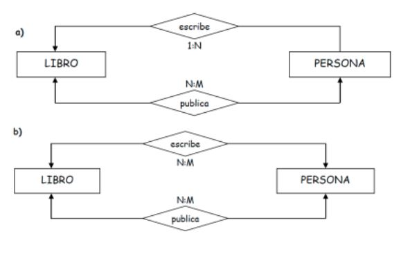
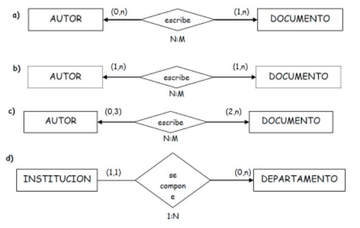
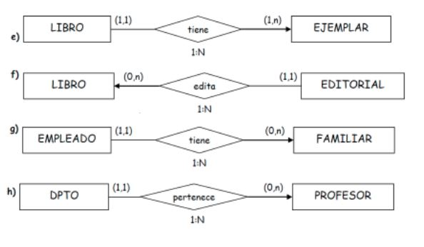

# EJERCICIOS INICIALES ENTIDAD RELACIÓN I

## Ejercicio 1: 
Interpreta los siguientes diagramas E/R. Indica su cardinalidad y su tipo de correspondencia.

## Ejercicio 2: 
Indica la cardinalidad y el tipo de correspondencia de los siguientes diagramas E/R.
Escribe frases que definan las cardinalidades entre las distintas entidades de cada diagrama.

## Ejercicio 3: 
Escribe frases que definan las cardinalidades entre las distintas entidades de estos diagramas.

## Ejercicio 4: 
Escribe frases que definan las cardinalidades entre las distintas entidades de estos diagramas

