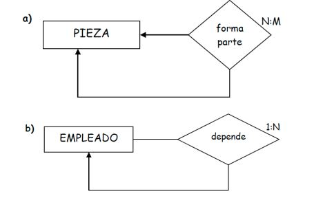
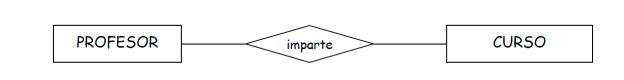
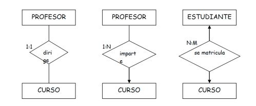
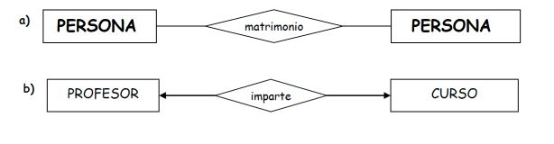

# EJERCICIOS INICIALES ENTIDAD RELACIÓN II

 
## Ejercicio 5: 
Escribe frases que definan las cardinalidades entre la misma entidad de estos diagramas y los atributos que se te ocurran.

## Ejercicio 6: 
Según la relación anterior, escribe los distintos tipos de cardinalidades y relación que pueden existir en ella, así como los atributos que se te ocurran.

## Ejercicio 7: 
Interpreta los siguientes diagramas ER. Añade los atributos correspondientes.

## Ejercicio 8: 
Interpreta el siguiente diagrama ER añadiendo cardinalidades, tipos de correspondencia así como atributos (¿la relación necesitará atributos?).

