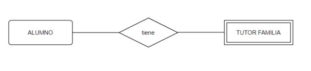

# EJERCICIOS INICIALES ENTIDAD RELACIÓN III

Según los siguientes modelos ER, especifica las cardinalidades (ten en cuenta que no están puestas las “flechitas” para no dar pistas), tipos de relación, así como los atributos de cada entidad (y relación si lo estimas oportuno). Por último, define si la dependencia es en EXISTENCIA o en IDENTIFICACIÓN.

a) El modelo quiere almacenar información de los despachos de un edificio. Los despachos están numerados en cada planta desde 1 hasta el total de despachos que hay en esa planta.

b) Una factura se compone por lineas de facturas. Una línea de factura tiene información sobre el producto, el precio por unidad, la cantidad y el precio de la compra de varias unidades de ese producto. 

c) Un alumno puede o no tener asignado uno o varios tutores familiares. En algunos casos los alumnos cambian de tutores familiares de referencia, por lo que se quiere saber la fecha en la que el tutor familiar empezó a serlo.

