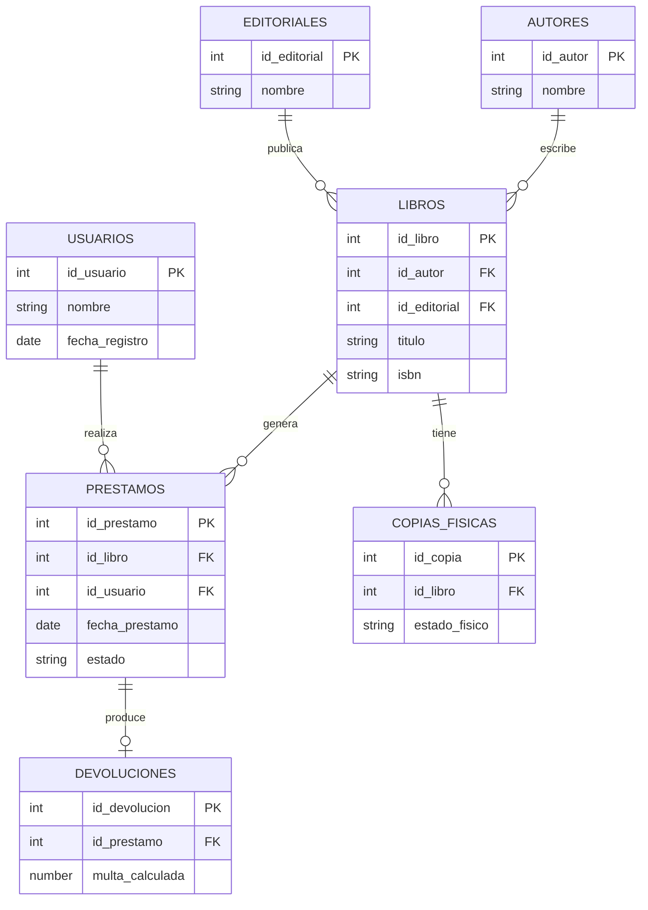
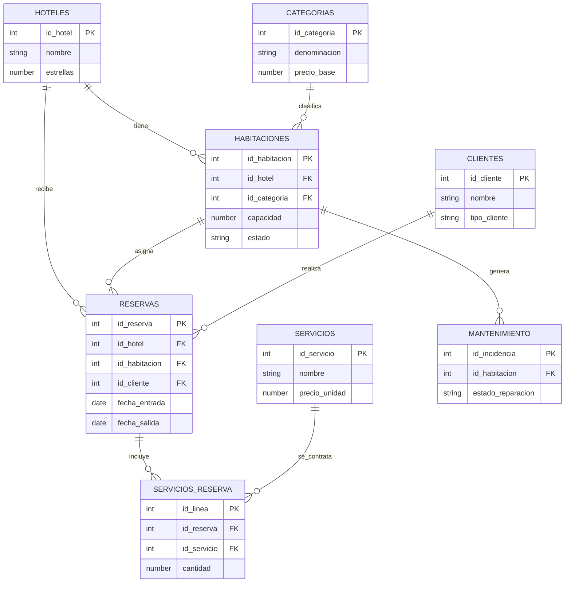
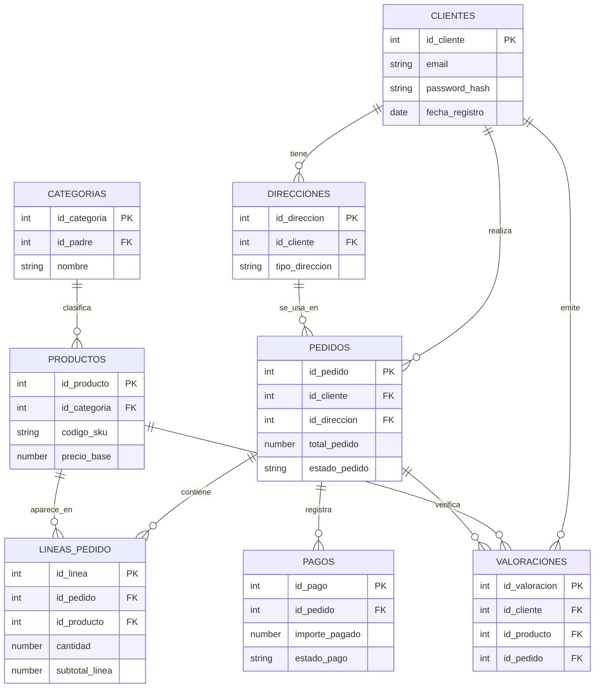
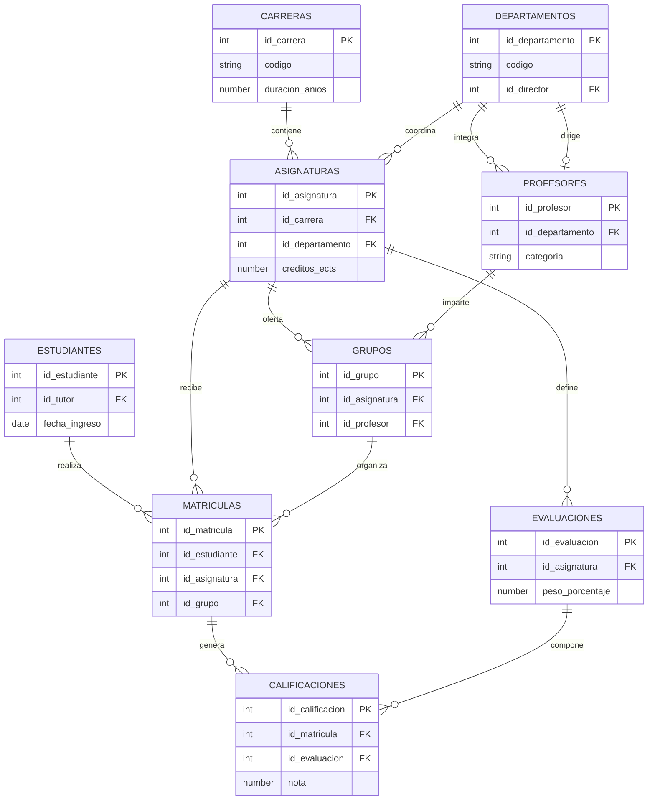
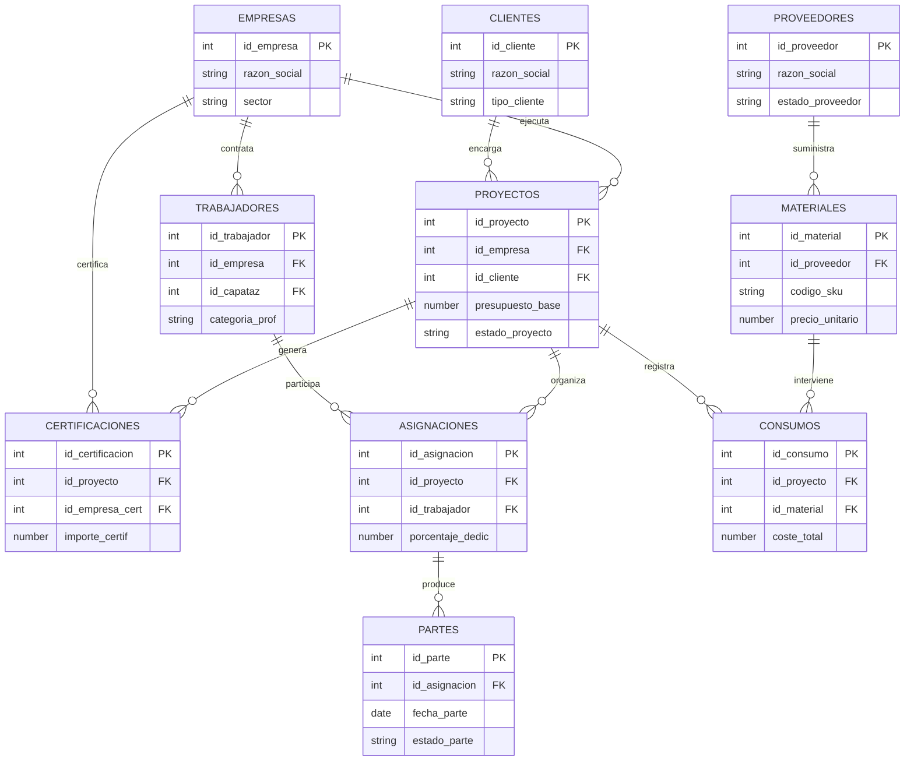

# Relación de Ejercicios DDL Avanzados

## Introducción

Esta relación contiene 5 ejercicios amplios de modelado físico orientados a Oracle SQL. En todos los casos se trabaja con:

- `CREATE TABLE` y `ALTER TABLE`.
- Claves primarias, alternativas y foráneas.
- Restricciones `CHECK`, `UNIQUE`, `DEFAULT` y acciones referenciales.
- Secuencias o identidad para claves numéricas autogeneradas.

Los diagramas se presentan en formato Mermaid para que se visualicen mejor en la vista previa Markdown de VS Code.

En todos los ejercicios:

1. Nombra las restricciones de forma explícita.
2. Separa, cuando sea razonable, la creación base de tablas y la adición posterior de restricciones.
3. Justifica qué restricciones resuelves con DDL declarativo y cuáles quedan fuera del alcance de esta versión simplificada.
4. Comprueba el resultado con `DESC` y consultando el diccionario de datos.

---

## Ejercicio 1. Sistema de Gestión Bibliotecaria

### Esquema relacional

### Restricciones a implementar

- Los identificadores principales de `AUTORES`, `EDITORIALES`, `LIBROS`, `USUARIOS` y `PRESTAMOS` serán numéricos, positivos y se generarán automáticamente.
- El ISBN de cada libro tendrá siempre 13 caracteres, no podrá repetirse y deberá comenzar por `978` o `979`.
- El número de ejemplares total de un libro no podrá ser negativo, tendrá como valor inicial 1 y no podrá superar 500.
- La fecha de préstamo no podrá ser posterior a la fecha actual.
- La fecha de devolución prevista debe ser obligatoriamente posterior a la fecha de préstamo.
- La fecha real de devolución, si existe, debe ser igual o posterior a la fecha de préstamo.
- El estado de un préstamo solo podrá ser: `ACTIVO`, `DEVUELTO`, `RETRASADO` o `PERDIDO`.
- La multa acumulada nunca podrá ser negativa y se inicializará en 0.
- El estado físico de una copia solo podrá ser: `NUEVO`, `BUENO`, `REGULAR`, `DETERIORADO` o `BAJA`.
- Un usuario no podrá tener más de 3 préstamos activos simultáneamente.
- El tipo de usuario solo podrá ser: `ESTUDIANTE`, `PROFESOR`, `INVESTIGADOR` o `EXTERNO`.
- Al eliminar un autor, si tiene libros asociados, su identificador en `LIBROS` quedará como `NULL`.
- Al eliminar una editorial que tenga libros publicados, la operación será rechazada.
- Al eliminar un libro, se eliminarán automáticamente todas sus copias físicas y préstamos históricos asociados.
- El año de publicación de un libro debe estar entre 1450 y el año actual.
- La multa calculada en `DEVOLUCIONES` debe ser igual a: días de retraso × 0,50 euros, y nunca podrá superar 50 euros.

### Se pide

1. Crear todas las tablas del sistema con sus tipos de datos adecuados.
2. Definir las claves primarias, claves alternativas y claves foráneas necesarias.
3. Incorporar las restricciones de dominio, obligatoriedad y valores por defecto.
4. Implementar las acciones referenciales de borrado indicadas en el enunciado.
5. Indicar qué reglas del enunciado no pueden resolverse solo con DDL declarativo en esta versión simplificada.
6. Elaborar un juego mínimo de inserciones de prueba que demuestre casos válidos y casos rechazados.

---

## Ejercicio 2. Sistema de Reservas Hoteleras

### Esquema relacional

### Restricciones a implementar

- Los identificadores principales de `HOTELES`, `HABITACIONES`, `CATEGORIAS`, `CLIENTES`, `RESERVAS` y `SERVICIOS` serán numéricos, positivos y se generarán automáticamente.
- La capacidad de una habitación no podrá ser negativa, tendrá como valor inicial 2 y no podrá superar 6.
- El número de huéspedes en una reserva no podrá superar la capacidad de la habitación asignada.
- La fecha de entrada debe ser igual o posterior a la fecha de la reserva.
- La fecha de salida debe ser posterior a la fecha de entrada.
- El estado de una reserva solo podrá ser: `PENDIENTE`, `CONFIRMADA`, `CHECK_IN`, `CHECK_OUT`, `CANCELADA` o `NO_SHOW`.
- El estado de una habitación solo podrá ser: `DISPONIBLE`, `OCUPADA`, `RESERVADA`, `MANTENIMIENTO` o `FUERA_SERVICIO`.
- El precio total de una reserva nunca podrá ser negativo y debe ser mayor o igual que el precio base de la categoría.
- El tipo de cliente solo podrá ser: `PARTICULAR`, `EMPRESA`, `GRUPO` o `AGENCIA`.
- El tipo de servicio solo podrá ser: `RESTAURANTE`, `SPA`, `LAVANDERIA`, `TRASLADO`, `EXCURSION` u `OTROS`.
- El estado de reparación solo podrá ser: `PENDIENTE`, `EN_CURSO`, `RESUELTA` o `DESCARTADA`.
- La fecha de nacimiento del cliente debe ser anterior a la fecha actual y el cliente debe tener al menos 18 años.
- Al eliminar un hotel, se eliminarán automáticamente todas sus habitaciones, reservas asociadas e incidencias de mantenimiento.
- Al eliminar una categoría que tenga habitaciones asociadas, la operación será rechazada.
- Al eliminar un cliente, si tiene reservas históricas, el identificador del cliente quedará como `NULL`.
- El coste de reparación nunca podrá ser negativo y, si no se indica, será 0.
- La cantidad de servicios contratados debe ser mayor que 0 y no podrá superar 10 por línea.
- El precio de línea en `SERVICIOS_RESERVA` debe ser igual a: cantidad × precio_unidad del servicio.

### Se pide

1. Crear todas las tablas del sistema hotelero con los tipos de datos más adecuados.
2. Establecer claves primarias, únicas y foráneas, incluyendo las acciones de borrado requeridas.
3. Implementar restricciones de longitud, rangos, listas cerradas y valores por defecto.
4. Dejar fuera de alcance las validaciones que exijan comparar datos entre tablas o cálculos automáticos.
5. Preparar inserciones de ejemplo que verifiquen reservas correctas, errores de capacidad y borrados referenciales.
6. Documentar brevemente por qué algunas reglas no pueden resolverse solo con `CHECK` en Oracle.

---

## Ejercicio 3. Plataforma de E-Commerce

### Esquema relacional

### Restricciones a implementar

- Los identificadores principales de `CLIENTES`, `DIRECCIONES`, `PEDIDOS`, `PRODUCTOS`, `CATEGORIAS`, `LINEAS_PEDIDO`, `VALORACIONES` y `PAGOS` serán numéricos, positivos y se generarán automáticamente.
- El `password_hash` tendrá siempre 64 caracteres.
- La fecha de registro del cliente no podrá ser posterior a la fecha actual.
- El estado de cuenta solo podrá ser: `ACTIVA`, `INACTIVA`, `SUSPENDIDA`, `BLOQUEADA` o `ELIMINADA`.
- El código postal debe tener entre 3 y 10 caracteres.
- El tipo de dirección solo podrá ser: `ENVIO`, `FACTURACION` o `AMBAS`.
- Un cliente debe tener al menos una dirección de envío para poder realizar pedidos.
- La fecha de pedido no podrá ser posterior a la fecha actual.
- El estado de pedido solo podrá ser: `CARRITO`, `PENDIENTE_PAGO`, `PAGADO`, `EN_PREPARACION`, `ENVIADO`, `ENTREGADO`, `DEVUELTO` o `CANCELADO`.
- El método de pago solo podrá ser: `TARJETA`, `PAYPAL`, `TRANSFERENCIA`, `CONTRAREEMBOLSO` o `CRIPTOMONEDA`.
- El total del pedido nunca podrá ser negativo y debe ser igual a la suma de los subtotales de línea.
- El número de seguimiento, si existe, debe tener entre 10 y 30 caracteres.
- El código SKU de cada producto no podrá repetirse y debe tener entre 5 y 20 caracteres.
- El precio base de un producto nunca podrá ser negativo ni cero.
- El stock actual no podrá ser negativo y el stock mínimo debe ser mayor o igual a 0.
- El peso en kg debe ser mayor que 0 y no podrá superar 500.
- El estado del producto solo podrá ser: `ACTIVO`, `INACTIVO`, `AGOTADO`, `DESCONTINUADO` o `PROXIMAMENTE`.
- La cantidad en cada línea de pedido debe ser mayor que 0 y no podrá superar 100.
- El descuento de línea debe estar entre 0 y 100, y el precio unitario aplicado debe ser mayor que 0.
- El subtotal de línea debe ser igual a: cantidad × precio_unitario × (1 - descuento_linea / 100).
- La puntuación de valoración debe estar entre 1 y 5.
- Una valoración solo puede existir si existe el correspondiente pedido entregado con ese producto.
- El estado de pago solo podrá ser: `PENDIENTE`, `COMPLETADO`, `FALLIDO`, `REEMBOLSADO` o `CANCELADO`.
- El importe pagado debe ser mayor que 0 y no podrá superar el total del pedido.
- Al eliminar un cliente, sus direcciones y valoraciones se eliminarán automáticamente; sus pedidos pasarán a `id_cliente = NULL`.
- Al eliminar un producto, si tiene líneas de pedido asociadas, la operación será rechazada.
- Al eliminar una categoría padre, el `id_padre` de sus subcategorías quedará como `NULL`.
- Al eliminar un pedido, se eliminarán automáticamente sus líneas, valoraciones asociadas y pagos.

### Se pide

1. Diseñar y crear todas las tablas del sistema de comercio electrónico.
2. Definir claves primarias, únicas y foráneas, junto con las acciones `ON DELETE` exigidas.
3. Añadir restricciones de longitud, listas cerradas, rangos y campos calculables simples.
4. Señalar qué validaciones del enunciado quedarían fuera del alcance al usar solo DDL declarativo.
5. Generar datos de prueba suficientes para comprobar inserciones válidas, rechazos y borrados.
6. Identificar qué reglas exigen consultar otras tablas o agregados y, por tanto, no deben resolverse solo con `CHECK`.

---

## Ejercicio 4. Sistema de Gestión Universitaria

### Esquema relacional

### Restricciones a implementar

- Los identificadores principales de `CARRERAS`, `ASIGNATURAS`, `DEPARTAMENTOS`, `PROFESORES`, `ESTUDIANTES`, `GRUPOS`, `MATRICULAS`, `EVALUACIONES` y `CALIFICACIONES` serán numéricos, positivos y se generarán automáticamente.
- El código de cada carrera tendrá 4 caracteres y no podrá repetirse.
- El código de cada asignatura tendrá entre 5 y 10 caracteres y no podrá repetirse.
- El código de cada departamento tendrá 3 caracteres y no podrá repetirse.
- La duración de la carrera debe estar entre 1 y 6 años.
- Los créditos totales de una carrera deben estar entre 60 y 360 ECTS.
- El nivel de la carrera solo podrá ser: `GRADO`, `MASTER` o `DOCTORADO`.
- Los créditos ECTS de una asignatura deben estar entre 3 y 30, siendo múltiplo de 1,5.
- El curso de la asignatura debe estar entre 1 y la duración de la carrera a la que pertenece.
- El cuatrimestre solo podrá ser: `PRIMERO`, `SEGUNDO` o `ANUAL`.
- El tipo de asignatura solo podrá ser: `OBLIGATORIA`, `OPTATIVA`, `TRONCAL` o `LIBRE_CONFIGURACION`.
- La categoría del profesor solo podrá ser: `TITULAR`, `CATEDRATICO`, `CONTRATADO_DOCTOR`, `AYUDANTE` o `ASOCIADO`.
- El salario anual del profesor debe ser mayor o igual a 17.640 euros y no podrá superar 150.000 euros.
- La fecha de contratación no podrá ser posterior a la fecha actual.
- La fecha de nacimiento del estudiante debe ser anterior a la fecha actual, y el estudiante debe tener entre 16 y 80 años.
- La fecha de ingreso no podrá ser posterior a la fecha actual ni anterior a la fecha de nacimiento.
- El estado del estudiante solo podrá ser: `ACTIVO`, `BAJA_TEMPORAL`, `EGRESADO`, `EXPULSADO` o `TRASLADADO`.
- El estado de la carrera solo podrá ser: `ACTIVA`, `INACTIVA`, `EXTINTA` o `EN_IMPLANTACION`.
- La capacidad de un grupo debe estar entre 10 y 200.
- El estado del grupo solo podrá ser: `ABIERTO`, `CERRADO`, `CANCELADO` o `FINALIZADO`.
- Un estudiante no podrá matricularse en más de 75 créditos ECTS por año académico.
- El estado de matrícula solo podrá ser: `PENDIENTE`, `CONFIRMADA`, `ANULADA`, `CONGELADA` o `FINALIZADA`.
- La nota final debe estar entre 0 y 10, con 2 decimales como máximo.
- El tipo de evaluación solo podrá ser: `EXAMEN`, `TRABAJO`, `PRACTICAS`, `PROYECTO`, `PARTICIPACION` o `EXAMEN_FINAL`.
- El peso porcentaje de una evaluación debe estar entre 5 y 70, y la suma de pesos por asignatura debe ser 100.
- La nota de calificación debe estar entre 0 y 10, con 2 decimales.
- Un profesor no puede ser director de más de un departamento simultáneamente.
- Un estudiante no puede ser tutor de sí mismo.
- Al eliminar un departamento, si tiene profesores asignados, la operación será rechazada.
- Al eliminar un profesor, si es director de departamento, `id_director` quedará como `NULL`; si imparte en grupos, `id_profesor` quedará como `NULL`.
- Al eliminar una asignatura, se eliminarán automáticamente sus grupos, evaluaciones y matrículas asociadas.
- Al eliminar una matrícula, se eliminarán automáticamente sus calificaciones asociadas.
- El promedio global del estudiante debe mantenerse actualizado como media ponderada de las notas finales por créditos ECTS.

### Se pide

1. Crear el esquema completo de la base de datos universitaria.
2. Definir restricciones de entidad, dominio, unicidad y referencia.
3. Diseñar los mecanismos necesarios para controlar reglas intertabla y agregadas.
4. Señalar qué controles intertabla y agregados quedarían fuera del alcance al usar solo DDL declarativo.
5. Añadir ejemplos de inserción, actualización y borrado que prueben las reglas más complejas.
6. Explicar qué reglas serían especialmente delicadas de resolver solo con DDL declarativo en Oracle y cómo las abordarías en una versión ampliada.

---

## Ejercicio 5. Sistema de Gestión de Proyectos de Construcción

### Esquema relacional

### Restricciones a implementar

- Los identificadores principales de `EMPRESAS`, `PROYECTOS`, `CLIENTES`, `TRABAJADORES`, `ASIGNACIONES`, `PARTES`, `MATERIALES`, `CONSUMOS`, `PROVEEDORES` y `CERTIFICACIONES` serán numéricos, positivos y se generarán automáticamente.
- El código de proyecto no podrá repetirse.
- La capacidad de construcción debe ser mayor que 0 y no superar 1.000.000 m² por año.
- El sector de la empresa solo podrá ser: `EDIFICACION`, `OBRA_CIVIL`, `INDUSTRIAL`, `REHABILITACION` o `INSTALACIONES`.
- La fecha de fundación no podrá ser posterior a la fecha actual.
- El estado de la empresa solo podrá ser: `ACTIVA`, `INACTIVA`, `EN_CONCURSO`, `FUSIONADA` o `EXTINGUIDA`.
- El presupuesto base del proyecto debe ser mayor que 0 y no superar 500.000.000 euros.
- La fecha de inicio no podrá ser posterior a la fecha actual.
- La fecha de fin prevista debe ser posterior a la fecha de inicio.
- La fecha de fin real, si existe, debe ser igual o posterior a la fecha de inicio.
- El estado del proyecto solo podrá ser: `PLANIFICACION`, `EN_EJECUCION`, `PARALIZADO`, `FINALIZADO`, `ENTREGADO` o `CANCELADO`.
- El porcentaje de ejecución debe estar entre 0 y 100 y, si el estado es `FINALIZADO` o `ENTREGADO`, debe ser 100.
- El tipo de cliente solo podrá ser: `PUBLICO`, `PRIVADO`, `CONCESION` o `COLABORACION_PUBLICO_PRIVADA`.
- El crédito aprobado debe ser mayor o igual a 0 y no superar el presupuesto base del proyecto asociado.
- La categoría profesional solo podrá ser: `PEON`, `OFICIAL`, `CAPATAZ`, `JEFE_EQUIPO`, `ENCARGADO`, `ARQUITECTO`, `INGENIERO` o `DIRECTOR_OBRA`.
- El salario mensual debe ser mayor o igual a 1.260 euros y no superar 25.000 euros.
- La fecha de alta del trabajador no podrá ser posterior a la fecha actual.
- La fecha de baja, si existe, debe ser posterior o igual a la fecha de alta.
- Un trabajador no puede ser capataz de sí mismo.
- El porcentaje de dedicación en una asignación debe estar entre 10 y 100.
- El rol en el proyecto solo podrá ser: `DIRECTOR`, `JEFE_OBRA`, `CAPATAZ`, `OFICIAL`, `PEON`, `SEGURIDAD`, `CALIDAD` o `ADMINISTRATIVO`.
- Las fechas de asignación deben estar dentro del período del proyecto.
- Un trabajador no podrá tener asignaciones superpuestas en el tiempo que sumen más del 100 de dedicación.
- Las horas normales en un parte deben estar entre 0 y 8.
- Las horas extras deben estar entre 0 y 4.
- Las horas nocturnas deben estar entre 0 y 8.
- La suma de horas normales, extras y nocturnas no podrá superar 12 por día.
- El estado del parte solo podrá ser: `BORRADOR`, `PENDIENTE`, `VALIDADO`, `RECHAZADO` o `FACTURADO`.
- El código SKU del material tendrá entre 5 y 20 caracteres y no podrá repetirse.
- La unidad de medida solo podrá ser: `UNIDAD`, `METRO`, `METRO_CUADRADO`, `METRO_CUBICO`, `KILOGRAMO`, `LITRO`, `HORA` o `JORNADA`.
- El precio unitario debe ser mayor que 0.
- El stock actual no podrá ser negativo.
- El estado del proveedor solo podrá ser: `ACTIVO`, `INACTIVO`, `BAJA_TEMPORAL` o `SANCIONADO`.
- La cantidad consumida debe ser mayor que 0.
- El coste total debe ser igual a: cantidad × precio_unitario del material.
- El tipo de certificación solo podrá ser: `OBRA_EJECUTADA`, `MATERIALES`, `EQUIPAMIENTO`, `IMPREVISTOS` o `AMPLIACION`.
- El importe de certificación debe ser mayor que 0 y no superar el presupuesto base del proyecto.
- El estado de certificación solo podrá ser: `SOLICITADA`, `EN_REVISION`, `APROBADA`, `RECHAZADA` o `PAGADA`.
- Al eliminar una empresa, si tiene proyectos o trabajadores asociados, la operación será rechazada.
- Al eliminar un proyecto, se eliminarán automáticamente sus asignaciones, partes, consumos y certificaciones.
- Al eliminar un cliente, si tiene proyectos asociados, el `id_cliente` quedará como `NULL`.
- Al eliminar un trabajador, si es capataz de otros, el `id_capataz` quedará como `NULL`; si tiene asignaciones, estas se eliminarán.
- Al eliminar un material, si tiene consumos asociados, la operación será rechazada.
- Al eliminar un proveedor, si tiene materiales asociados, el `id_proveedor` quedará como `NULL`.

### Se pide

1. Crear todas las tablas del sistema de gestión de proyectos de construcción.
2. Definir claves primarias, alternativas y foráneas con las políticas de borrado adecuadas.
3. Añadir restricciones de longitud, rango, listas cerradas y valores por defecto donde proceda.
4. Señalar qué reglas del enunciado quedarían fuera del alcance al usar solo DDL declarativo.
5. Proponer un conjunto de pruebas mínimo que incluya inserciones correctas, errores de dominio y errores por integridad referencial.
6. Indicar qué reglas podrían resolverse con procedimientos o paquetes auxiliares si el sistema creciera en complejidad.

---

## Sugerencia metodológica

Para cada ejercicio, se recomienda seguir este orden de trabajo:

1. Crear primero las tablas sin todas las dependencias circulares más complejas.
2. Añadir después claves foráneas, restricciones `CHECK`, `UNIQUE` y acciones `ON DELETE`.
3. Incorporar secuencias o columnas identidad para claves numéricas.
4. Documentar qué reglas del enunciado se dejan fuera por no resolverse solo con DDL declarativo.
5. Preparar un script final de pruebas con inserciones, actualizaciones, borrados y consultas de validación.

---

## Ampliación opcional

En cualquiera de los cinco ejercicios, amplía el trabajo con estas tareas:

1. Definir índices adicionales justificados.
2. Generar comentarios sobre tablas y columnas.
3. Preparar un script de borrado ordenado del esquema.
