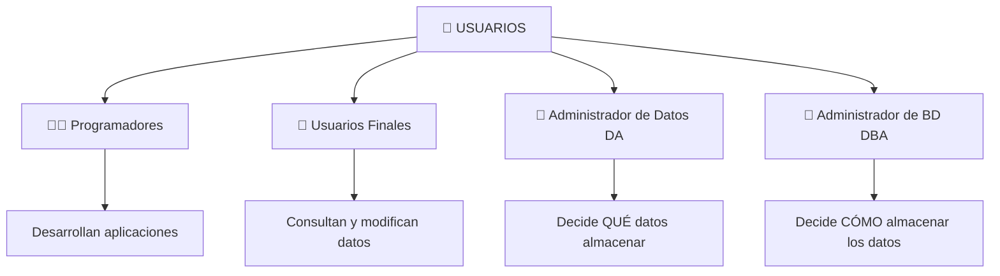
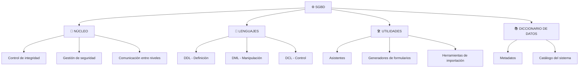

# 📊 BASES DE DATOS - UD1: CONCEPTOS BÁSICOS
## Presentación Interactiva Visual

---

## 🎯 **ÍNDICE DE CONTENIDOS**

1. [🚀 Introducción: ¿Qué sabemos?](#introduccion)
2. [📁 La Información y su Almacenamiento](#informacion)
3. [📂 Sistemas Gestores de Ficheros](#ficheros)
4. [🏛️ Sistemas Gestores de Bases de Datos](#sgbd)
5. [🏗️ Arquitectura de una Base de Datos](#arquitectura)
6. [⚙️ Componentes de un SGBD](#componentes)

---

## 🚀 **INTRODUCCIÓN** {#introduccion}

### 💭 **PREGUNTA INICIAL PARA REFLEXIONAR**

> **🤔 Antes de empezar... ¿Qué piensas?**
> 
> - ¿Qué entiendes por **Bases de Datos**?
> - ¿Conoces algún **Sistema Gestor de Bases de Datos**?
> - ¿Has trabajado con Bases de Datos o has oído sobre ellas?
> - ¿Consideras importante aprender a trabajar con Bases de Datos?

### 🎪 **ACTIVIDAD INTERACTIVA: "Lluvia de Ideas"**

**Instrucciones:** En equipos de 3-4 personas, dedicad 5 minutos a:
1. Listar ejemplos de **sistemas que usen bases de datos** en vuestra vida diaria
2. Pensar en **problemas** que podrían surgir sin bases de datos

**Ejemplos de respuesta:**
- 🏦 Cajeros automáticos (datos bancarios)
- 🛒 Tiendas online (productos, clientes, pedidos)
- 🎮 Videojuegos (puntuaciones, perfiles)
- 📱 Redes sociales (usuarios, publicaciones)

---

## 📁 **LA INFORMACIÓN Y SU ALMACENAMIENTO** {#informacion}

### 🧠 **CONCEPTO CLAVE**

> **💡 INFORMÁTICA =** Ciencia que estudia el **tratamiento automático y racional** de la información

### 📊 **TIPOS DE INFORMACIÓN**

| Tipo | Descripción | Ejemplo |
|------|-------------|---------|
| **🔄 Volátil** | Se procesa y desecha | Cálculo temporal |
| **💾 Persistente** | Se almacena para uso futuro | Datos de clientes |

### 🕰️ **EVOLUCIÓN DEL ALMACENAMIENTO**

```
📇 Tarjetas de papel → 💾 Ficheros digitales → 🗄️ Bases de datos
```

#### **🎭 SIMULACIÓN: "El Archivo de la Empresa"**

**Escenario:** Imaginad una empresa de los años 1980...

**Problema:** 
- 📇 Miles de tarjetas de cartón con datos de clientes
- 🗂️ Archivadores organizados por letras
- 👥 Múltiples empleados buscando información simultáneamente

**❓ PREGUNTA DE REFLEXIÓN:**
> ¿Qué **ventajas** e **inconvenientes** tendría este sistema?

**Respuestas esperadas:**
- ✅ **Ventajas:** Simple, no requiere tecnología, visual
- ❌ **Inconvenientes:** Lento, propenso a errores, difícil de compartir

---

## 📂 **SISTEMAS GESTORES DE FICHEROS** {#ficheros}

### 🏷️ **DEFINICIÓN**

> **📂 Sistema Gestor de Ficheros:** Sistema de almacenamiento donde los datos se guardan en archivos con estructura particular

### 📋 **EJEMPLO PRÁCTICO: Fichero CLIENTES de un Banco**

```
📄 Archivo: CLIENTES
🔑 Campo clave: NIF
📏 Formato del registro:
```

| Campo | Nombre | Tipo | Longitud |
|-------|--------|------|----------|
| 1 | NIF | Alfanumérico | 10 |
| 2 | APELLIDOS | Alfanumérico | 20 |
| 3 | NOMBRE | Alfanumérico | 15 |
| 4 | NACIMIENTO | Fecha | 8 |

### 🎯 **CASO PRÁCTICO 1: Centro Educativo**

**Situación:** Un centro quiere informatizar:
- 📄 Emisión mensual de recibos
- 📊 Actas de notas

#### ❌ **SOLUCIÓN CLÁSICA (PROBLEMÁTICA)**

**Fichero RECIBOS:**
```
📝 No Matrícula
👤 Nombre alumno
📚 Nombre asignatura 1, Precio asignatura 1
📚 Nombre asignatura 2, Precio asignatura 2
...
💰 Deducciones
```

**Fichero NOTAS:**
```
📝 No Matrícula
👤 Nombre alumno
📚 Nombre asignatura 1, Nota asignatura 1
📚 Nombre asignatura 2, Nota asignatura 2
...
```

#### ❓ **PREGUNTA INVESTIGADORA:**
> **🔍 ¿Qué defectos observas en esta organización?**

**Respuestas:**
1. **🔄 Campos repetidos** (multiplicación de espacio)
2. **⚠️ Dificultades para actualización** (más tiempo invertido)
3. **💥 Inconsistencia de datos** (errores de actualización)

#### ✅ **SOLUCIÓN MEJORADA**

**Fichero ALUMNOS:**
```
📝 No Matrícula
👤 Nombre alumno
💰 Deducciones
```

**Fichero ASIGNATURAS:**
```
📚 No Asignatura
📖 Nombre asignatura
💰 Precio asignatura
```

**Fichero NOTAS:**
```
📝 No Matrícula
📊 No Asignatura
🎯 Nota
```

### 🎮 **ACTIVIDAD: "Detecta los Problemas"**

**Instrucciones:** En parejas, analizad este escenario:

**🏦 CASO: Sistema Bancario con Ficheros**

Un banco maneja:
- 👤 Datos de clientes
- 💰 Cuentas de ahorro
- 📊 Programas de aplicación diversos

**❓ Preguntas para debatir:**
1. ¿Qué pasaría si un cliente cambia de dirección?
2. ¿Cómo obtendríamos una lista de clientes de código postal específico?
3. ¿Qué ocurre si dos cajeros procesan la misma cuenta simultáneamente?

### 🚨 **LOS 7 GRANDES PROBLEMAS DE LOS FICHEROS**

| Problema | 🎯 Descripción | 💡 Ejemplo |
|----------|---------------|-----------|
| **1. 🔄 Redundancia** | Datos duplicados | Dirección en múltiples archivos |
| **2. 🚫 Acceso difícil** | Consultas no previstas | Lista de clientes por código postal |
| **3. 🏝️ Aislamiento** | Datos dispersos | Diferentes formatos incompatibles |
| **4. ⚡ Concurrencia** | Accesos simultáneos | Dos retiros de la misma cuenta |
| **5. 🔒 Seguridad** | Acceso no controlado | Todos ven todo |
| **6. 🛡️ Integridad** | Restricciones difíciles | Saldo mínimo de cuenta |
| **7. 🔗 Dependencia** | Cambios físicos afectan programas | Modificar estructura de archivo |

---

## 🏛️ **SISTEMAS GESTORES DE BASES DE DATOS** {#sgbd}

### 🌟 **DEFINICIÓN FUNDAMENTAL**

> **🗄️ Base de Datos:** Colección de datos interrelacionados, almacenados sin redundancias perjudiciales, que sirven a múltiples aplicaciones

> **⚙️ SGBD:** Aplicación que permite definir, crear y mantener la base de datos, proporcionando acceso controlado

### 🏗️ **COMPONENTES DE UN SISTEMA DE BD**

#### **I. 📊 LOS DATOS**

| Tipo | Descripción | Ejemplo |
|------|-------------|---------|
| **🔒 Persistentes** | Permanecen indefinidamente | Datos de empleados |
| **📥 De Entrada** | Se introducen por primera vez | Nuevo cliente |
| **📤 De Salida** | Se extraen del sistema | Informes, consultas |

#### **II. 💻 EL HARDWARE**
- 🖥️ Servidores
- 💾 Dispositivos de almacenamiento
- 🌐 Redes de comunicación

#### **III. 📱 EL SOFTWARE**
- ⚙️ SGBD (Sistema Gestor)
- 🔧 Programas de aplicación
- 🛠️ Utilidades de sistema

#### **IV. 👥 LOS USUARIOS**



### ⭐ **VENTAJAS DE LAS BASES DE DATOS**

#### **🎯 ACTIVIDAD: "Antes y Después"**

**Instrucciones:** Comparad estas situaciones:

| 📂 **CON FICHEROS** | 🗄️ **CON BASE DE DATOS** |
|---------------------|---------------------------|
| Cambiar dirección en 5 archivos | Cambiar dirección en 1 lugar |
| Programar nueva consulta | Consulta inmediata |
| Acceso libre a todo | Permisos específicos |
| Datos inconsistentes | Integridad garantizada |

#### **🌟 LAS 6 VENTAJAS PRINCIPALES**

1. **🔄 Independencia de datos**
   - 💡 **Ejemplo:** Cambiar estructura sin afectar programas

2. **📉 Menos redundancia**
   - 💡 **Problema evitado:** Apuntar algo en dos lugares diferentes

3. **🛡️ Mayor integridad**
   - 💡 **Ejemplo:** Saldo de cuenta nunca bajo cero

4. **📈 Mayor disponibilidad**
   - 💡 **Ejemplo:** Recuperación ante fallos

5. **👥 Compartición de datos**
   - 💡 **Ejemplo:** Miles de usuarios simultáneos

6. **🔒 Mayor seguridad**
   - 💡 **Ejemplo:** Cada usuario ve solo lo autorizado

### ⚠️ **DESVENTAJAS DE LAS BASES DE DATOS**

#### **❓ PREGUNTA CRÍTICA:**
> **🤔 Si las BD tienen tantas ventajas, ¿por qué seguir usando ficheros?**

**💰 Desventajas de Implantación:**
- 💸 Instalación costosa
- ⏰ Instalación larga y difícil
- 📉 Sin rentabilidad a corto plazo

**👨‍💼 Desventajas para Usuarios:**
- 🎓 Necesidad de formación especializada

#### **⚖️ REGLA DE ORO:**

> **💡 Usar ficheros cuando:** La cantidad de datos es tan reducida que no justifica las ventajas del SGBD
> 
> **Ejemplo:** Agenda simple con campos de texto por fecha

---

## 🏗️ **ARQUITECTURA DE UNA BASE DE DATOS** {#arquitectura}

### 🎯 **OBJETIVOS PRINCIPALES**

1. **👁️ Visión abstracta** - Ocultar detalles de almacenamiento
2. **🔄 Independencia** - Separar datos de aplicaciones

### 🏢 **LOS TRES NIVELES DE ARQUITECTURA**

```
👤 USUARIOS
    ⬇️
📱 NIVEL EXTERNO (Vistas)
    ⬇️
🧠 NIVEL CONCEPTUAL (Lógico)
    ⬇️
💾 NIVEL INTERNO (Físico)
```

#### **🔧 NIVEL INTERNO (Físico)**
> **🎯 Perspectiva:** Cómo se almacenan físicamente los datos

**Contiene:**
- 📁 Archivos que contienen información
- 🗂️ Organización de archivos
- 🔑 Campos clave
- 📏 Tipo y longitud de registros

#### **🧠 NIVEL CONCEPTUAL (Lógico)**
> **🎯 Perspectiva:** Qué datos se almacenan y sus relaciones

**Contiene:**
- 📊 Datos elementales (campos)
- 📋 Datos compuestos (registros)
- 🔗 Relaciones entre datos
- 📜 Reglas de negocio

#### **👁️ NIVELES EXTERNOS (Vistas)**
> **🎯 Perspectiva:** Percepciones individuales de los usuarios

**Características:**
- 👤 Cada usuario tiene su vista particular
- 🔄 Se pueden compartir vistas
- ✂️ Permiten omitir/reorganizar campos

### 📚 **EJEMPLO PRÁCTICO: Los Tres Niveles**

#### **👁️ ESQUEMAS EXTERNOS**

**Vista 1 - Administrativos:**
```
👥 ALUMNOS CON EDAD: ALDNI, ALEDAD
```

**Vista 2 - Profesores:**
```
📊 ASIGNATURAS APROBADAS: ALDNI, ASIGNUM, NOTA
```

#### **🧠 ESQUEMA CONCEPTUAL**

```
👤 ALUMNOS: ALDNI, ALNOM, ALAPELL, ...
📚 ASIGNATURAS: ASIGNUM, ASIGNOM, ASIGHORAS
📊 NOTAS: ALDNI, ASIGNUM, NOTA, FECHA

📜 REGLAS:
1. Un alumno tiene exactamente 8 asignaturas
2. Máximo 30 alumnos por asignatura
```

#### **💾 ESQUEMA INTERNO**

| Archivo | Organización | Clave | Long.Reg | Campos | Tipo |
|---------|--------------|-------|----------|--------|------|
| Alumnos | Indexada | ALDNI | 70 | ALDNI, ALNOM, ALAPELL | X(9), X(15), X(20) |

### 🔄 **INDEPENDENCIA DE DATOS**

#### **🎯 ACTIVIDAD: "¿Qué cambia?"**

**Escenario:** Analiza estos cambios y su impacto:

1. Pasar de archivo secuencial a indexado
2. Añadir campo "email" a alumno
3. Ocultar notas a administrativos

**❓ Preguntas:**
- ¿Qué niveles se ven afectados en cada caso?
- ¿Qué programas hay que modificar?

#### **🧩 TIPOS DE INDEPENDENCIA**

**1. 🧠 Independencia Lógica**
> **Definición:** Cambios en esquema conceptual NO afectan vistas externas que no usen los datos modificados

**💡 Ejemplo:**
- Suprimir "fecha de nacimiento" de alumno
- Añadir entidad "aula"
- ➡️ Programas existentes siguen funcionando

**2. 🔧 Independencia Física**
> **Definición:** Cambios en esquema interno NO afectan esquema conceptual

**💡 Ejemplo:**
- Reorganizar archivos para mejor rendimiento
- Cambiar indices
- ➡️ Usuarios no notan diferencia

---

## ⚙️ **COMPONENTES DE UN SGBD** {#componentes}

### 🏗️ **ARQUITECTURA DEL SGBD**



### 🧠 **1. NÚCLEO**
> **🎯 Función:** Programas transparentes que coordinan el SGBD

**Responsabilidades:**
- 🛡️ Control de integridad y seguridad
- 🔄 Comunicación entre niveles
- 🔄 Independencia de datos
- 📚 Gestión del diccionario
- 🔧 Soporte para utilidades y lenguajes

### 💬 **2. LENGUAJES**

#### **📝 DDL (Data Definition Language)**
> **🎯 Propósito:** Definir estructura de la base de datos

**Funciones:**
- 🏗️ Crear esquemas conceptual y externos
- 🔒 Establecer seguridad
- 👥 Asignar derechos de acceso

**💡 Ejemplo:**
```sql
CREATE TABLE Alumnos (
    DNI VARCHAR(10) PRIMARY KEY,
    Nombre VARCHAR(50),
    Edad INT
);
```

#### **🔧 DML (Data Manipulation Language)**
> **🎯 Propósito:** Gestionar la información

**Operaciones:**
- ➕ Añadir registros (INSERT)
- ❌ Eliminar registros (DELETE)
- ✏️ Modificar registros (UPDATE)
- 🔍 Consultar información (SELECT)

**💡 Ejemplo:**
```sql
SELECT Nombre, Edad 
FROM Alumnos 
WHERE Edad > 18;
```

#### **👮 DCL (Data Control Language)**
> **🎯 Propósito:** Controlar permisos y accesos

**Funciones:**
- ✅ Conceder permisos (GRANT)
- ❌ Revocar permisos (REVOKE)

**💡 Ejemplo:**
```sql
GRANT SELECT ON Alumnos TO profesor_matematicas;
```

### 🛠️ **3. UTILIDADES**
> **🎯 Propósito:** Facilitar el trabajo a usuarios y programadores

**Características:**
- 📱 Interfaces amigables
- 📋 Menús guiados
- 🎭 Asistentes interactivos

**Ejemplos:**
- 📊 Generadores de informes
- 📝 Creadores de formularios
- 📤 Herramientas de importación/exportación
- 🔄 Asistentes de migración

### 📚 **4. DICCIONARIO DE DATOS**
> **🎯 Propósito:** Almacenar toda la información sobre la BD

**También conocido como:** "Catálogo del sistema"

**Contiene información sobre:**
- 📋 Estructura de tablas
- 🔗 Relaciones entre tablas
- 👥 Usuarios y permisos
- 🔑 Índices y claves
- 📊 Estadísticas de uso

---

## 🎯 **ACTIVIDADES DE CONSOLIDACIÓN**

### 🧩 **ACTIVIDAD FINAL 1: "Mapa Conceptual"**

**Instrucciones:** En equipos, crear un mapa conceptual que conecte:
- Sistemas de ficheros ↔ Bases de datos
- Los tres niveles de arquitectura
- Componentes del SGBD
- Ventajas y desventajas

### 🎭 **ACTIVIDAD FINAL 2: "Role Playing"**

**Roles a representar:**
- 👑 Administrador de Datos (DA)
- 🔧 Administrador de BD (DBA)  
- 👨‍💻 Programador de aplicaciones
- 👤 Usuario final

**Escenario:** La empresa necesita añadir un nuevo campo "email" a la tabla de clientes.

**❓ Preguntas para cada rol:**
- ¿Cuál es tu responsabilidad en este cambio?
- ¿Qué impacto tiene en tu trabajo?
- ¿Qué aspectos debes considerar?

### 📊 **ACTIVIDAD FINAL 3: "Caso Práctico Integrador"**

**Situación:** Una biblioteca universitaria quiere informatizar su sistema.

**Datos a manejar:**
- 📚 Libros (título, autor, ISBN, editorial)
- 👥 Usuarios (estudiantes, profesores, personal)
- 📄 Préstamos (fechas, devoluciones, multas)

**Tareas a realizar:**
1. 🏗️ Diseñar los tres niveles de arquitectura
2. 🔍 Identificar posibles vistas de usuario
3. 🎯 Proponer qué componentes del SGBD usar
4. ⚖️ Evaluar: ¿ficheros o base de datos?

---

## 🎓 **PREGUNTAS DE AUTOEVALUACIÓN**

### ❓ **Nivel Básico**

1. **🤔 ¿Cuáles son las principales diferencias entre un sistema de ficheros y una base de datos?**

2. **🏗️ ¿Qué información contiene cada nivel de la arquitectura de tres niveles?**

3. **⚙️ ¿Cuáles son los cuatro componentes principales de un SGBD?**

### ❓ **Nivel Intermedio**

4. **🔄 Explica con un ejemplo la independencia física y lógica de datos.**

5. **👥 ¿Por qué es importante separar los roles de Administrador de Datos y Administrador de Base de Datos?**

6. **⚖️ ¿En qué situaciones recomendarías usar ficheros en lugar de una base de datos?**

### ❓ **Nivel Avanzado**

7. **🎯 Diseña un caso donde se aprecie claramente la ventaja de los tres niveles de arquitectura.**

8. **🔧 ¿Cómo se relacionan los lenguajes DDL, DML y DCL con los componentes del SGBD?**

9. **💡 Propón una solución para los problemas de concurrencia en sistemas de ficheros.**

---

## 📚 **RECURSOS ADICIONALES**

### 🔗 **Para Ampliar Conocimientos**

- 📖 **Lecturas recomendadas:** Fundamentos de Sistemas de Bases de Datos - Elmasri & Navathe
- 🎥 **Videos educativos:** "Database Design Course" - FreeCodeCamp
- 💻 **Herramientas prácticas:** MySQL Workbench, PostgreSQL, SQLite
- 🌐 **Sitios web:** W3Schools SQL Tutorial, Database Design Principles

### 🎯 **Próxima Unidad**
**UD2: Modelo Entidad-Relación**
- 🧩 Conceptos de entidad, atributo y relación
- 📊 Diagramas E-R
- 🔄 Cardinalidad y participación

---

## ✅ **RESUMEN EJECUTIVO**

### 🎯 **Conceptos Clave Aprendidos**

| Concepto | Descripción |
|----------|-------------|
| **📂 Sistema de Ficheros** | Almacenamiento básico con limitaciones |
| **🗄️ Base de Datos** | Almacenamiento avanzado, integrado y controlado |
| **🏗️ Arquitectura 3 Niveles** | Interno, Conceptual, Externo |
| **⚙️ SGBD** | Software que gestiona la base de datos |
| **🔄 Independencia** | Física y lógica de los datos |

### 🌟 **Logros de Aprendizaje**

Al completar esta unidad, el estudiante será capaz de:

- ✅ Distinguir entre sistemas de ficheros y bases de datos
- ✅ Identificar problemas de los sistemas de ficheros
- ✅ Explicar las ventajas de las bases de datos
- ✅ Describir la arquitectura de tres niveles
- ✅ Reconocer los componentes de un SGBD
- ✅ Evaluar cuándo usar cada tipo de sistema

---

*📅 Presentación creada para 1º DAW - Bases de Datos*  
*🏫 Colegio Salesiano "San Ignacio" - Cádiz*  
*👨‍🏫 Material didáctico interactivo*