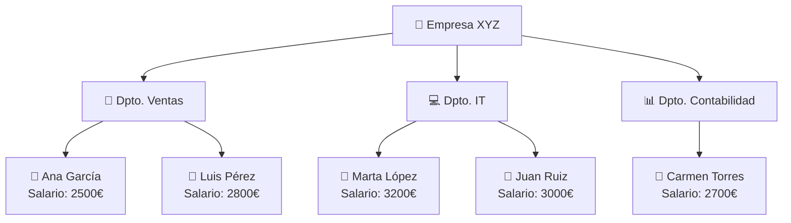
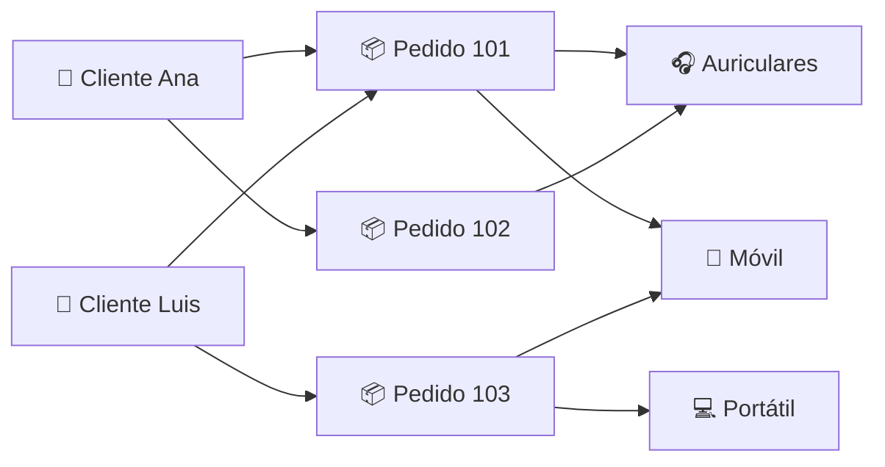
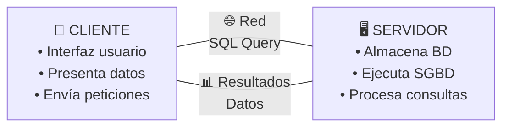
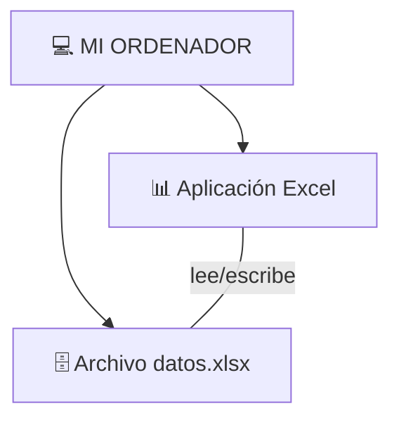
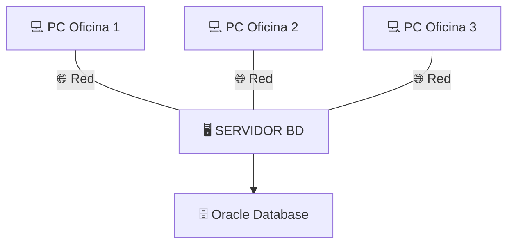
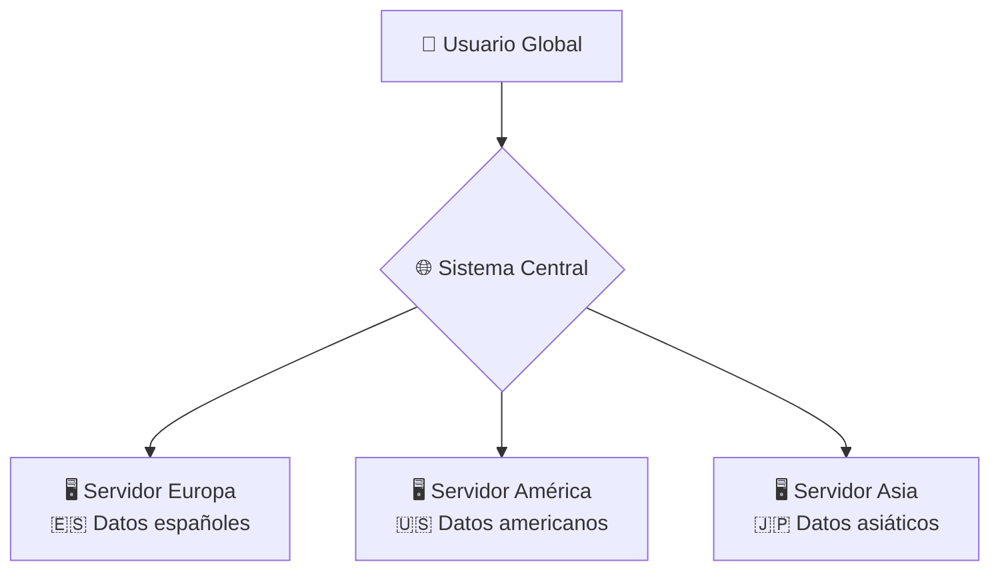
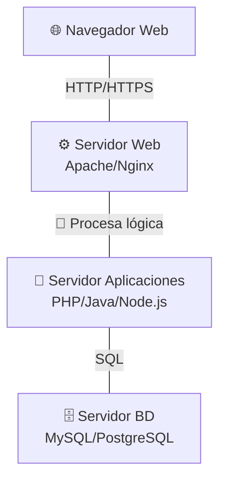
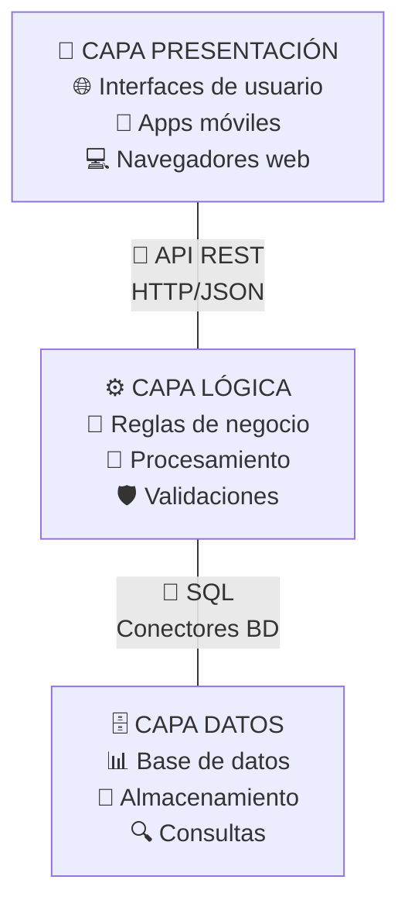
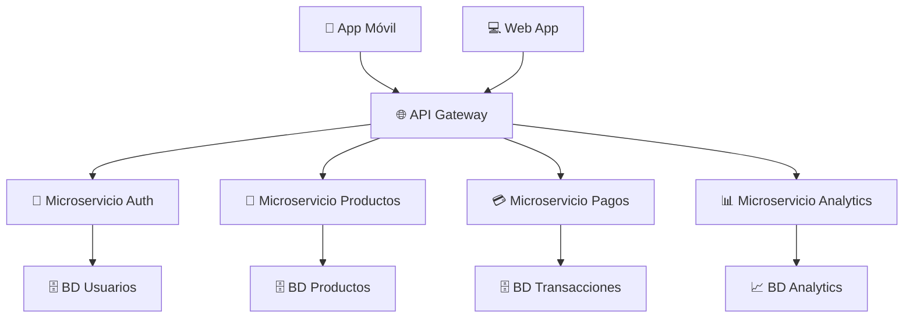

# 🏗️ MODELOS DE BASES DE DATOS Y ARQUITECTURA CLIENTE-SERVIDOR
## Presentación Visual Interactiva

---

## 🎯 **ÍNDICE DE CONTENIDOS**

1. [🧠 Introducción: ¿Cómo organizamos los datos?](#introduccion)
2. [🌳 Modelo Jerárquico](#jerarquico)
3. [🔗 Modelo en Red](#red)
4. [📊 Modelo Relacional](#relacional)
5. [⚖️ Comparativa de Modelos](#comparativa)
6. [🖥️ Arquitectura Cliente-Servidor](#cliente-servidor)
7. [🔄 Tipos de Configuraciones](#configuraciones)
8. [☁️ Evolución hacia Multicapa](#multicapa)

---

## 🧠 **INTRODUCCIÓN: ¿CÓMO ORGANIZAMOS LOS DATOS?** {#introduccion}

### 💭 **PREGUNTA INICIAL PARA REFLEXIONAR**

> **🤔 Imagina que tienes que organizar...**
> 
> - 📚 **Una biblioteca** con miles de libros
> - 🏢 **Una empresa** con empleados y departamentos
> - 🛒 **Una tienda online** con productos y clientes
> 
> **¿Cómo estructurarías esta información?**

### 🎪 **ACTIVIDAD INTERACTIVA: "Organizadores Naturales"**

**Instrucciones:** En parejas, dedicad 3 minutos a:
1. Elegir uno de los ejemplos anteriores
2. Dibujar cómo organizaríais esa información
3. Explicar las **relaciones** entre los elementos

### 🎯 **CONCEPTO CLAVE**

> **🏗️ MODELO DE BASE DE DATOS:** Define la forma en que los datos se **estructuran**, **organizan** y **relacionan** entre sí dentro de un sistema

### 📈 **EVOLUCIÓN HISTÓRICA**

```
1960s ────► 1970s ────► 1980s ────► 2000s
Jerárquico   En Red     Relacional   Orientado a Objetos
```

**❓ PREGUNTA CONECTORA:**
> **¿Por qué crees que han evolucionado los modelos de datos?**

---

## 🌳 **MODELO JERÁRQUICO** {#jerarquico}

### 🎯 **CARACTERÍSTICAS PRINCIPALES**

> **🌳 Organiza los datos en forma de ÁRBOL**
> - Cada nodo **padre** puede tener varios **hijos**
> - Cada hijo **solo tiene UN padre**
> - Representa relaciones **1:N (uno a muchos)**

### 🎨 **VISUALIZACIÓN INTERACTIVA**

```
                🏢 EMPRESA
                    │
        ┌───────────┼───────────┐
        │                       │
    💼 Ventas               💻 Informática
        │                       │
    ┌───┼───┐               ┌───┼───┐
    │       │               │       │
  👤Ana   👤Luis         👤Marta  👤Juan
```

### 🎮 **ACTIVIDAD: "Construye tu Árbol"**

**Escenario:** Sistema de archivos de tu ordenador

**Tareas:**
1. 📁 Dibuja la estructura desde C:\ hasta un archivo específico
2. 🔍 Identifica las relaciones padre-hijo
3. 🤔 ¿Puede un archivo estar en dos carpetas a la vez?

### 💡 **EJEMPLO REAL: Sistema de Nóminas**

**Contexto:** Empresa con múltiples departamentos



### ✅ **VENTAJAS**

| Ventaja | Descripción | Ejemplo |
|---------|-------------|---------|
| **🚀 Simplicidad** | Estructura fácil de entender | Árbol de carpetas |
| **⚡ Velocidad** | Accesos predefinidos muy rápidos | Búsqueda por departamento |
| **🎯 Eficiencia** | Ideal para relaciones 1:N | Padre → Hijos |

### ⚠️ **DESVENTAJAS**

| Desventaja | Descripción | Ejemplo |
|------------|-------------|---------|
| **🔒 Rigidez** | Un hijo solo puede tener un padre | Empleado no puede estar en 2 dptos |
| **❌ Limitaciones** | No representa relaciones N:M | Proyectos con múltiples empleados |
| **🔧 Mantenimiento** | Cambios estructurales complicados | Reorganizar departamentos |

### 🕰️ **CONTEXTO HISTÓRICO**

> **📅 Años 60:** Primer modelo usado masivamente
> 
> **🏢 IBM IMS (Information Management System):** Sistema pionero para la misión Apollo

### ❓ **PREGUNTA DE TRANSICIÓN**
> **🤔 Si un empleado trabaja en DOS departamentos, ¿cómo lo representarías en un modelo jerárquico?**

---

## 🔗 **MODELO EN RED** {#red}

### 🎯 **CARACTERÍSTICAS PRINCIPALES**

> **🔗 Evolución del modelo jerárquico**
> - Un nodo **puede tener VARIOS padres**
> - Permite relaciones **N:M (muchos a muchos)**
> - Información en **registros (nodos)** conectados por **enlaces**

### 🎨 **VISUALIZACIÓN INTERACTIVA**



### 🎮 **ACTIVIDAD: "Red de Relaciones"**

**Escenario:** Universidad con estudiantes y asignaturas

**Situación:**
- 👤 **Ana** estudia: Matemáticas, Programación, Inglés
- 👤 **Luis** estudia: Matemáticas, Historia, Inglés  
- 👤 **Marta** estudia: Programación, Historia, Arte

**Tareas:**
1. 🎨 Dibuja la red de relaciones
2. 🔍 Identifica qué estudiantes comparten asignaturas
3. 📊 ¿Cuántos "padres" tiene cada estudiante?

### 💡 **EJEMPLO REAL: Sistema de Pedidos**

**Contexto:** Plataforma de e-commerce

| Entidad | Relaciones |
|---------|------------|
| **👤 Clientes** | Pueden hacer múltiples pedidos |
| **📦 Pedidos** | Pertenecen a un cliente, contienen múltiples productos |
| **🛍️ Productos** | Pueden estar en múltiples pedidos |

**Ventaja clave:** Un producto puede aparecer en muchos pedidos simultáneamente

### ✅ **VENTAJAS**

| Ventaja | Descripción | Ejemplo |
|---------|-------------|---------|
| **🔄 Flexibilidad** | Permite relaciones complejas | Estudiante-Asignatura |
| **🌐 Realismo** | Refleja mejor el mundo real | Productos en múltiples pedidos |
| **🔗 Conectividad** | Enlaces múltiples entre registros | Red social de amistades |

### ⚠️ **DESVENTAJAS**

| Desventaja | Descripción | Impacto |
|------------|-------------|---------|
| **🧩 Complejidad** | Diseño y mantenimiento difícil | Programadores especializados |
| **🔧 Enlaces manuales** | Hay que gestionar punteros | Propenso a errores |
| **📈 Overhead** | Gestión de múltiples relaciones | Mayor uso de recursos |

### ❓ **PREGUNTA DE REFLEXIÓN**
> **🤔 En una red social como Instagram, ¿cómo representarías que:**
> - Un usuario puede seguir a muchos otros
> - Un usuario puede ser seguido por muchos otros
> - Un post puede recibir likes de múltiples usuarios

---

## 📊 **MODELO RELACIONAL** {#relacional}

### 🎯 **CARACTERÍSTICAS PRINCIPALES**

> **📊 El modelo MÁS USADO actualmente**
> - Propuesto por **E.F. Codd en 1970**
> - Información organizada en **TABLAS**
> - Filas = **tuplas/registros** | Columnas = **atributos/campos**
> - Relaciones mediante **claves externas**

### 🎨 **VISUALIZACIÓN INTERACTIVA: Tienda Online**

#### **🙋‍♀️ Tabla CLIENTES**

| ID_CLIENTE | NOMBRE | CIUDAD | EMAIL |
|------------|--------|--------|-------|
| 1 | Ana García | Sevilla | ana@email.com |
| 2 | Luis Pérez | Cádiz | luis@email.com |
| 3 | Marta López | Madrid | marta@email.com |

#### **📦 Tabla PEDIDOS**

| ID_PEDIDO | ID_CLIENTE | FECHA | TOTAL |
|-----------|------------|-------|-------|
| 101 | 1 | 2025-01-12 | 250.50€ |
| 102 | 2 | 2025-02-01 | 89.99€ |
| 103 | 1 | 2025-02-15 | 125.00€ |

#### **🛍️ Tabla PRODUCTOS**

| ID_PRODUCTO | NOMBRE | PRECIO | CATEGORIA |
|-------------|--------|--------|-----------|
| P001 | iPhone 15 | 899.99€ | Móviles |
| P002 | MacBook Air | 1299.99€ | Portátiles |
| P003 | AirPods Pro | 249.99€ | Accesorios |

### 🎮 **ACTIVIDAD INTERACTIVA: "Constructor de Consultas"**

**🔍 Preguntas a resolver usando las tablas:**

1. **¿Qué clientes viven en Sevilla?**
2. **¿Cuántos pedidos ha hecho Ana García?**
3. **¿Cuál es el pedido más caro?**
4. **¿Qué productos cuestan menos de 300€?**

**💡 Respuestas:**
1. Ana García
2. 2 pedidos (101 y 103)
3. Pedido 101 (250.50€)
4. AirPods Pro (249.99€)

### 🔑 **CONCEPTOS CLAVE**

#### **🎯 Clave Primaria (Primary Key)**
> **Identifica ÚNICAMENTE cada registro**

```sql
ID_CLIENTE (en tabla CLIENTES)
ID_PEDIDO (en tabla PEDIDOS)
ID_PRODUCTO (en tabla PRODUCTOS)
```

#### **🔗 Clave Externa (Foreign Key)**
> **Conecta tablas entre sí**

```sql
ID_CLIENTE en tabla PEDIDOS 
    ↓
Referencia a ID_CLIENTE en tabla CLIENTES
```

### 💡 **EJEMPLO AMPLIADO: Netflix**

#### **🎬 Tabla PELÍCULAS**

| ID_PELICULA | TITULO | GENERO | AÑO |
|-------------|--------|--------|-----|
| M001 | Matrix | Ciencia Ficción | 1999 |
| M002 | Titanic | Romance | 1997 |

#### **👤 Tabla USUARIOS**

| ID_USUARIO | NOMBRE | PLAN | FECHA_REGISTRO |
|------------|--------|------|----------------|
| U001 | Ana | Premium | 2023-01-15 |
| U002 | Luis | Básico | 2023-03-20 |

#### **⭐ Tabla VALORACIONES**

| ID_USUARIO | ID_PELICULA | PUNTUACION | FECHA |
|------------|-------------|-------------|-------|
| U001 | M001 | 5 | 2024-02-10 |
| U001 | M002 | 4 | 2024-02-15 |
| U002 | M001 | 3 | 2024-03-01 |

### ✅ **VENTAJAS DEL MODELO RELACIONAL**

| Ventaja | Descripción | Ejemplo |
|---------|-------------|---------|
| **🔄 Independencia** | Lógica y física separadas | Cambiar estructura sin afectar apps |
| **📝 SQL** | Lenguaje estándar universal | SELECT, INSERT, UPDATE, DELETE |
| **🛡️ Integridad** | Reglas automáticas de consistencia | Claves primarias únicas |
| **🔧 Simplicidad** | Fácil de entender y usar | Tablas como hojas de cálculo |
| **🌐 Flexibilidad** | Consultas complejas posibles | JOINs entre múltiples tablas |

### ⚠️ **DESVENTAJAS**

| Desventaja | Descripción | Cuándo ocurre |
|------------|-------------|---------------|
| **📊 Complejidad** | Muchas tablas y relaciones | Sistemas muy grandes |
| **⚡ Rendimiento** | JOINs pueden ser costosos | Consultas complejas |
| **🎯 Planificación** | Diseño cuidadoso necesario | Antes de implementar |

### 🎯 **ACTIVIDAD PRÁCTICA: "Diseña tu Streaming"**

**Escenario:** Crear una plataforma como Spotify

**Entidades necesarias:**
- 👤 Usuarios
- 🎵 Canciones  
- 👨‍🎤 Artistas
- 📀 Álbumes
- 📋 Playlists

**Tareas:**
1. 🎨 Diseña las tablas con sus campos
2. 🔑 Identifica claves primarias y externas
3. 🔗 Define las relaciones entre tablas
4. 📝 Escribe 3 consultas de ejemplo

### ❓ **PREGUNTA DE TRANSICIÓN**
> **🤔 Después de ver estos tres modelos, ¿cuál crees que es mejor para:**
> - Una aplicación móvil simple
> - Un sistema bancario
> - Una red social global

---

## ⚖️ **COMPARATIVA DE MODELOS** {#comparativa}

### 🏆 **TABLA COMPARATIVA COMPLETA**

| Característica | 🌳 Jerárquico | 🔗 En Red | 📊 Relacional |
|----------------|---------------|------------|---------------|
| **🏗️ Estructura** | Árbol | Gráfico | Tablas |
| **🔗 Relaciones** | 1:N | N:M | N:M |
| **🔧 Flexibilidad** | 🔴 Baja | 🟡 Media | 🟢 Alta |
| **👤 Facilidad uso** | 🟡 Media | 🔴 Baja | 🟢 Alta |
| **💬 Lenguaje** | Punteros | Enlaces | SQL |
| **⚡ Velocidad** | 🟢 Alta | 🟡 Media | 🟡 Media |
| **💰 Coste desarrollo** | 🟢 Bajo | 🔴 Alto | 🟡 Medio |
| **🕰️ Época de uso** | 1960s | 1970s | 1970s-hoy |

### 🎮 **ACTIVIDAD: "Elige tu Modelo"**

**Para cada escenario, justifica qué modelo usarías:**

#### **📋 Escenario 1: Sistema de Archivos del SO**
- **Estructura:** Carpetas y subcarpetas
- **Relaciones:** Una carpeta padre, múltiples hijos
- **Accesos:** Navegación por rutas

**💡 Respuesta esperada:** Jerárquico (estructura natural de árbol)

#### **📋 Escenario 2: Red Social Profesional (LinkedIn)**
- **Estructura:** Usuarios, empresas, habilidades, contactos
- **Relaciones:** Un usuario puede trabajar en varias empresas, tener múltiples habilidades
- **Accesos:** Búsquedas complejas, recomendaciones

**💡 Respuesta esperada:** Relacional (flexibilidad para consultas complejas)

#### **📋 Escenario 3: Sistema de Reservas de Vuelos**
- **Estructura:** Vuelos, pasajeros, asientos, rutas
- **Relaciones:** Un vuelo tiene múltiples pasajeros, un pasajero puede tener múltiples vuelos
- **Accesos:** Consultas en tiempo real, alta concurrencia

**💡 Respuesta esperada:** Relacional (SQL para consultas complejas)

### 🎯 **CASOS DE USO REALES**

#### **🌳 Modelos Jerárquicos Actuales**
- 📁 **Sistemas de archivos:** Windows, macOS, Linux
- 🏢 **Organigramas empresariales:** Estructura de mando
- 🌐 **XML/JSON:** Estructuras de datos anidadas
- 📊 **Clasificaciones:** Taxonomías, categorías

#### **📊 Modelos Relacionales Dominantes**
- 🏦 **Sistemas bancarios:** MySQL, PostgreSQL, Oracle
- 🛒 **E-commerce:** Amazon, eBay, Shopify
- 🎓 **Sistemas educativos:** Moodle, universidades
- 🏥 **Gestión hospitalaria:** Historiales médicos

### ❓ **PREGUNTA REFLEXIVA**
> **🤔 ¿Por qué crees que el modelo relacional ha "ganado" la batalla y es el más usado actualmente?**

**💡 Pistas para el debate:**
- Estándar SQL
- Independencia de datos
- Flexibilidad de consultas
- Ecosistema de herramientas

---

## 🖥️ **ARQUITECTURA CLIENTE-SERVIDOR** {#cliente-servidor}

### 🎯 **CONCEPTO FUNDAMENTAL**

> **🏗️ Arquitectura Cliente-Servidor:** Forma de **organizar equipos y programas** que participan en la gestión y uso de una base de datos

### 💭 **PREGUNTA INICIAL**

> **🤔 Cuando accedes a Instagram desde tu móvil...**
> - ¿Dónde están almacenadas tus fotos?
> - ¿Dónde se procesan los "likes"?
> - ¿Qué hace tu móvil exactamente?

### 🎨 **DIVISIÓN DE RESPONSABILIDADES**



### 🎮 **ACTIVIDAD: "Identifica Cliente y Servidor"**

**Para cada ejemplo, identifica qué es cliente y qué es servidor:**

| Ejemplo | Cliente | Servidor |
|---------|---------|----------|
| 🏦 **Cajero automático** | ? | ? |
| 📧 **Gmail en navegador** | ? | ? |
| 🎮 **Fortnite online** | ? | ? |
| 💻 **Excel con BD local** | ? | ? |

**💡 Respuestas:**
- 🏦 Cliente: Cajero | Servidor: Sistema bancario central
- 📧 Cliente: Navegador | Servidor: Servidores de Google
- 🎮 Cliente: Consola/PC | Servidor: Servidores de Epic Games
- 💻 Cliente y Servidor: Mismo ordenador

### 🧩 **COMPONENTES PRINCIPALES**

| Componente | 🎯 Función | 📍 Ubicación |
|------------|------------|--------------|
| **🗄️ Gestión de datos** | Manipula y administra la BD | 🖥️ Servidor |
| **👤 Interfaz de usuario** | Muestra info y permite interacción | 📱 Cliente |
| **⚙️ Lógica de aplicación** | Procesa reglas de negocio | 🔄 Cliente/Servidor |

### 💡 **EJEMPLO DETALLADO: Banco Online**

#### **📱 En el Cliente (App móvil):**
- 🔐 Pantalla de login
- 💰 Mostrar saldo actual
- 📊 Historial de movimientos
- 💸 Formulario de transferencia

#### **🖥️ En el Servidor:**
- 🗄️ Base de datos con cuentas
- 🔒 Validación de credenciales
- 💰 Cálculo de saldos
- 🔐 Autorización de operaciones

#### **🌐 Comunicación:**
```
Cliente envía: "LOGIN: usuario123, password456"
Servidor responde: "OK: Token de sesión ABC123"

Cliente envía: "CONSULTAR_SALDO: cuenta 12345"
Servidor responde: "SALDO: 1.250,75€"
```

### ✅ **VENTAJAS DE LA ARQUITECTURA**

| Ventaja | Descripción | Ejemplo |
|---------|-------------|---------|
| **🎯 Centralización** | Datos en un solo lugar | Actualizaciones instantáneas |
| **🔒 Seguridad** | Control centralizado de acceso | Permisos desde el servidor |
| **👥 Concurrencia** | Múltiples usuarios simultáneos | 1000 usuarios en WhatsApp |
| **🔧 Mantenimiento** | Cambios solo en el servidor | Actualizar app sin reinstalar |
| **📈 Escalabilidad** | Añadir más clientes fácilmente | Nuevos usuarios sin problemas |
| **🌍 Ubicuidad** | Acceso desde cualquier lugar | Trabajar desde casa |

### ⚠️ **DESVENTAJAS**

| Desventaja | Descripción | Impacto |
|------------|-------------|---------|
| **💥 Punto único de fallo** | Si cae el servidor, todo para | Instagram caído = nadie puede usarlo |
| **💰 Coste de infraestructura** | Servidores potentes y caros | Inversión inicial alta |
| **🌐 Dependencia de red** | Sin conexión = sin servicio | Sin wifi = no acceso |
| **⚡ Cuello de botella** | Servidor limitado por capacidad | Lentitud en horas pico |

### ❓ **PREGUNTA DE REFLEXIÓN**
> **🤔 ¿Por qué aplicaciones como WhatsApp funcionan incluso cuando tienes poca conexión, pero aplicaciones como Instagram necesitan buena conexión?**

---

## 🔄 **TIPOS DE CONFIGURACIONES** {#configuraciones}

### 🖥️ **1. CONFIGURACIÓN MONOEQUIPO (Anfitrión)**

> **🎯 Cliente y servidor en el MISMO equipo**



#### **💡 Ejemplo: Desarrollador Local**
- **Situación:** Programador trabajando en su proyecto
- **Cliente:** Navegador web (localhost:3000)
- **Servidor:** MySQL instalado localmente
- **BD:** Base de datos de pruebas

#### **✅ Ventajas:**
- 🚀 **Muy rápido** (sin latencia de red)
- 💰 **Económico** (un solo equipo)
- 🔒 **Privado** (datos no salen del equipo)

#### **❌ Desventajas:**
- 👤 **Solo un usuario**
- 📍 **Sin acceso remoto**
- 💾 **Recursos limitados**

### 🖥️ **2. CLIENTE/SERVIDOR CLÁSICO**

> **🎯 Servidor dedicado + múltiples clientes**



#### **💡 Ejemplo: Sistema de Gestión Escolar**
- **Servidor:** Equipo en el centro de datos del colegio
- **Clientes:** PCs en secretaría, aulas, dirección
- **BD:** Datos de alumnos, notas, horarios

#### **🎮 Actividad: "Diseña tu Red Escolar"**
**Identifica qué tipo de información accedería cada usuario:**
- 👨‍🏫 **Profesor:** ¿Qué puede ver/modificar?
- 👩‍💼 **Secretaria:** ¿Qué permisos necesita?
- 👨‍💼 **Director:** ¿Qué nivel de acceso?
- 👨‍🎓 **Alumno:** ¿Qué puede consultar?

### 🌍 **3. BASES DE DATOS DISTRIBUIDAS**

> **🎯 Información repartida en VARIOS servidores**



#### **💡 Ejemplo: Netflix Global**
- **Europa:** Perfiles y visualizaciones de usuarios europeos
- **América:** Datos de usuarios americanos
- **Asia:** Información de usuarios asiáticos
- **Usuario:** Ve "una sola" plataforma Netflix

#### **✅ Ventajas:**
- ⚡ **Rendimiento** (datos cerca del usuario)
- 🛡️ **Resistencia** (un servidor cae, otros siguen)
- 📈 **Escalabilidad** (añadir servidores por región)

#### **❌ Desventajas:**
- 🧩 **Complejidad** (sincronización entre servidores)
- 🔄 **Consistencia** (mismos datos en todos lados)
- 💰 **Coste** (múltiples infraestructuras)

### ☁️ **4. CON SERVIDOR DE APLICACIONES**

> **🎯 Tres capas separadas: Cliente + Aplicación + Base de Datos**



#### **💡 Ejemplo: Moodle (Plataforma Educativa)**

**🌐 Capa Cliente:**
- Navegador del estudiante/profesor
- App móvil de Moodle

**⚙️ Capa Aplicación:**
- Servidor con código PHP de Moodle
- Gestiona sesiones, permisos, lógica de negocio

**🗄️ Capa Datos:**
- Base de datos MySQL
- Almacena usuarios, cursos, calificaciones

#### **🎮 Actividad: "Traza la Petición"**

**Escenario:** Estudiante sube una tarea a Moodle

**Paso a paso:**
1. 🖱️ Estudiante hace clic en "Subir archivo"
2. 🌐 Navegador envía petición HTTP
3. ⚙️ Servidor web recibe y procesa
4. 🧠 Aplicación valida permisos y guarda archivo
5. 🗄️ Base de datos almacena metadatos
6. ✅ Confirmación regresa al estudiante

### ❓ **PREGUNTA COMPARATIVA**
> **🤔 ¿Qué configuración usarías para:**
> - Una tienda con 3 empleados
> - Un banco nacional
> - Una startup tecnológica
> - Un videojuego multijugador global

---

## ☁️ **EVOLUCIÓN HACIA MULTICAPA** {#multicapa}

### 🎯 **ARQUITECTURA THREE-TIER (3 CAPAS)**

> **🏗️ Separación clara de responsabilidades en 3 niveles**



### 🎮 **ACTIVIDAD: "Diseña Amazon en 3 Capas"**

**Para cada funcionalidad de Amazon, identifica en qué capa va:**

| Funcionalidad | Capa Presentación | Capa Lógica | Capa Datos |
|---------------|-------------------|-------------|------------|
| **🛒 Carrito de compra** | Interfaz del carrito | Calcular total + impuestos | Productos y precios |
| **🔍 Buscar productos** | Caja de búsqueda | Algoritmo de búsqueda | Catálogo de productos |
| **💳 Procesar pago** | Formulario de pago | Validar tarjeta + stock | Guardar transacción |
| **⭐ Reseñas** | Mostrar estrellas | Calcular promedio | Comentarios de usuarios |

### 💡 **EJEMPLO DETALLADO: Plataforma de Streaming**

#### **🎨 CAPA DE PRESENTACIÓN**
```
📱 App móvil: 
- Lista de películas
- Reproductor de video
- Perfil de usuario

🌐 Web browser:
- Catálogo navegable
- Sistema de búsqueda
- Panel de administración
```

#### **⚙️ CAPA DE LÓGICA DE NEGOCIO**
```
🧠 Servidor de aplicaciones:
- Algoritmo de recomendaciones
- Gestión de suscripciones
- Control de acceso por regiones
- Transcodificación de videos
```

#### **🗄️ CAPA DE DATOS**
```
📊 Bases de datos:
- Catálogo de contenido
- Perfiles de usuarios
- Historiales de visualización
- Datos de facturación
```

### 🌟 **VENTAJAS DE LA ARQUITECTURA MULTICAPA**

| Ventaja | Descripción | Ejemplo |
|---------|-------------|---------|
| **🔧 Mantenibilidad** | Cambios aislados por capa | Cambiar diseño sin tocar BD |
| **📈 Escalabilidad** | Escalar cada capa independientemente | Más servidores de app en Black Friday |
| **👥 Especialización** | Equipos expertos por capa | Frontend, Backend, DBA |
| **🔄 Reutilización** | Una lógica para múltiples interfaces | API para web y móvil |
| **🧪 Testing** | Pruebas independientes por capa | Test unitarios de lógica |

### 🚀 **EVOLUCIÓN A LA NUBE (Cloud)**

#### **☁️ Microservicios y Cloud Native**



#### **🎯 Características Cloud Native:**
- **🐳 Contenedores:** Docker, Kubernetes
- **⚡ Serverless:** AWS Lambda, Azure Functions
- **📊 Base de datos como servicio:** RDS, CosmosDB
- **🔄 Auto-escalado:** Responde a demanda automáticamente

### 🎮 **ACTIVIDAD FINAL: "Tu Startup Multicapa"**

**Escenario:** Crear una plataforma de delivery de comida

**Tareas:**
1. **🎨 Diseña la capa de presentación:**
   - ¿Qué interfaces necesitas? (cliente, restaurante, repartidor)
   
2. **⚙️ Define la lógica de negocio:**
   - ¿Qué reglas y procesos necesitas?
   
3. **🗄️ Planifica la capa de datos:**
   - ¿Qué información almacenar?
   
4. **☁️ Considera la escalabilidad:**
   - ¿Cómo manejar 1000 pedidos simultáneos?

### ❓ **PREGUNTA DE SÍNTESIS**
> **🤔 Compara las ventajas de usar:**
> - Un monolito tradicional (todo en un servidor)
> - Arquitectura de 3 capas
> - Microservicios en la nube
> 
> **¿Cuándo usarías cada uno?**

---

## 🎯 **ACTIVIDADES DE CONSOLIDACIÓN**

### 🧩 **ACTIVIDAD INTEGRADORA 1: "Elige el Modelo y la Arquitectura"**

**Para cada escenario, justifica tu elección:**

#### **📚 Biblioteca Digital**
- **Entidades:** Libros, usuarios, préstamos, autores, categorías
- **Usuarios:** 500 estudiantes concurrentes
- **Acceso:** Local y remoto

**Decisiones a tomar:**
1. 🏗️ **Modelo de datos:** ¿Jerárquico, Red o Relacional?
2. 🖥️ **Arquitectura:** ¿Monoequipo, Cliente-Servidor o Multicapa?
3. 🛠️ **Justificación:** ¿Por qué esa combinación?

#### **🎮 Videojuego Multijugador**
- **Entidades:** Jugadores, partidas, rankings, items, clanes
- **Usuarios:** 100,000 jugadores globales
- **Requisitos:** Tiempo real, alta disponibilidad

#### **🏪 Tienda de Barrio**
- **Entidades:** Productos, ventas, clientes, proveedores
- **Usuarios:** 2 empleados
- **Requisitos:** Simple, económico, confiable

### 🎭 **ACTIVIDAD 2: "Role Playing: Comité de Decisión"**

**Roles:**
- 👑 **CTO (Chief Technology Officer):** Toma decisiones técnicas
- 💰 **CFO (Chief Financial Officer):** Controla presupuesto
- 👥 **UX Designer:** Se enfoca en experiencia de usuario
- 🔒 **Security Expert:** Prioriza seguridad
- 👨‍💻 **Lead Developer:** Considera implementación

**Escenario:** Startup de ride-sharing (como Uber)

**Debate:** ¿Qué arquitectura implementar?

**Puntos a considerar:**
- Escalabilidad global
- Coste de desarrollo
- Tiempo hasta el lanzamiento
- Seguridad de datos
- Experiencia de usuario

### 📊 **ACTIVIDAD 3: "Diseño Completo: Red Social Universitaria"**

**Especificaciones:**
- 👥 10,000 estudiantes
- 🏫 50 universidades
- 💬 Mensajería instantánea
- 📚 Compartir apuntes
- 🎯 Grupos de estudio

**Entregables:**
1. **🏗️ Modelo de datos:** Diseño de tablas y relaciones
2. **🖥️ Arquitectura:** Diagrama de componentes
3. **📱 Interfaces:** Mockups de pantallas principales
4. **⚡ Escalabilidad:** Plan para crecimiento
5. **🔒 Seguridad:** Medidas de protección de datos

---

## 🎓 **PREGUNTAS DE AUTOEVALUACIÓN**

### ❓ **Nivel Básico**

1. **🌳 ¿Cuáles son las principales características del modelo jerárquico?**

2. **📊 ¿Qué elementos componen una tabla en el modelo relacional?**

3. **🖥️ ¿Cuál es la diferencia entre cliente y servidor en una arquitectura cliente-servidor?**

### ❓ **Nivel Intermedio**

4. **⚖️ Compara las ventajas y desventajas de los tres modelos de datos.**

5. **🔄 ¿Cuándo recomendarías usar una arquitectura distribuida?**

6. **☁️ ¿Qué ventajas ofrece la arquitectura multicapa sobre la cliente-servidor tradicional?**

### ❓ **Nivel Avanzado**

7. **🎯 Diseña un sistema de gestión hospitalaria especificando modelo de datos y arquitectura.**

8. **🚀 ¿Cómo evolucionaría tu diseño si el sistema tuviera que atender a 100 hospitales?**

9. **🔍 Analiza por qué el modelo relacional ha prevalecido sobre los otros modelos.**

---

## 📚 **RECURSOS ADICIONALES**

### 🔗 **Para Ampliar Conocimientos**

#### **📖 Lecturas Recomendadas**
- "Database System Concepts" - Silberschatz, Galvin, Gagne
- "Designing Data-Intensive Applications" - Martin Kleppmann
- "Clean Architecture" - Robert C. Martin

#### **🎥 Videos Educativos**
- "Database Design Course" - FreeCodeCamp
- "Microservices Explained" - TechWorld with Nana
- "SQL vs NoSQL" - Hussein Nasser

#### **💻 Herramientas Prácticas**
- **🎨 Diseño:** draw.io, Lucidchart
- **🗄️ Bases de datos:** MySQL Workbench, pgAdmin
- **☁️ Cloud:** AWS RDS, Google Cloud SQL
- **📊 Modelado:** ERD Plus, dbdiagram.io

#### **🌐 Sitios Web de Referencia**
- Database Design Principles - Microsoft Docs
- AWS Architecture Center
- High Scalability - Real case studies

### 🎯 **Próximas Unidades**
- **UD2:** Modelo Entidad-Relación en profundidad
- **UD3:** Normalización de bases de datos
- **UD4:** SQL: Lenguaje de consulta estructurado

---

## ✅ **RESUMEN EJECUTIVO**

### 🎯 **Conceptos Clave Aprendidos**

| Tema | Conceptos Principales |
|------|----------------------|
| **🏗️ Modelos de Datos** | Jerárquico (árbol), Red (gráfico), Relacional (tablas) |
| **📊 Modelo Relacional** | Tablas, claves primarias/externas, SQL |
| **🖥️ Cliente-Servidor** | Separación de responsabilidades, centralización |
| **☁️ Arquitecturas** | Monoequipo, distribuidas, multicapa |
| **🚀 Evolución** | De mainframes a microservicios cloud |

### 🌟 **Competencias Desarrolladas**

Al completar esta unidad, el estudiante será capaz de:

- ✅ **Distinguir** entre los diferentes modelos de datos
- ✅ **Evaluar** qué modelo usar según el contexto
- ✅ **Diseñar** arquitecturas cliente-servidor básicas
- ✅ **Analizar** ventajas y desventajas de cada enfoque
- ✅ **Aplicar** conocimientos en casos prácticos reales
- ✅ **Justificar** decisiones técnicas de diseño

### 🔮 **Conexión con el Futuro**

Estos conocimientos son la base para:
- 🎯 **Diseño de sistemas** empresariales
- ☁️ **Arquitecturas cloud-native**
- 📱 **Desarrollo de aplicaciones** modernas
- 🔒 **Seguridad** en sistemas distribuidos
- 📈 **Escalabilidad** y rendimiento

---

*📅 Presentación creada para 1º DAW - Bases de Datos*  
*🏫 Colegio Salesiano "San Ignacio" - Cádiz*  
*👨‍🏫 Material didáctico visual e interactivo*  
*🎯 Modelos de Datos y Arquitectura Cliente-Servidor*