# Presentación: Introducción Modelo Entidad/Relación
## ¿Qué es el modelo E-R?

**Bases de Datos - 1º DAW**  
**Tema 2: El Modelo Entidad/Relación (E/R)**

---

## 📋 Índice

1. Introducción al Modelo E/R
   - Contexto histórico
   - Los tres niveles de abstracción
   - Ventajas del modelo
   - Notación básica


## 1. INTRODUCCIÓN AL MODELO ENTIDAD/RELACIÓN

### 1.1. ¿Qué es el Modelo E/R?

**Definición:**
> El **Modelo Entidad/Relación (E/R)** es un modelo conceptual que representa la estructura lógica de una base de datos de forma abstracta e independiente de cualquier Sistema Gestor de Bases de Datos (SGBD).

**Creador:** Peter Chen (1976)

**Objetivo principal:**
- Construir un **modelo conceptual** del problema
- Reflejar el **mundo real** de forma estructurada
- Servir como **base** para el modelo lógico relacional
- Facilitar la **comunicación** entre técnicos y usuarios

---

### 1.2. Contexto Histórico: ¿Por qué surgió?

**Antes del modelo E/R (pre-1976):**

❌ **Problemas:**
- Diseño directo en modelos físicos
- Dependencia total del SGBD específico
- Dificultad de comunicación entre equipos
- Detección tardía de errores
- Falta de metodología estandarizada

**Con el modelo E/R:**

✅ **Soluciones:**
1. **Abstracción:** Separación del "qué" (datos) y el "cómo" (implementación)
2. **Visualización:** Diagramas gráficos comprensibles
3. **Estandarización:** Notación universal
4. **Portabilidad:** Independiente del SGBD
5. **Comunicación:** Lenguaje común entre técnicos y usuarios

---

### 1.3. Aclaración Terminológica Importante

**⚠️ CUIDADO:** Existe una confusión común entre dos conceptos diferentes:

#### **A) Arquitectura de Tres Niveles ANSI/SPARC (Tema 1)**

Esta arquitectura describe **cómo los usuarios ven la base de datos ya implementada**:

| Nivel | Descripción | Quién lo ve |
|-------|-------------|-------------|
| **Externo (Vistas)** | Cómo cada usuario ve los datos | Usuarios finales, aplicaciones |
| **Conceptual/Lógico** | Estructura global de toda la BD | Administrador BD |
| **Interno/Físico** | Cómo se almacenan físicamente | Sistema operativo, SGBD |

**Ejemplo:**
```
Nivel Externo: Vista de CLIENTES para departamento comercial
              └─ Solo ve: nombre, teléfono, email

Nivel Conceptual: Tabla CLIENTES completa con todos sus campos
                 └─ Estructura: PRIMARY KEY, FOREIGN KEY, tipos de datos

Nivel Interno: Archivos en disco, índices B-tree, bloques de datos
              └─ Implementación: /var/lib/mysql/database/clientes.ibd
```

---

#### **B) Niveles de Diseño de Bases de Datos (Tema 2 - Modelo E/R)**

Estos niveles describen **el proceso de creación de la base de datos** desde cero:

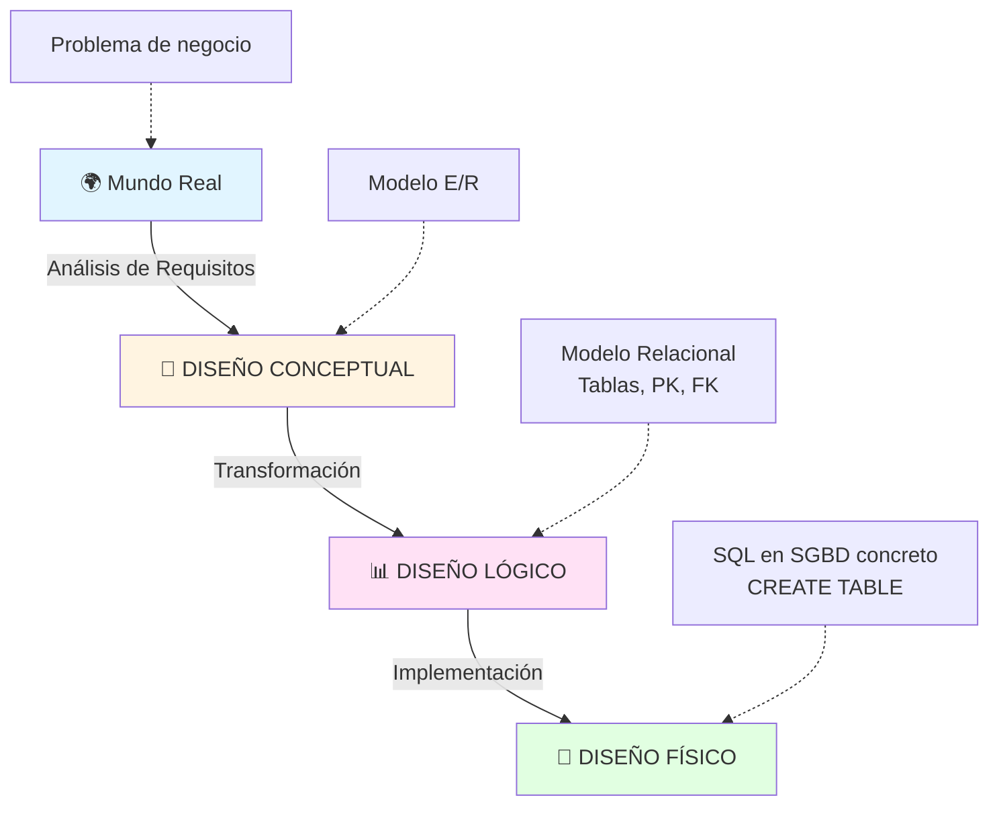

| Nivel de Diseño | Pregunta | Herramienta | Resultado | Ejemplo |
|-----------------|----------|-------------|-----------|---------|
| **1. CONCEPTUAL** | ¿QUÉ datos necesitamos? | **Modelo E/R** | Diagrama con entidades, atributos, relaciones | ![diagrama] CLIENTE-PEDIDO-PRODUCTO |
| **2. LÓGICO** | ¿CÓMO organizamos esos datos? | **Modelo Relacional** | Esquema de tablas con PK, FK, normalización | CLIENTE(PK), PEDIDO(PK,FK) |
| **3. FÍSICO** | ¿DÓNDE y cómo se almacenan? | **SQL específico del SGBD** | Scripts DDL, índices, particiones | CREATE TABLE en MySQL |

---

#### **C) Comparación Lado a Lado**

| Aspecto | Arquitectura ANSI/SPARC (Tema 1) | Niveles de Diseño (Tema 2) |
|---------|-----------------------------------|----------------------------|
| **¿Cuándo se usa?** | BD ya implementada y funcionando | Proceso de creación de BD desde cero |
| **Propósito** | Independencia de datos, seguridad | Metodología de diseño estructurado |
| **Nivel Conceptual** | Vista global de la BD implementada | Modelo E/R (diagramas, entidades) |
| **Nivel Lógico** | Parte del conceptual en ANSI | Modelo Relacional (tablas, claves) |
| **Nivel Físico** | Almacenamiento en disco | Implementación SQL específica |
| **Confusión común** | "Conceptual" = estructura de tablas | "Conceptual" = diagrama E/R |

---

### 1.4. Diferencias Clave: Modelo E/R vs Modelo Relacional

**Pregunta crucial:** Si el Modelo E/R es conceptual y el Modelo Relacional es lógico, ¿en qué se diferencian?

#### **Comparación Detallada:**

| Característica | MODELO E/R (Conceptual) | MODELO RELACIONAL (Lógico) |
|----------------|-------------------------|----------------------------|
| **Nivel** | Diseño Conceptual | Diseño Lógico |
| **Independencia SGBD** | ✅ Totalmente independiente | ⚠️ Independiente pero orientado a BDs relacionales |
| **Notación** | Gráfica (diagramas) | Textual (esquemas de tablas) |
| **Elementos principales** | Entidades, Atributos, Relaciones | Tablas, Columnas, Claves, Constraints |
| **Relaciones N:M** | Se representan directamente con rombo | Se convierten en tabla intermedia |
| **Atributos multivaluados** | Se permiten `{Teléfono}` | ❌ NO permitidos (violan 1FN) |
| **Atributos compuestos** | Se permiten (Dirección completa) | Se descomponen en columnas atómicas |
| **Herencia** | Se representa con jerarquías IS-A | Varias estrategias de implementación |
| **Público objetivo** | Usuarios, analistas de negocio | Diseñadores de BD, programadores |
| **Lenguaje** | Visual, comprensible | Formal, técnico |
| **Ejemplo** | ![Rectángulo] CLIENTE → ![Rombo] realiza → ![Rectángulo] PEDIDO | `CLIENTE(#id)` → `PEDIDO(#id, id_cliente FK)` |

---

#### **Ejemplo Completo de Transformación:**

**MODELO E/R (Conceptual):**

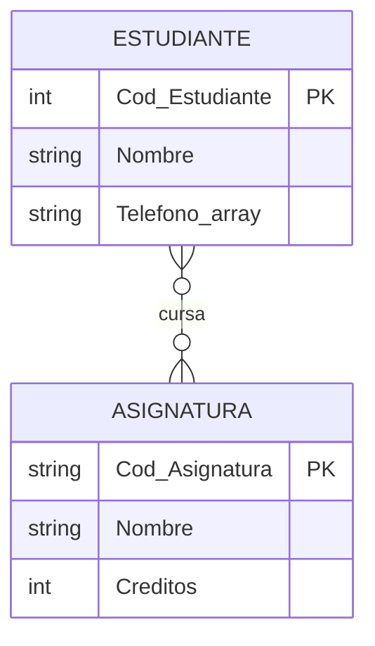

**Características del E/R:**
- Relación N:M directa (rombo)
- Atributo multivaluado: `{Teléfono}`
- Visual y gráfico

---

**MODELO RELACIONAL (Lógico):**

```
ESTUDIANTE(#Cod_Estudiante, Nombre)
ASIGNATURA(#Cod_Asignatura, Nombre, Créditos)
MATRÍCULA(#Cod_Estudiante, #Cod_Asignatura, Fecha, Nota)
  FK: Cod_Estudiante → ESTUDIANTE
  FK: Cod_Asignatura → ASIGNATURA
TELÉFONO_ESTUDIANTE(#Cod_Estudiante, #Teléfono, Tipo)
  FK: Cod_Estudiante → ESTUDIANTE
```

**Transformaciones aplicadas:**
1. ✅ Relación N:M → Tabla intermedia MATRÍCULA
2. ✅ Atributo multivaluado → Tabla TELÉFONO_ESTUDIANTE
3. ✅ Definidas claves primarias (PK) y foráneas (FK)
4. ✅ Normalización aplicada (cumple 1FN, 2FN, 3FN)

---

**MODELO FÍSICO (Implementación SQL en MySQL):**

```sql
CREATE TABLE ESTUDIANTE (
    Cod_Estudiante INT AUTO_INCREMENT PRIMARY KEY,
    Nombre VARCHAR(100) NOT NULL,
    INDEX idx_nombre (Nombre)
) ENGINE=InnoDB DEFAULT CHARSET=utf8mb4;

CREATE TABLE ASIGNATURA (
    Cod_Asignatura VARCHAR(10) PRIMARY KEY,
    Nombre VARCHAR(100) NOT NULL,
    Creditos TINYINT CHECK (Creditos > 0),
    INDEX idx_nombre (Nombre)
) ENGINE=InnoDB;

CREATE TABLE MATRICULA (
    Cod_Estudiante INT,
    Cod_Asignatura VARCHAR(10),
    Fecha_Matricula DATE DEFAULT CURRENT_DATE,
    Nota DECIMAL(4,2) CHECK (Nota BETWEEN 0 AND 10),
    PRIMARY KEY (Cod_Estudiante, Cod_Asignatura),
    FOREIGN KEY (Cod_Estudiante) REFERENCES ESTUDIANTE(Cod_Estudiante)
        ON DELETE CASCADE ON UPDATE CASCADE,
    FOREIGN KEY (Cod_Asignatura) REFERENCES ASIGNATURA(Cod_Asignatura)
        ON DELETE RESTRICT ON UPDATE CASCADE,
    INDEX idx_fecha (Fecha_Matricula)
) ENGINE=InnoDB;

CREATE TABLE TELEFONO_ESTUDIANTE (
    Cod_Estudiante INT,
    Telefono VARCHAR(15),
    Tipo ENUM('Móvil', 'Fijo', 'Trabajo') NOT NULL,
    PRIMARY KEY (Cod_Estudiante, Telefono),
    FOREIGN KEY (Cod_Estudiante) REFERENCES ESTUDIANTE(Cod_Estudiante)
        ON DELETE CASCADE
) ENGINE=InnoDB;
```

**Decisiones físicas específicas de MySQL:**
- Motor de almacenamiento: InnoDB (transaccional)
- AUTO_INCREMENT para claves primarias
- Índices para optimizar búsquedas
- Charset: utf8mb4 (soporte completo Unicode)
- Constraints: CHECK, ON DELETE CASCADE
- Tipos específicos: TINYINT, ENUM, DECIMAL

---

#### **¿Por qué esta separación?**

| Ventaja | Explicación |
|---------|-------------|
| **Independencia del SGBD** | El E/R es igual para MySQL, PostgreSQL u Oracle |
| **Comunicación** | Los usuarios entienden el E/R, los técnicos el Relacional |
| **Validación temprana** | Errores se detectan en E/R (fácil de corregir) |
| **Portabilidad** | Cambiar de SGBD solo afecta al nivel físico |
| **Evolución** | Modificar E/R sin tocar código SQL |
| **Normalización** | El paso E/R → Relacional aplica normalización |

---

<!-- ### 1.5. Resumen de la Distinción

**En este curso (Tema 2):**

```
Requisitos del Usuario
         ↓
📐 NIVEL CONCEPTUAL → Modelo Entidad/Relación (E/R)
         ↓ (Transformación)
📊 NIVEL LÓGICO → Modelo Relacional (Tablas, PK, FK)
         ↓ (Implementación)
💾 NIVEL FÍSICO → SQL en SGBD específico (MySQL, PostgreSQL...)
```

**Vocabulario correcto para este tema:**
- ✅ "Vamos a diseñar el **modelo conceptual E/R**"
- ✅ "Transformaremos el E/R al **modelo lógico relacional**"
- ✅ "Implementaremos el modelo relacional en **SQL físico**"

**Vocabulario INCORRECTO:**
- ❌ "El modelo conceptual son las tablas" → NO, las tablas son lógicas
- ❌ "El E/R y el relacional son lo mismo" → NO, son niveles diferentes
- ❌ "El nivel conceptual ANSI es el E/R" → NO, son contextos diferentes

---

**Ventajas de esta separación:**
- Cambiar de SGBD sin redesñar el modelo conceptual
- Validar requisitos antes de programar
- Optimizar implementación física sin alterar la lógica
- Documentación clara del sistema
- Diferentes equipos trabajan en diferentes niveles

---

### 1.4. Ventajas del Modelo E/R

#### **1.4.1. Comprensión global del sistema**
- Vista panorámica de todas las entidades
- Visualización de interrelaciones
- Validación con usuarios no técnicos

#### **1.4.2. Detección temprana de errores**

| Tipo de Error | Ejemplo | Detección con E/R |
|---------------|---------|-------------------|
| **Redundancia** | Información duplicada | Se identifica visualmente |
| **Omisión** | Entidades/relaciones faltantes | Se detecta en revisión |
| **Dependencias incorrectas** | Cardinalidades erróneas | Se corrige antes de implementar |
| **Anomalías** | Inconsistencias futuras | Se previenen en diseño |

#### **1.4.3. Comunicación multidisciplinar**

El modelo E/R sirve como "lengua franca" entre:
- 👔 **Analistas de negocio:** Validan procesos
- 💻 **Diseñadores de BD:** Traducen a esquemas
- 🔧 **Programadores:** Implementan la lógica
- 👥 **Usuarios finales:** Verifican necesidades

#### **1.4.4. Independencia del SGBD**

Un mismo diagrama E/R puede implementarse en:
- MySQL / MariaDB
- PostgreSQL
- Oracle Database
- Microsoft SQL Server
- SQLite

--- -->
<!-- ---

## 2. ELEMENTOS DEL MODELO ENTIDAD/RELACIÓN

**Pregunta de transición:** Una vez conocido el contexto y propósito del modelo E/R, ¿cuáles son sus componentes fundamentales?

| Elemento | Símbolo | Descripción | Notación Textual |
|----------|---------|-------------|------------------|
| **Entidad fuerte** | 🟦 Rectángulo simple | Objeto independiente | CLIENTE |
| **Entidad débil** | 🟦🟦 Rectángulo doble | Depende de otra entidad | HABITACIÓN |
| **Atributo** | ⭕ Óvalo | Propiedad de entidad/relación | Nombre |
| **Atributo clave** | <u>⭕</u> Óvalo subrayado | Identificador único | #DNI, #Cod_Cliente |
| **Atributo multivaluado** | ⭕⭕ Óvalo doble | Múltiples valores | {Teléfono} |
| **Atributo derivado** | ⊙ Óvalo punteado | Se calcula | (Edad) |
| **Relación** | 🔶 Rombo | Asociación entre entidades | realiza, contiene |
| **Relación identificadora** | 🔶🔶 Rombo doble | Relaciona débil con fuerte | tiene |

---

### Ejemplo de un Modelo E/R: Sistema de Biblioteca

**Pregunta:** ¿Cómo aplicamos el modelo E/R a un caso real?

#### **Enunciado:**
Una biblioteca gestiona libros, autores, socios y préstamos.

**Requisitos:**
1. Libros con ISBN, título, editorial, año de publicación
2. Cada libro puede tener varios autores
3. Socios con DNI, nombre, dirección, teléfono, email
4. Socios pueden pedir prestados varios libros
5. Registrar fechas de préstamo y devolución

#### **Paso 1: Identificar entidades**

| Entidad | Justificación | Tipo |
|---------|---------------|------|
| LIBRO | Objeto principal a gestionar | Fuerte |
| AUTOR | Información independiente | Fuerte |
| SOCIO | Usuario del sistema | Fuerte |
| PRÉSTAMO | Transacción de préstamo | Fuerte |

#### **Paso 2: Definir atributos**

```
LIBRO(#ISBN, Título, Editorial, Año_Publicación, Num_Páginas)
AUTOR(#Cod_Autor, Nombre, Apellidos, Nacionalidad, Fecha_Nacimiento)
SOCIO(#DNI, Nombre, Apellidos, Dirección, Teléfono, Email, Fecha_Inscripción)
PRÉSTAMO(#Cod_Préstamo, Fecha_Préstamo, Fecha_Devolución_Prevista, Fecha_Devolución_Real)
```

#### **Paso 3: Identificar relaciones**

| Relación | Entre | Cardinalidad | Atributos |
|----------|-------|--------------|-----------|
| ESCRITO_POR | LIBRO - AUTOR | N:M | Orden_Autor |
| REALIZA | SOCIO - PRÉSTAMO | 1:N | - |
| SE_PRESTA | LIBRO - PRÉSTAMO | 1:N | - |

#### **Paso 4: Diagrama E/R completo**

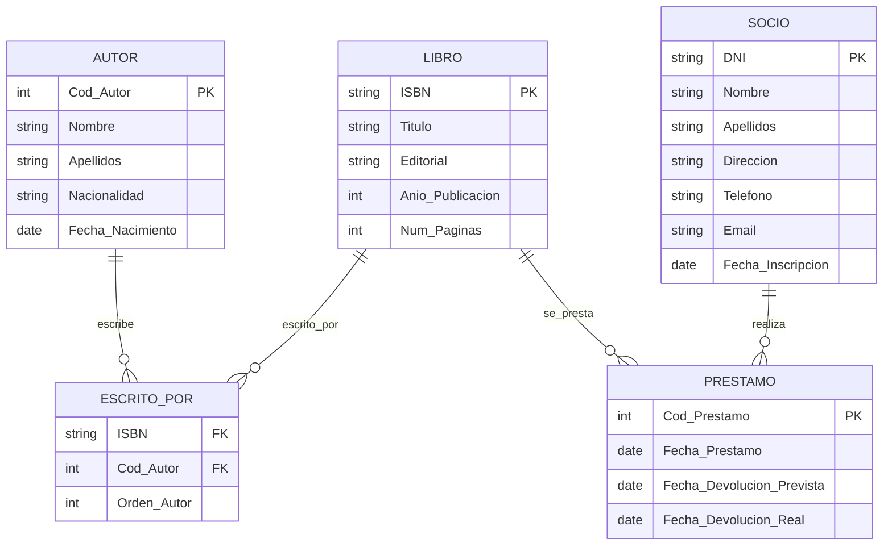

#### **Interpretación del diagrama:**

✅ **LIBRO - AUTOR (N:M):**
- Un libro puede tener varios autores
- Un autor puede escribir varios libros
- Se necesita tabla intermedia ESCRITO_POR

✅ **SOCIO - PRÉSTAMO (1:N):**
- Un socio puede realizar muchos préstamos
- Cada préstamo pertenece a un solo socio

✅ **LIBRO - PRÉSTAMO (1:N):**
- Un libro puede prestarse muchas veces (historial)
- Cada préstamo es de un solo libro

---

### 2.1. ENTIDADES

#### **2.1.1. Definición formal**

> **Entidad:** Conjunto de objetos reales o conceptuales del mundo real que tienen características comunes y sobre los cuales deseamos almacenar información.

**Características esenciales:**
- ✅ Tiene **existencia propia**
- ✅ Posee **atributos** que la describen
- ✅ Tiene un **identificador único**
- ✅ Agrupa **ocurrencias** (instancias concretas)

#### **2.1.2. Entidad vs Ocurrencia**

**Concepto fundamental:**

| Concepto | Definición | Analogía POO | Ejemplo |
|----------|------------|--------------|---------|
| **Entidad (Tipo)** | Concepto abstracto, plantilla | Clase | CLIENTE |
| **Ocurrencia (Instancia)** | Elemento concreto | Objeto | Cliente "Ana López" DNI:12345678A |

**Ejemplo práctico:**

```
ENTIDAD: ESTUDIANTE
├─ Ocurrencia 1: Ana García (Exp: 12345)
├─ Ocurrencia 2: Pedro Sánchez (Exp: 12346)
└─ Ocurrencia 3: Laura Martín (Exp: 12347)
```

#### **2.1.3. Ejemplos por sectores**

**Sector educativo:**
- ESTUDIANTE, PROFESOR, ASIGNATURA, AULA, MATRÍCULA

**Sector sanitario:**
- PACIENTE, MÉDICO, TRATAMIENTO, CONSULTA, HOSPITAL

**E-commerce:**
- CLIENTE, PRODUCTO, PEDIDO, CATEGORÍA, PROVEEDOR

**Gestión empresarial:**
- EMPLEADO, DEPARTAMENTO, PROYECTO, CLIENTE, FACTURA

#### **2.1.4. Tipos de entidades**

**Pregunta:** ¿Todas las entidades son iguales?

##### **A) Entidades Fuertes (Regulares)**

**Definición:** Existen por sí mismas, no dependen de otras entidades.

**Características:**
- Clave primaria **independiente**
- Representación: **rectángulo simple**
- Pueden existir sin otras entidades

**Ejemplos:**
```
CLIENTE(#DNI, Nombre, Dirección, Teléfono)
PRODUCTO(#Cod_Producto, Nombre, Precio, Stock)
EMPLEADO(#Num_Empleado, Nombre, Salario, Fecha_Contratación)
```

##### **B) Entidades Débiles**

**Definición:** Dependen de otra entidad para su existencia o identificación.

**Características:**
- **No tienen clave primaria propia suficiente**
- Su clave es **compuesta**: incluye clave de entidad fuerte + discriminante
- Representación: **rectángulo doble**
- Relación con entidad fuerte: **rombo doble**

**Ejemplo clásico: HOTEL - HABITACIÓN**

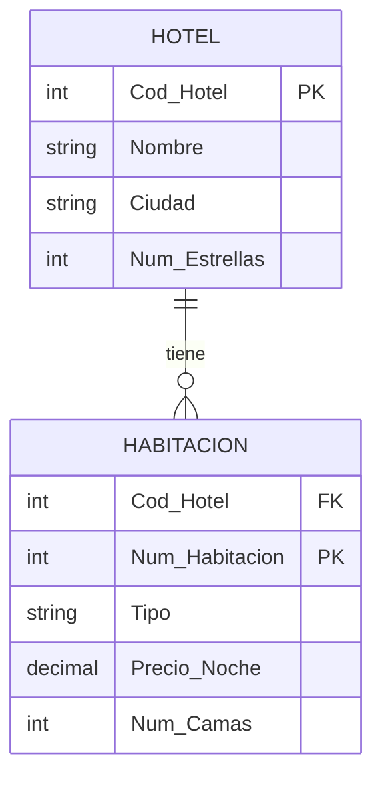

**Análisis:**
- HABITACIÓN no existe sin HOTEL
- Clave primaria: **(Cod_Hotel, Num_Habitacion)**
- Dos hoteles pueden tener habitación número 101
- `Cod_Hotel` es clave foránea y parte de la clave primaria

**Más ejemplos:**
```
PEDIDO ||--o{ LÍNEA_PEDIDO
  └─ Clave: (Num_Pedido, Num_Línea)

EDIFICIO ||--o{ DESPACHO
  └─ Clave: (Cod_Edificio, Num_Planta, Num_Despacho)

EMPLEADO ||--o{ FAMILIAR_A_CARGO
  └─ Clave: (DNI_Empleado, DNI_Familiar)
```

#### **2.1.5. Requisitos de una entidad válida**

Para considerar un concepto como entidad debe cumplir:

| Requisito | Descripción | ✅ Correcto | ❌ Incorrecto |
|-----------|-------------|-------------|---------------|
| **Múltiples ocurrencias** | Más de un elemento | CLIENTE (muchos clientes) | EMPRESA (solo una) |
| **Varios atributos** | Información compleja | PRODUCTO (código, nombre, precio...) | COLOR (solo nombre) |
| **Identificador único** | Distinguir ocurrencias | EMPLEADO (#DNI) | Sin clave definida |
| **Relevancia** | Aporta valor al sistema | PEDIDO (información necesaria) | DATO_IRRELEVANTE |

#### **2.1.6. Errores comunes**

##### **Error 1: Atributo como entidad**

❌ **Incorrecto:**
```
Entidad: TELÉFONO
Atributos: Número
```

✅ **Correcto:**
```
Entidad: CLIENTE
Atributos: #Cod_Cliente, Nombre, Teléfono
```

**Excepción válida:** Si necesitamos almacenar múltiples teléfonos con información adicional:

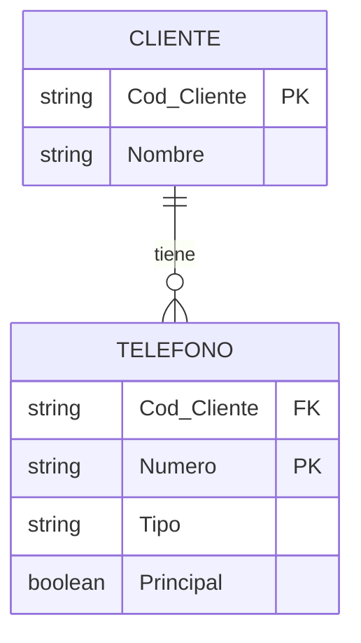

##### **Error 2: Relación como entidad**

❌ **Incorrecto:**
```
Entidad: MATRÍCULA (confunde acción con datos)
```

✅ **Correcto:**
```
Relación: SE_MATRICULA (ESTUDIANTE - ASIGNATURA)
Atributos de relación: Fecha_Matrícula, Nota
```

##### **Error 3: Sin identificador único**

❌ **Incorrecto:**
```
PRODUCTO(Nombre, Precio)
```

✅ **Correcto:**
```
PRODUCTO(#Cod_Producto, Nombre, Precio)
```

---

### 2.3. RELACIONES

**Pregunta de transición:** Tenemos entidades, ¿pero cómo se conectan entre sí?

#### **2.3.1. Definición**

> **Relación:** Asociación o vínculo significativo entre ocurrencias de una o más entidades que tiene significado en el contexto del sistema.

**Características:**
- Tiene un **nombre** (verbo o frase verbal)
- Conecta **dos o más entidades**
- Tiene **cardinalidad** (cuántas ocurrencias participan)
- Puede tener **atributos propios**
- Expresa **reglas de negocio**

**Representación:** Rombo con nombre del verbo

---

#### **2.3.2. Elementos de una relación**

##### **A) Nombre de la relación**

**Regla:** Usar **verbo** o **frase verbal** descriptiva.

**Buenos nombres:**
- REALIZA: CLIENTE realiza PEDIDO
- TRABAJA_EN: EMPLEADO trabaja_en DEPARTAMENTO
- IMPARTE: PROFESOR imparte ASIGNATURA
- PERTENECE_A: PRODUCTO pertenece_a CATEGORÍA
- ESCRIBE: AUTOR escribe LIBRO

**Malos nombres:**
- ❌ CLIENTE_PEDIDO (no es verbo)
- ❌ RELACIÓN1 (sin significado)
- ❌ TIENE (demasiado genérico)

**Test de validación:** Leer "Entidad1 [VERBO] Entidad2" debe tener sentido.

##### **B) Rol en relaciones**

En relaciones **reflexivas** o con **múltiples participaciones**, especificar el **rol**:

**Ejemplo 1: EMPLEADO supervisa EMPLEADO**
```
Roles:
- Supervisor (jefe)
- Supervisado (subordinado)
```

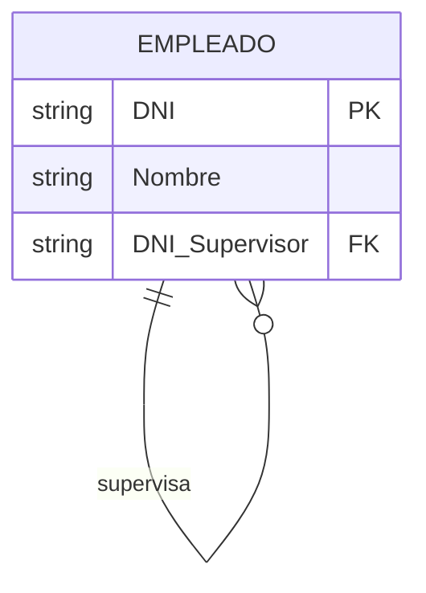

**Ejemplo 2: PERSONA casada_con PERSONA**
```
Roles:
- Cónyuge_1
- Cónyuge_2
```

---

#### **2.3.3. Tipos de relaciones**

##### **A) Relaciones Binarias** (las más comunes)

Conectan **dos entidades**.

**Ejemplo 1: CLIENTE realiza PEDIDO**

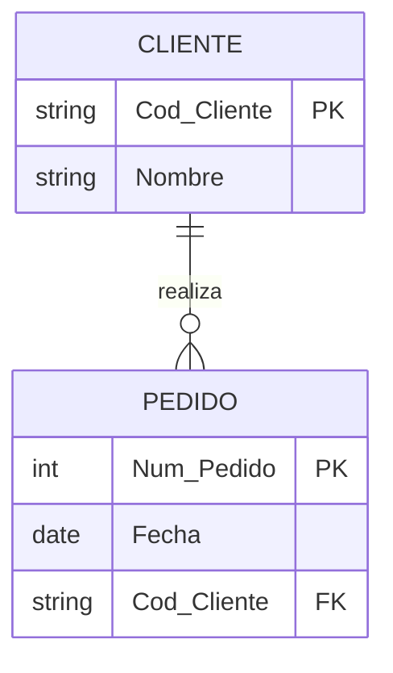

**Ejemplo 2: ESTUDIANTE cursa ASIGNATURA**

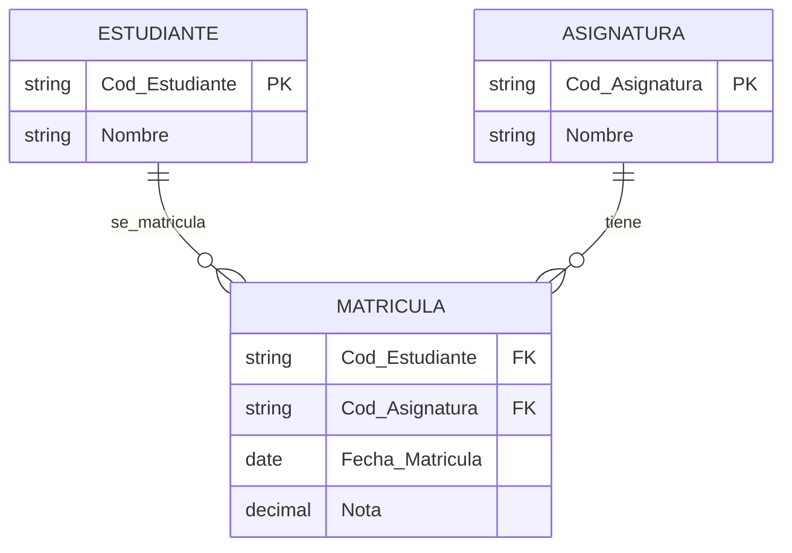

---

##### **B) Relaciones Ternarias**

Conectan **tres entidades** simultáneamente.

**¿Cuándo usar?** Cuando la asociación tiene sentido SOLO con las tres entidades juntas.

**Ejemplo: PROVEEDOR suministra PRODUCTO a PROYECTO**

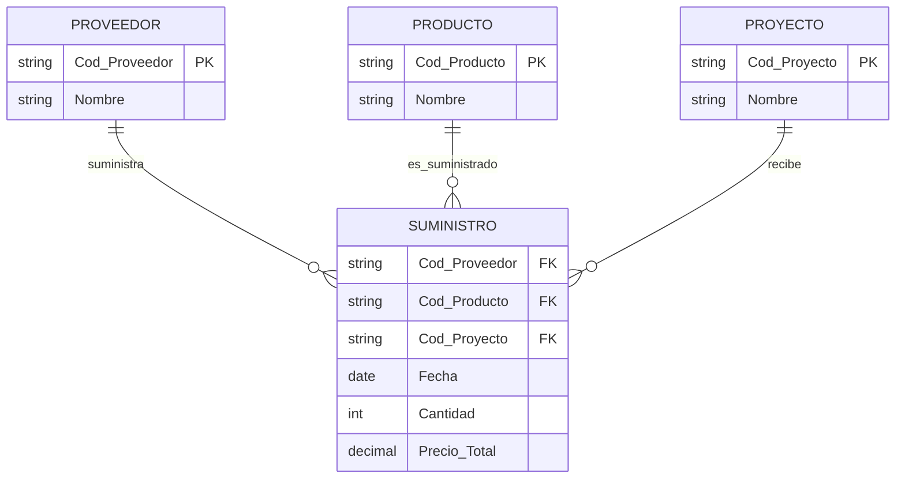

**Interpretación:**
- Proveedor X suministra Producto Y para Proyecto Z
- La fecha y cantidad dependen de las tres entidades

**Test de necesidad:**
- ¿Proveedor-Producto sin Proyecto? ❌ No tiene sentido
- ¿Producto-Proyecto sin Proveedor? ❌ No tiene sentido
- ¿Proveedor-Proyecto sin Producto? ❌ No tiene sentido

✅ **Necesitamos las tres → Relación ternaria genuina**

---

##### **C) Relaciones Reflexivas (Recursivas)**

Una entidad se relaciona **consigo misma**.

**Ejemplo 1: Jerarquía organizacional**

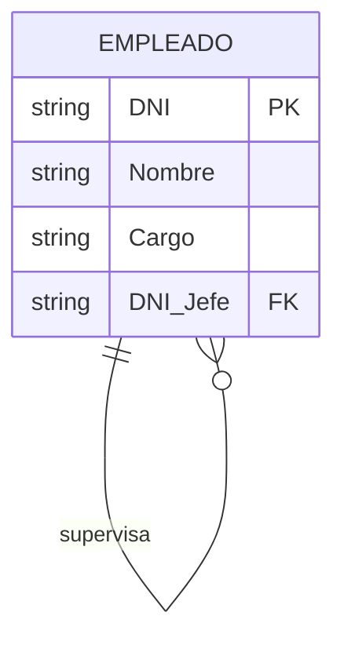

**Lectura:** Un empleado supervisa a otros empleados.

**Ejemplo 2: Prerrequisitos de asignaturas**

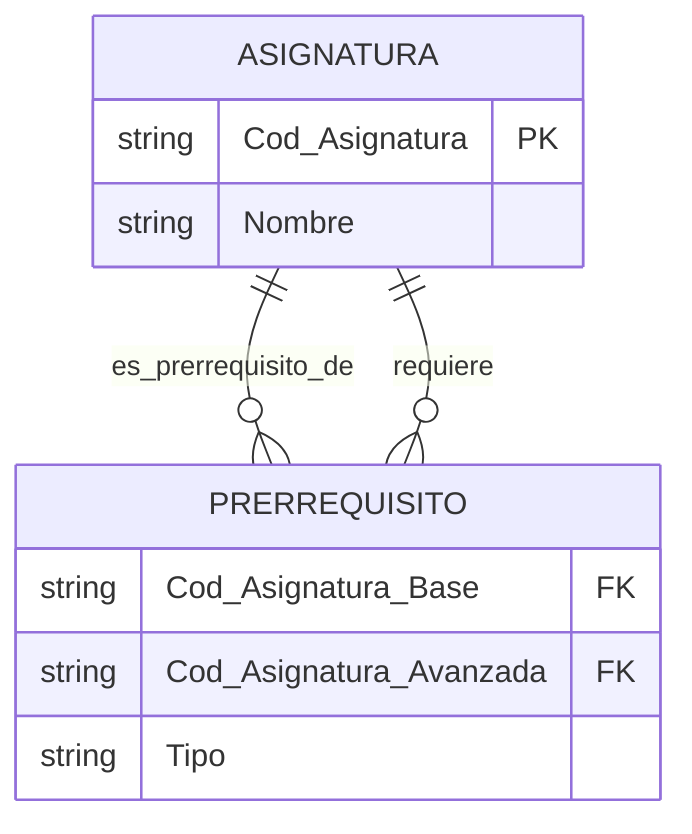

**Ejemplo 3: Red social - Amistades**

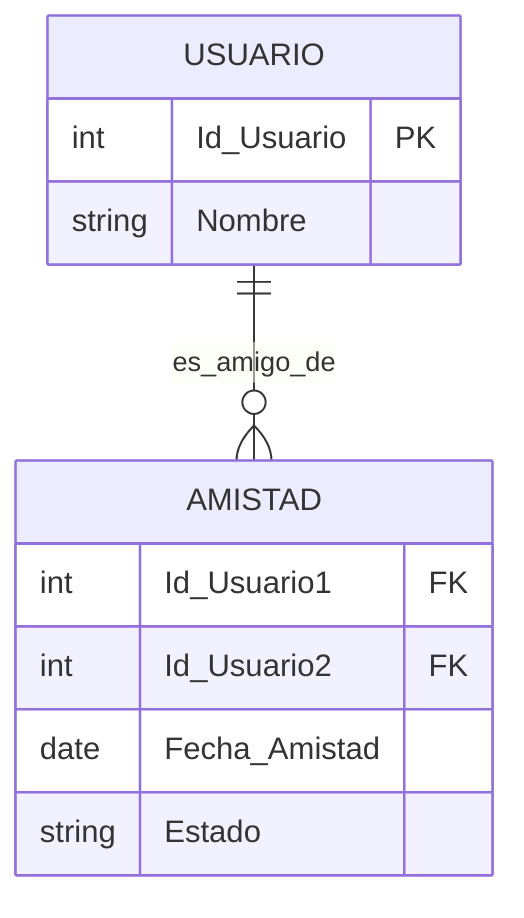

---

#### **2.3.4. Grado de las relaciones**

**Pregunta:** ¿Cuántas entidades participan en una relación?

| Grado | Nombre | Entidades | Ejemplo |
|-------|--------|-----------|---------|
| **1** | Unaria/Reflexiva | 1 | EMPLEADO supervisa EMPLEADO |
| **2** | Binaria | 2 | CLIENTE realiza PEDIDO |
| **3** | Ternaria | 3 | PROVEEDOR suministra PRODUCTO a PROYECTO |
| **N** | N-aria | 4 o más | MÉDICO prescribe MEDICAMENTO a PACIENTE en CONSULTA |

**Recomendación:** Preferir relaciones binarias. Descomponer n-arias cuando sea posible sin perder semántica.

---

#### **2.3.5. Cardinalidad de relaciones**

**Pregunta:** ¿Cuántas ocurrencias de una entidad se relacionan con cuántas de otra?

##### **Tipos de cardinalidad:**

###### **1. Relación 1:1 (Uno a Uno)**

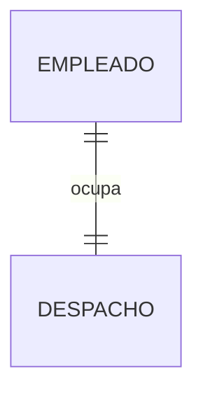

**Interpretación:**
- Cada empleado ocupa **como máximo un** despacho
- Cada despacho es ocupado por **como máximo un** empleado

**Ejemplos:**
- PERSONA - PASAPORTE
- PAÍS - CAPITAL
- EMPLEADO - PLAZA_PARKING

---

###### **2. Relación 1:N (Uno a Muchos)**

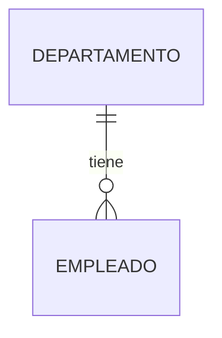

**Interpretación:**
- Un departamento tiene **muchos** empleados
- Un empleado pertenece a **un solo** departamento

**Ejemplos:**
- CLIENTE - PEDIDOS
- PROFESOR - TUTORÍAS
- CATEGORÍA - PRODUCTOS

---

###### **3. Relación N:M (Muchos a Muchos)**

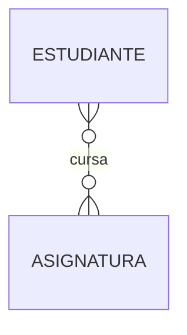

**Interpretación:**
- Un estudiante cursa **muchas** asignaturas
- Una asignatura es cursada por **muchos** estudiantes

**Implementación:** Requiere **tabla intermedia**

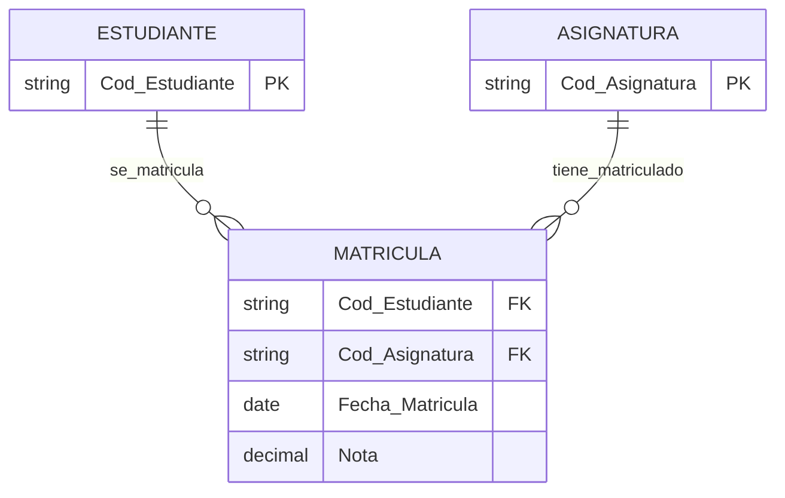

**Más ejemplos N:M:**
- ACTOR - PELÍCULA
- INGREDIENTE - RECETA
- PROVEEDOR - PRODUCTO

---

#### **2.3.6. Participación: Total vs Parcial**

**Pregunta:** ¿Es obligatorio u opcional participar en la relación?

##### **A) Participación Total (Obligatoria)**

**Toda** ocurrencia de la entidad **debe** participar.

**Notación:** Línea doble `||` o mínimo = 1

**Ejemplos:**
- Todo PEDIDO debe tener un CLIENTE
- Todo EMPLEADO debe pertenecer a un DEPARTAMENTO
- Toda MATRÍCULA debe tener un ESTUDIANTE

```
CLIENTE ||--|| PEDIDO
         ↑
   Obligatorio
```

##### **B) Participación Parcial (Opcional)**

**Algunas** ocurrencias pueden no participar.

**Notación:** Línea simple `|` o mínimo = 0

**Ejemplos:**
- Un CLIENTE puede no tener PEDIDOS (recién registrado)
- Un PROFESOR puede no impartir ASIGNATURA actualmente
- Un PRODUCTO puede no estar en ningún PEDIDO

```
CLIENTE ||--o{ PEDIDO
            ↑
        Opcional
```

---

##### **C) Notación (mín, máx)**

Formato preciso que indica participación mínima y máxima.

| Notación | Significado |
|----------|-------------|
| **(0,1)** | Opcional, máximo 1 |
| **(1,1)** | Obligatorio, exactamente 1 |
| **(0,N)** | Opcional, pueden ser varios |
| **(1,N)** | Obligatorio, al menos 1 |
| **(2,5)** | Mínimo 2, máximo 5 |

**Ejemplo completo:**

```
CLIENTE (1,1) ---- realiza ---- (0,N) PEDIDO
```

**Lectura:**
- Cada PEDIDO es realizado por **exactamente 1** CLIENTE (1,1)
- Cada CLIENTE puede realizar **0 o muchos** PEDIDOS (0,N)

---

#### **2.3.7. Relaciones múltiples entre entidades**

Dos entidades pueden tener **varias relaciones** diferentes.

**Ejemplo 1: PERSONA - CIUDAD**

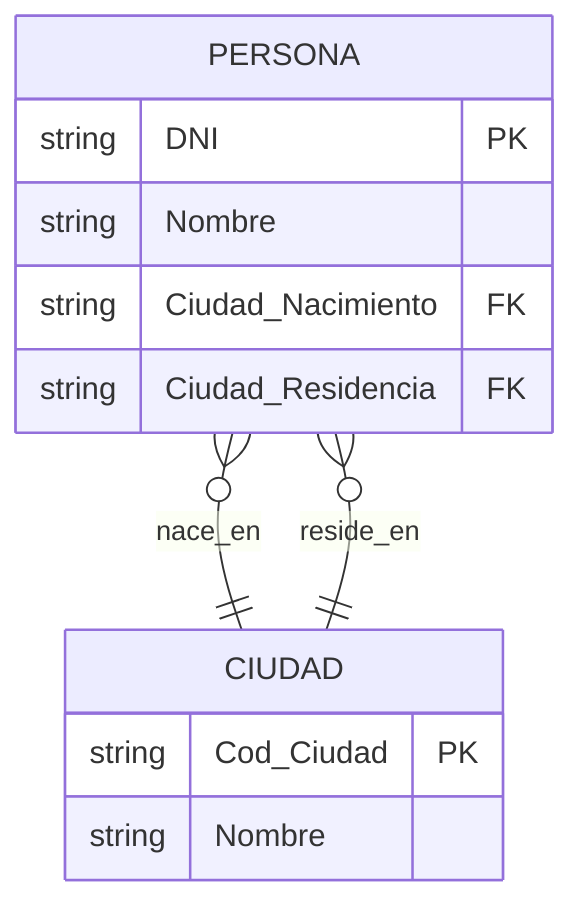

**Ejemplo 2: EMPLEADO - DEPARTAMENTO**

```
EMPLEADO (N) -- trabaja_en -- (1) DEPARTAMENTO
EMPLEADO (1) -- dirige -- (0..1) DEPARTAMENTO
```

Un empleado trabaja en un departamento, pero además puede dirigirlo.

---

## 🎯 Resumen y Conclusiones

### Conceptos Clave Aprendidos

**1. Modelo E/R:**
- Modelo conceptual independiente del SGBD
- Propuesto por Peter Chen (1976)
- Nivel de abstracción conceptual
- Base para modelo lógico relacional

**2. Entidades:**
- Objetos del mundo real con características comunes
- **Fuertes:** Existencia independiente
- **Débiles:** Dependen de otras entidades
- Tienen atributos e identificadores únicos

**3. Atributos:**
- Propiedades que describen entidades/relaciones
- **Simples** vs **Compuestos**
- **Monovaluados** vs **Multivaluados**
- **Almacenados** vs **Derivados**
- Claves: Candidatas, Primarias, Alternativas, Compuestas

**4. Relaciones:**
- Asociaciones entre entidades
- **Grado:** Binarias, Ternarias, N-arias, Reflexivas
- **Cardinalidad:** 1:1, 1:N, N:M
- **Participación:** Total (obligatoria), Parcial (opcional)
- Pueden tener atributos propios

---


### 2.2. ATRIBUTOS

**Pregunta de transición:** Ya sabemos identificar entidades, ¿pero qué información guardamos de cada una?

#### **2.2.1. Definición**

> **Atributo:** Propiedad o característica que describe una entidad o relación. Representa datos específicos que almacenamos sobre cada ocurrencia.

**Elementos de un atributo:**
- **Nombre:** Identificador descriptivo
- **Dominio:** Conjunto de valores posibles
- **Cardinalidad:** Obligatorio/opcional
- **Tipo:** Simple/compuesto/multivaluado/derivado

**Notación textual:**
```
ENTIDAD(atributo1, atributo2, atributo3, ...)
CLIENTE(#Cod_Cliente, Nombre, Apellidos, Email, Teléfono, Dirección)
```

#### **2.2.2. Clasificación completa**

##### **A) Por su función**

| Tipo | Símbolo | Descripción | Ejemplo |
|------|---------|-------------|---------|
| **Clave (Identificador)** | # o subrayado | Distingue unívocamente | #DNI, #Cod_Producto |
| **Descriptor** | Normal | Información adicional | Nombre, Teléfono, Precio |

##### **B) Por su estructura**

###### **1. Atributos Simples (Atómicos)**

**Definición:** No se pueden dividir en componentes más pequeños.

**Ejemplos:**
- Edad: `25`
- Precio: `19.99`
- Stock: `150`
- DNI: `12345678A`

```
PRODUCTO(#Cod_Producto, Nombre, Precio, Stock)
```

---

###### **2. Atributos Compuestos**

**Definición:** Se pueden dividir en subatributos con significado propio.

**Ejemplo 1: Dirección**
```
Dirección
├── Calle: "Gran Vía"
├── Número: "28"
├── Piso: "3ºB"
├── Código_Postal: "28013"
└── Ciudad: "Madrid"
```

**Ejemplo 2: Nombre Completo**
```
Nombre_Completo
├── Nombre: "Ana"
├── Apellido1: "García"
└── Apellido2: "López"
```

**Decisión de diseño:**

| Caso | Solución |
|------|----------|
| Buscar por ciudad/CP | ✅ Dividir atributo |
| Siempre usar completo | ✅ Mantener simple |
| Consultas mixtas | ✅ Dividir siempre |

**Implementación:**
```
CLIENTE(#Cod_Cliente, Nombre, Apellido1, Apellido2, 
        Calle, Numero, Piso, CP, Ciudad)
```

---

###### **3. Atributos Multivaluados**

**Definición:** Pueden tener múltiples valores para una misma ocurrencia.

**Notación:** Llaves `{}` o óvalo doble

**Ejemplos:**
```
PROFESOR(#DNI, Nombre, {Teléfono}, {Idioma}, {Email})
PERSONA(#DNI, Nombre, {Titulación_Universitaria})
PRODUCTO(#Cod_Producto, Nombre, {Color_Disponible})
```

<!-- **Problema:** Violan la Primera Forma Normal (1FN). -->

<!-- **Solución:** Crear entidad relacionada (débil):

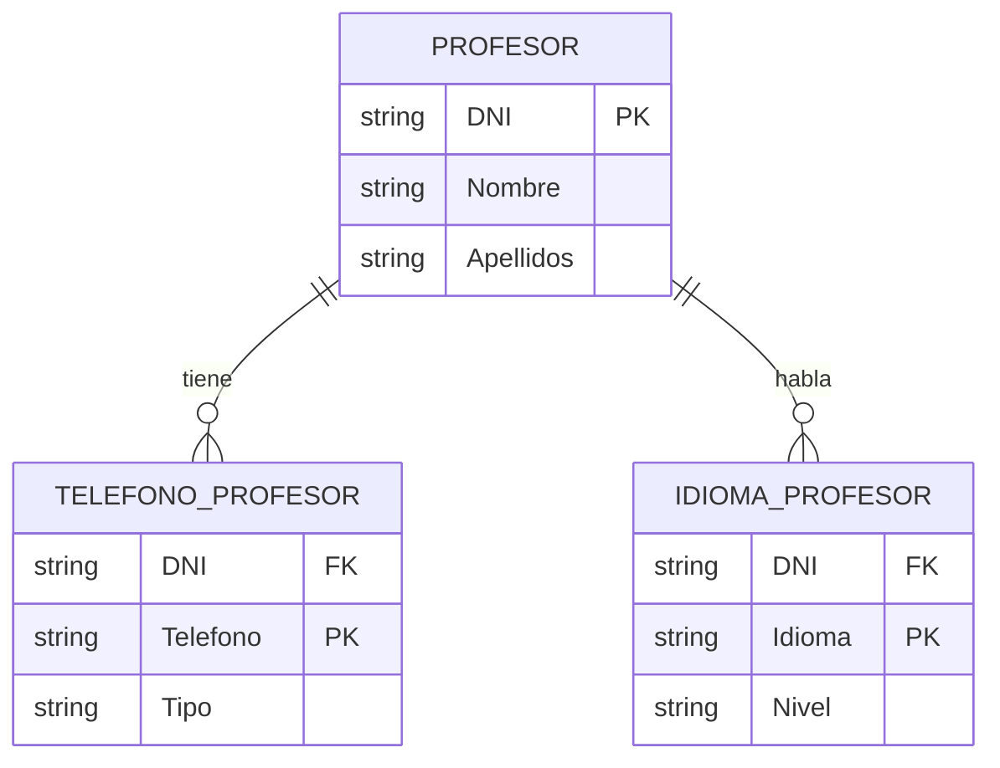

---

###### **4. Atributos Derivados**

**Definición:** Su valor se calcula a partir de otros atributos.

**Notación:** Paréntesis `()` o óvalo punteado

| Atributo Derivado | Fórmula | Atributos Base |
|-------------------|---------|----------------|
| (Edad) | `YEAR(NOW()) - YEAR(Fecha_Nacimiento)` | Fecha_Nacimiento |
| (Total_Pedido) | `SUM(Cantidad × Precio)` | Líneas del pedido |
| (Antigüedad) | `DATEDIFF(NOW(), Fecha_Contratación)` | Fecha_Contratación |
| (IMC) | `Peso / (Altura²)` | Peso, Altura |
| (Precio_Con_IVA) | `Precio_Base × 1.21` | Precio_Base |

**Ejemplo:**
```
EMPLEADO(#DNI, Nombre, Fecha_Nacimiento, (Edad), 
         Fecha_Contratación, (Antigüedad), 
         Salario_Base, Complementos, (Salario_Total))
```

**¿Almacenar o calcular?**

| Criterio | Almacenar | Calcular |
|----------|-----------|----------|
| **Rendimiento** | ✅ Más rápido | ❌ Más lento |
| **Consistencia** | ❌ Puede desactualizarse | ✅ Siempre correcto |
| **Espacio** | ❌ Ocupa más | ✅ Ahorra espacio |
| **Auditoría** | ✅ Valor histórico | ❌ No guarda historial |

**Decisión:** Calcular por defecto, almacenar solo si hay requisitos de rendimiento o auditoría.

---

#### **2.2.3. Dominios de atributos**

**Pregunta:** ¿Qué valores puede tomar cada atributo?

> **Dominio:** Conjunto de valores válidos que puede tomar un atributo.

| Tipo de Dominio | Descripción | Ejemplo SQL | Valores |
|-----------------|-------------|-------------|---------|
| **Entero** | Números sin decimales | `INT` | Edad: 0-120, Stock: 0-99999 |
| **Decimal** | Números con decimales | `DECIMAL(10,2)` | Precio: 0.00-99999.99 |
| **Cadena fija** | Texto longitud fija | `CHAR(9)` | DNI: "12345678A" |
| **Cadena variable** | Texto longitud variable | `VARCHAR(100)` | Nombre, Email |
| **Fecha** | Fechas | `DATE` | 2025-11-11 |
| **Hora** | Horas | `TIME` | 14:30:00 |
| **Fecha-Hora** | Marca temporal | `DATETIME` | 2025-11-11 14:30:00 |
| **Booleano** | Verdadero/Falso | `BOOLEAN` | Activo: TRUE/FALSE |
| **Enumerado** | Lista cerrada | `ENUM` | Estado: {Pendiente, Enviado, Entregado} |

**Ejemplo de especificación completa:**
```sql
CREATE TABLE PRODUCTO (
    Cod_Producto VARCHAR(10) PRIMARY KEY,
    Nombre VARCHAR(100) NOT NULL,
    Descripcion TEXT,
    Precio DECIMAL(10,2) CHECK (Precio >= 0),
    Stock INT CHECK (Stock >= 0),
    Fecha_Alta DATE DEFAULT CURRENT_DATE,
    Activo BOOLEAN DEFAULT TRUE,
    Categoria ENUM('Electrónica', 'Informática', 'Hogar')
);
```

---

#### **2.2.4. Claves: Identificadores Únicos**

**Pregunta:** ¿Cómo distinguimos una ocurrencia de otra?

##### **Clave Candidata**

> Conjunto **mínimo** de atributos que identifica **unívocamente** cada ocurrencia.

**Propiedades:**
1. **Unicidad:** No hay dos ocurrencias con mismos valores
2. **Minimalidad:** No se puede quitar ningún atributo sin perder unicidad

**Ejemplo:**
```
ESTUDIANTE(DNI, Num_Matrícula, Email, Nombre)
```

Claves candidatas:
- `{DNI}` → Único por persona
- `{Num_Matrícula}` → Único por estudiante
- `{Email}` → Si no se permiten duplicados

##### **Clave Primaria (Primary Key - PK)**

> Clave candidata **elegida** como identificador principal.

**Notación:** Subrayado o símbolo #

**Criterios de selección:**

| Criterio | Descripción | Ejemplo |
|----------|-------------|---------|
| **Estabilidad** | No cambia con el tiempo | ✅ Cod_Cliente vs ❌ Email |
| **Simplicidad** | Preferir simples a compuestas | ✅ DNI vs ❌ (Nombre+Apellidos+Fecha) |
| **Tamaño** | Atributos pequeños | ✅ INT vs ❌ VARCHAR(200) |
| **Sin significado** | Códigos autogenerados | ✅ Cod_Producto vs ❌ Nombre |

**Ejemplo:**
```
ESTUDIANTE(#Num_Matrícula, DNI, Email, Nombre)
         ↑ Clave primaria elegida
```

##### **Clave Alternativa (Alternate Key - AK)**

> Claves candidatas **no elegidas** como primaria, pero mantienen unicidad.

**Implementación:**
```sql
CREATE TABLE ESTUDIANTE (
    Num_Matricula INT PRIMARY KEY,        -- Clave primaria
    DNI VARCHAR(9) UNIQUE NOT NULL,       -- Clave alternativa
    Email VARCHAR(100) UNIQUE,            -- Clave alternativa
    Nombre VARCHAR(100) NOT NULL
);
```

##### **Clave Compuesta**

> Clave primaria formada por **dos o más atributos**.

**Ejemplo 1: Matrícula**
```
MATRÍCULA(#Cod_Estudiante, #Cod_Asignatura, #Año_Académico, Nota)
```

Un estudiante puede matricularse en la misma asignatura en diferentes años.

**Ejemplo 2: Detalle de pedido**
```
LÍNEA_PEDIDO(#Num_Pedido, #Num_Línea, Cod_Producto, Cantidad, Precio)
```

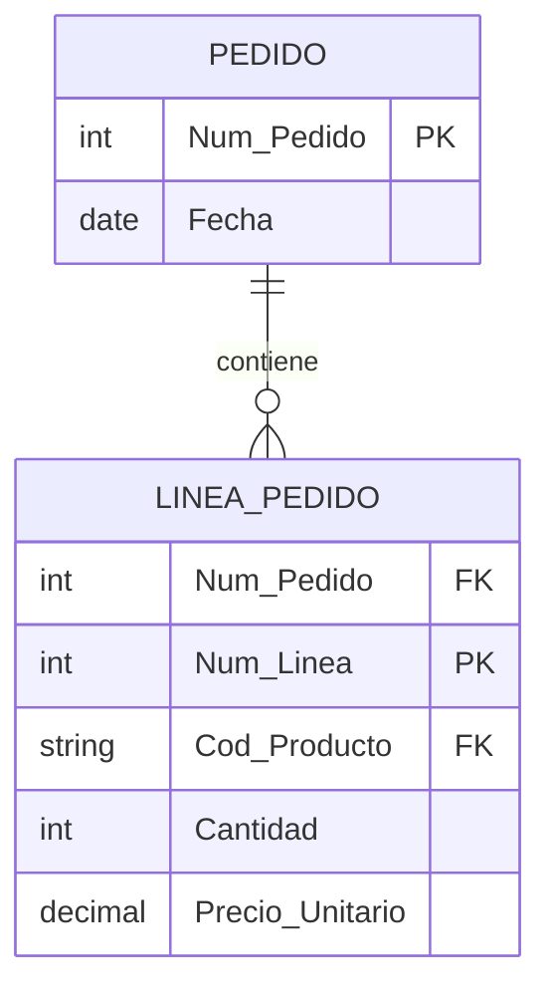

---

#### **2.2.5. Atributos en relaciones**

**Pregunta:** ¿Solo las entidades tienen atributos?

**Respuesta:** No, las **relaciones** también pueden tener atributos propios.

##### **¿Cuándo un atributo pertenece a la relación?**

Un atributo es de la relación si:
- ❌ No puede asociarse a ninguna entidad individualmente
- ✅ Su valor depende de la **combinación** de entidades participantes

**Ejemplo 1: EMPLEADO trabaja_en PROYECTO**

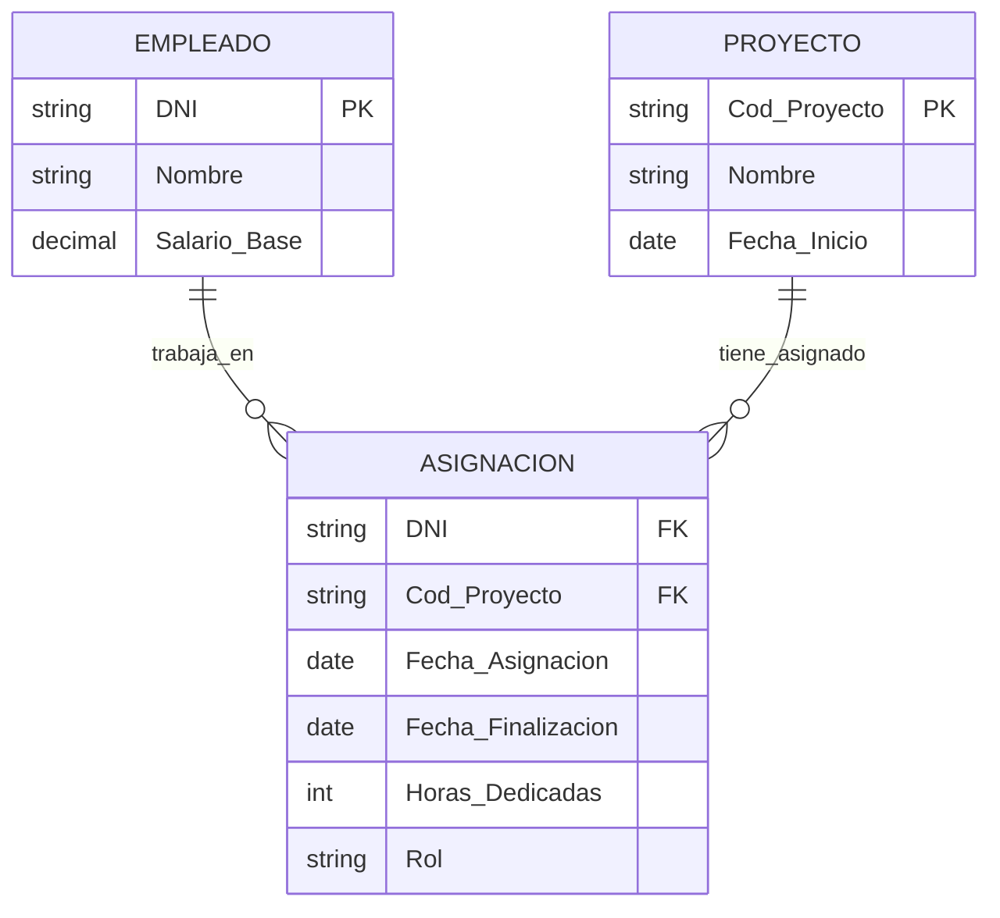

**Análisis de atributos:**
- `Fecha_Asignación`: ¿Del empleado? No. ¿Del proyecto? No. → **De la relación**
- `Rol`: "Analista" en proyecto A, "Desarrollador" en proyecto B → **De la relación**
- `Horas_Dedicadas`: Depende de qué empleado en qué proyecto → **De la relación**

**Ejemplo 2: ESTUDIANTE cursa ASIGNATURA**

```
Relación: MATRÍCULA
Atributos de relación:
- Fecha_Matrícula
- Convocatoria (1ª, 2ª, 3ª...)
- Nota (depende del estudiante Y la asignatura)
```

**Ejemplo 3: ACTOR actúa_en PELÍCULA**

```
Relación: ACTUACIÓN
Atributos de relación:
- Nombre_Personaje
- Tipo_Papel (principal, secundario, cameo)
- Cachê (lo cobrado por esa película específica)
```

---

#### **2.2.6. Errores comunes con atributos**

##### **Error 1: Multivaluados sin normalizar**

❌ **Incorrecto:**
```
CLIENTE(#Cod_Cliente, Nombre, Teléfonos)
Ejemplo: ("001", "Juan", "666111222, 911333444")
```

✅ **Correcto:**
```
CLIENTE(#Cod_Cliente, Nombre)
TELÉFONO(#Cod_Cliente, #Teléfono, Tipo)
```

##### **Error 2: Compuestos sin dividir cuando necesario**

❌ **Incorrecto** (si buscamos por ciudad):
```
CLIENTE(#Cod_Cliente, Nombre, Dirección_Completa)
```

✅ **Correcto:**
```
CLIENTE(#Cod_Cliente, Nombre, Calle, Número, Piso, CP, Ciudad)
```

##### **Error 3: Almacenar derivados sin justificación**

❌ **Incorrecto:**
```
PERSONA(#DNI, Nombre, Fecha_Nacimiento, Edad)
-- Edad se desactualiza
```

✅ **Correcto:**
```
PERSONA(#DNI, Nombre, Fecha_Nacimiento, (Edad))
-- Calcular: YEAR(CURDATE()) - YEAR(Fecha_Nacimiento)
```

##### **Error 4: Claves primarias inestables**

❌ **Incorrecto:**
```
CLIENTE(#Email, Nombre, Teléfono)
-- Email puede cambiar
```

✅ **Correcto:**
```
CLIENTE(#Cod_Cliente, Nombre, Email, Teléfono)
```

---


### Pregunta de Reflexión

**¿Por qué es tan importante diseñar bien el modelo E/R?**

✅ Un buen diseño conceptual:
- Evita redundancias e inconsistencias
- Facilita implementación y mantenimiento
- Previene errores costosos
- Documenta el sistema de forma comprensible
- Permite evolución del sistema

❌ Un mal diseño conceptual:
- Genera bases de datos problemáticas
- Dificulta consultas y actualizaciones
- Causa pérdida de información
- Complica mantenimiento
- Requiere rediseños costosos

--- --> -->
