# Presentación: Modelo Entidad/Relación (E/R)

**Bases de Datos - 1º DAW**  
**Unidad 2: Diseño Conceptual de Bases de Datos**

---

## 📋 Índice de la Presentación

1. Introducción al Modelo E/R
2. Elementos Básicos del Modelo
3. Entidades Débiles y Fuertes
4. Relaciones N-arias
5. Control de Redundancia
6. Modelo E/R Extendido
7. Del Modelo E/R al Relacional

---

## 1. Introducción al Modelo E/R

### ¿Qué es el Modelo Entidad/Relación?

- **Creador:** Peter Chen (1976)
- **Propósito:** Representar la estructura lógica de una base de datos
- **Nivel:** Diseño conceptual (independiente del SGBD)

### ¿Por qué necesitamos el Modelo E/R?

**Pregunta inicial:** ¿Qué pasaría si empezamos a crear tablas en SQL sin planificar?

**Problemas sin diseño previo:**
- ❌ Datos duplicados
- ❌ Información inconsistente
- ❌ Dificultad para consultar datos
- ❌ Mantenimiento complicado
- ❌ Errores difíciles de corregir

**Beneficios del Modelo E/R:**
- ✅ Visualización clara de la estructura
- ✅ Comunicación con usuarios no técnicos
- ✅ Detección temprana de errores
- ✅ Base sólida para implementación SQL
- ✅ Documentación del sistema

---

### Los Tres Niveles de Abstracción

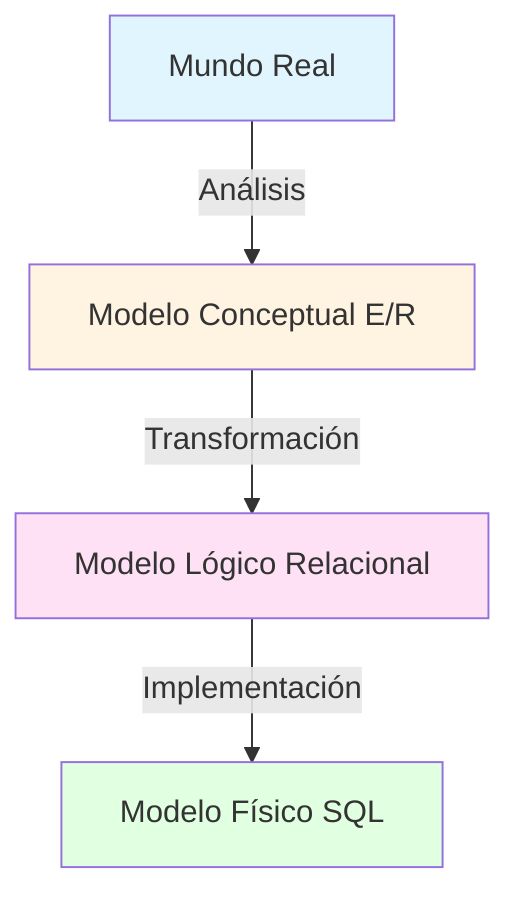

1. **Conceptual (E/R):** ¿QUÉ información necesitamos?
2. **Lógico (Relacional):** ¿CÓMO organizamos esa información?
3. **Físico (SQL):** ¿DÓNDE y cómo la almacenamos?

---

### Notación Básica del Modelo E/R

| Elemento | Representación | Significado |
|----------|----------------|-------------|
| **Entidad** | 🟦 Rectángulo | Objeto del mundo real |
| **Atributo** | 🟨 Óvalo | Propiedad de una entidad |
| **Relación** | 🟥 Rombo | Asociación entre entidades |
| **Clave primaria** | Subrayado | Identificador único |

**Ejemplo visual:**

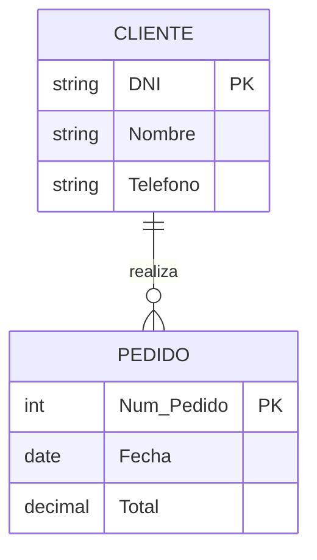

---

## 2. Elementos Básicos del Modelo

### 2.1. Entidades

**Pregunta:** ¿Qué objetos de la realidad debemos representar en nuestra base de datos?

**Definición:** Una **entidad** es un conjunto de objetos con características comunes sobre los que necesitamos almacenar información.

**Ejemplos:**
- 📚 Biblioteca → LIBRO, AUTOR, SOCIO
- 🏥 Hospital → PACIENTE, MÉDICO, HABITACIÓN
- 🛒 Tienda → PRODUCTO, CLIENTE, PEDIDO

### Tipos de Entidades

#### **Entidad Fuerte**
- Existe por sí misma
- Tiene su propia clave primaria
- Ejemplo: CLIENTE (identificado por DNI)

#### **Entidad Débil**
- Depende de otra entidad para existir
- Su clave incluye la clave de otra entidad
- Ejemplo: HABITACIÓN (depende de HOTEL)

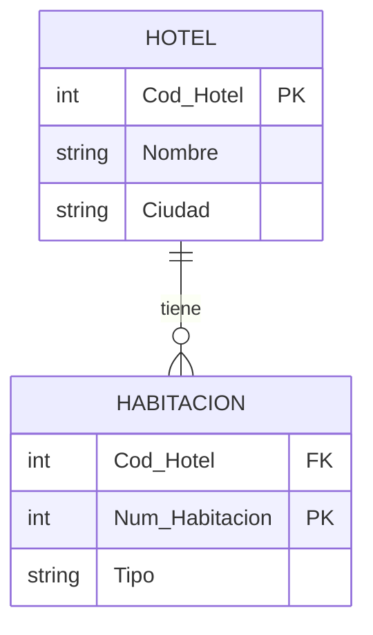

---

### 2.2. Atributos

**Pregunta:** ¿Qué información necesitamos guardar de cada entidad?

**Definición:** Propiedades o características que describen una entidad.

#### Clasificación de Atributos

**1. Simples vs Compuestos**

```
EMPLEADO
├─ DNI (simple)
├─ Salario (simple)
└─ Dirección (compuesto)
   ├─ Calle
   ├─ Número
   ├─ Código Postal
   └─ Ciudad
```

**2. Monovaluados vs Multivaluados**

- **Monovaluado:** Un solo valor → `Fecha_Nacimiento`
- **Multivaluado:** Múltiples valores → `Teléfonos {}`

**3. Almacenados vs Derivados**

- **Almacenado:** Se guarda → `Fecha_Nacimiento`
- **Derivado:** Se calcula → `Edad` (a partir de fecha de nacimiento)

---

### Claves: Identificadores Únicos

**Pregunta:** ¿Cómo distinguimos una ocurrencia de otra?

| Tipo de Clave | Definición | Ejemplo |
|---------------|------------|---------|
| **Clave Candidata** | Puede identificar unívocamente | DNI, Email, Num_Seguridad_Social |
| **Clave Primaria** | Candidata elegida como principal | DNI |
| **Clave Alternativa** | Candidatas no elegidas | Email |
| **Clave Compuesta** | Formada por 2+ atributos | (ISBN, Num_Ejemplar) |

**Propiedades de una buena clave primaria:**
1. ✅ **Única:** No se repite
2. ✅ **No nula:** Siempre tiene valor
3. ✅ **Inmutable:** No cambia en el tiempo
4. ✅ **Simple:** Lo más corta posible

---

### 2.3. Relaciones

**Pregunta:** ¿Cómo se asocian las entidades entre sí?

**Definición:** Asociación significativa entre entidades.

**Ejemplo básico:**

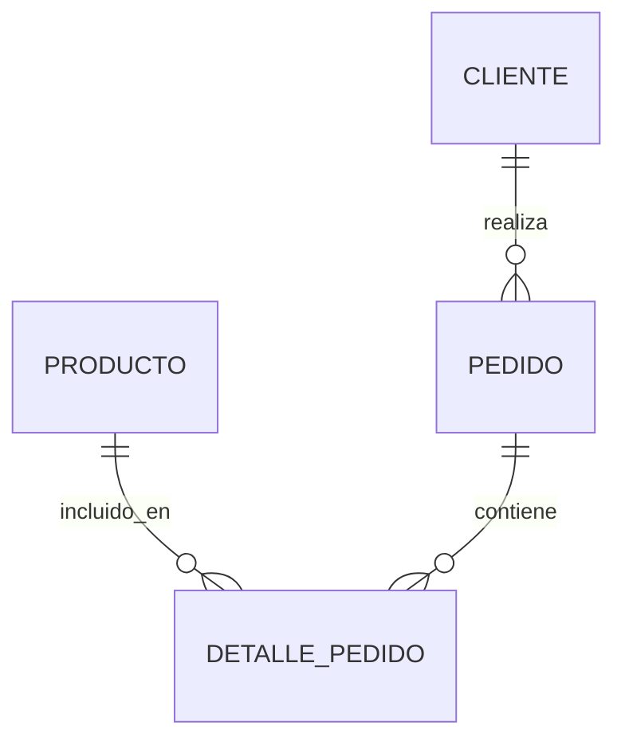

### Elementos de una Relación

1. **Nombre:** Verbo que describe la asociación
2. **Entidades participantes:** 2 o más entidades
3. **Grado:** Número de entidades que participan
4. **Cardinalidad:** Cuántas ocurrencias se relacionan
5. **Participación:** Obligatoria (total) u opcional (parcial)

---

### 2.4. Grado de las Relaciones

**Pregunta:** ¿Cuántas entidades intervienen en una relación?

#### **Relación Unaria (Grado 1)**
Una entidad consigo misma.

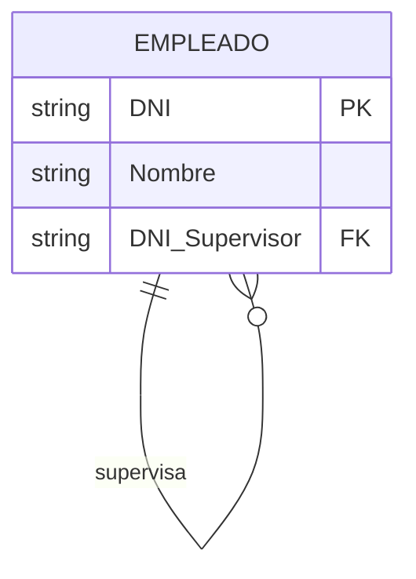

**Ejemplo:** Un empleado supervisa a otros empleados.

---

#### **Relación Binaria (Grado 2)**
Dos entidades relacionadas. **¡La más común!**

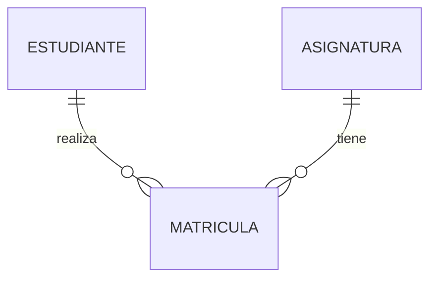

**Ejemplo:** Estudiantes se matriculan en asignaturas.

---

#### **Relación Ternaria (Grado 3)**
Tres entidades simultáneamente.

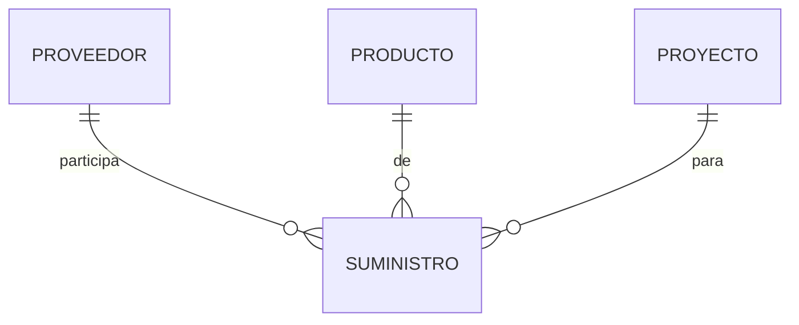

**Ejemplo:** Un proveedor suministra un producto a un proyecto (las tres son necesarias).

---

### 2.5. Cardinalidad de las Relaciones

**Pregunta:** ¿Cuántas ocurrencias de una entidad se relacionan con cuántas de otra?

#### **Tipos de Cardinalidad**

**1. Relación 1:1 (Uno a Uno)**

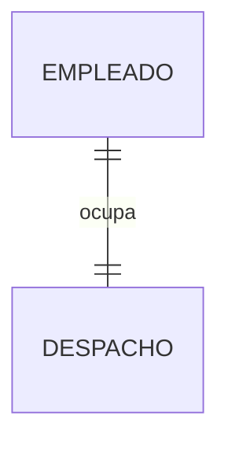

- Un empleado ocupa un despacho
- Un despacho es ocupado por un empleado

**Ejemplo:** PERSONA - PASAPORTE

---

**2. Relación 1:N (Uno a Muchos)**

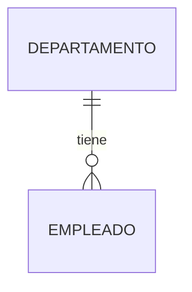

- Un departamento tiene muchos empleados
- Un empleado pertenece a un departamento

**Ejemplo:** MADRE - HIJOS

---

**3. Relación N:M (Muchos a Muchos)**

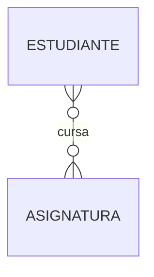

- Un estudiante cursa muchas asignaturas
- Una asignatura es cursada por muchos estudiantes

**Ejemplo:** ACTORES - PELÍCULAS

---

### Participación: Total vs Parcial

**Notación:**
- **Línea doble (||):** Participación total (obligatoria)
- **Línea simple (|):** Participación parcial (opcional)

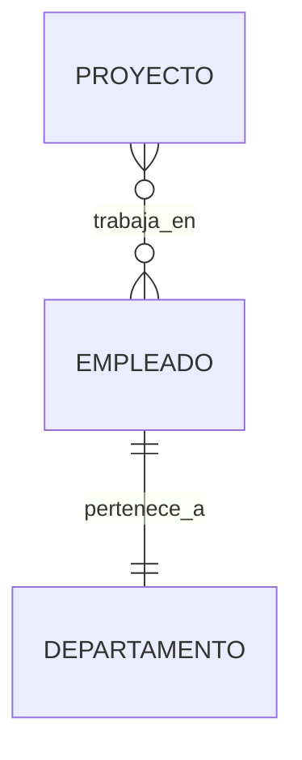

- **Todo empleado DEBE pertenecer a un departamento** (total)
- **No todo empleado trabaja en proyectos** (parcial)

---

### 2.6. Atributos en Relaciones

**Pregunta:** ¿Dónde colocamos la información sobre la relación misma?

**Regla:** Si un atributo **depende de la combinación de dos entidades**, pertenece a la relación.

**Ejemplo:**

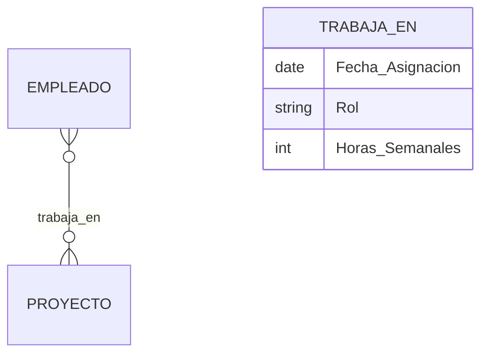

- `Fecha_Asignacion` no es del empleado ni del proyecto
- Depende de **qué empleado** trabaja en **qué proyecto**
- Por tanto, pertenece a la relación TRABAJA_EN

**Otro ejemplo:** ESTUDIANTE - ASIGNATURA
- Relación: MATRÍCULA
- Atributos: `Fecha_Matricula`, `Nota_Final`, `Convocatoria`

---

## 3. Entidades Débiles y Fuertes

**Pregunta:** ¿Todas las entidades tienen la misma independencia?

### Diferencias Clave

| Característica | Entidad Fuerte | Entidad Débil |
|----------------|----------------|---------------|
| **Existencia** | Independiente | Depende de otra |
| **Identificación** | Clave propia | Clave + clave ajena |
| **Representación** | Rectángulo simple | Rectángulo doble |
| **Relación** | Estándar | Identificadora |

### Ejemplo Completo: Cadena Hotelera

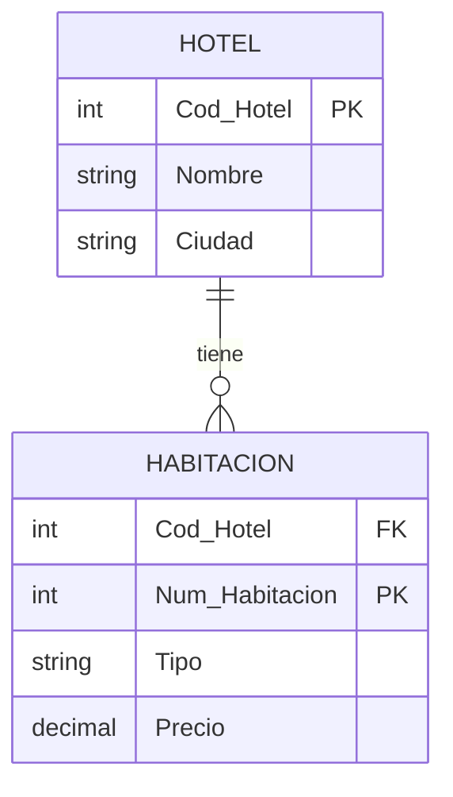

**Análisis:**
- HABITACIÓN no puede existir sin HOTEL
- La clave de HABITACIÓN es `(Cod_Hotel, Num_Habitacion)`
- Relación identificadora: `tiene`

---

### Tipos de Dependencia

**1. Dependencia en Existencia**
- La entidad débil no puede existir sin la fuerte
- Ejemplo: PEDIDO no existe sin CLIENTE

**2. Dependencia en Identificación**
- La entidad débil necesita la clave de la fuerte para identificarse
- Ejemplo: HABITACIÓN necesita Cod_Hotel

**Una entidad puede tener dependencia en existencia SIN tener dependencia en identificación.**

---

## 4. Relaciones N-arias

**Pregunta:** ¿Y si necesitamos relacionar más de dos entidades a la vez?

### Relaciones Ternarias

**Ejemplo clásico:** PROVEEDOR - PRODUCTO - PROYECTO

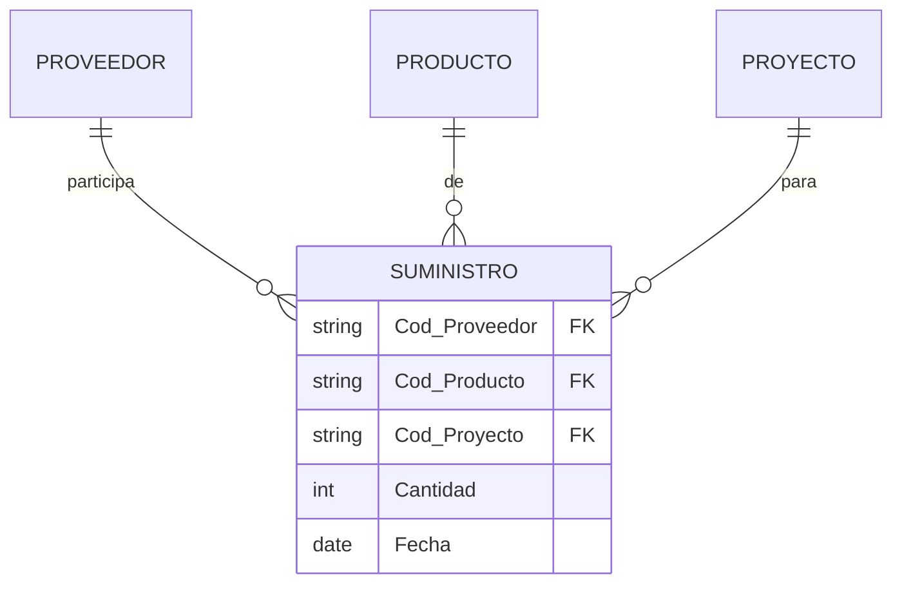

**Interpretación:**
- Un proveedor suministra un producto a un proyecto
- Las tres entidades son necesarias simultáneamente
- `Cantidad` y `Fecha` son atributos de la relación ternaria

---

### ¿Cuándo usar relaciones ternarias?

**Test de necesidad:**

❓ ¿Tiene sentido la relación si falta una entidad?

**Caso PROVEEDOR - PRODUCTO - PROYECTO:**
- ¿Proveedor-Producto sin Proyecto? No tiene sentido
- ¿Proveedor-Proyecto sin Producto? No tiene sentido
- ¿Producto-Proyecto sin Proveedor? No tiene sentido

✅ **Necesitamos las tres → Relación ternaria genuina**

---

### Conversión a Binarias

**A veces es posible (y recomendable) descomponer en binarias:**

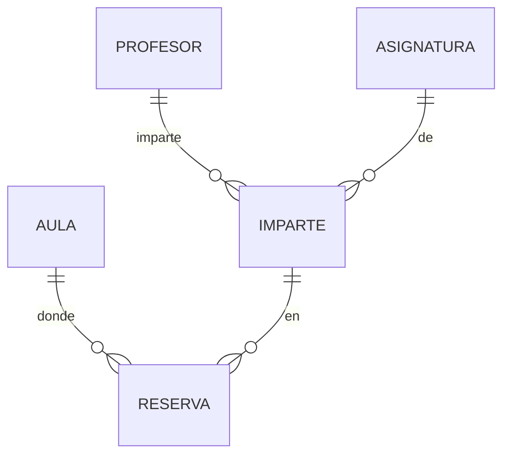

**Ventajas:**
- Más fácil de implementar
- Más flexible
- Evita complejidad innecesaria

**Desventaja:**
- Puede no capturar la semántica exacta

---

## 5. Control de Redundancia

**Pregunta:** ¿Por qué es tan importante evitar información duplicada?

### ¿Qué es la Redundancia?

**Definición:** Información que puede deducirse o calcularse a partir de otra información ya almacenada.

**Problemas de la redundancia:**
- ❌ **Inconsistencias:** Datos contradictorios
- ❌ **Desperdicio de espacio:** Duplicación innecesaria
- ❌ **Anomalías de actualización:** Dificultad para mantener coherencia
- ❌ **Mayor complejidad:** Más difícil de programar y mantener

---

### Ejemplo Clásico: Persona-Vivienda-Municipio

**❌ Modelo con redundancia:**

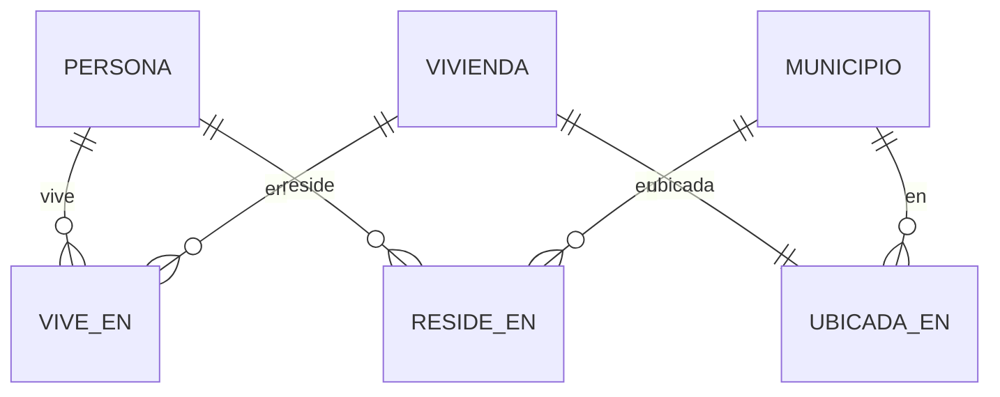

**Problema:** Si sabemos que persona vive en vivienda, y vivienda está en municipio, ¿para qué guardar que persona reside en municipio?

---

**✅ Modelo sin redundancia:**

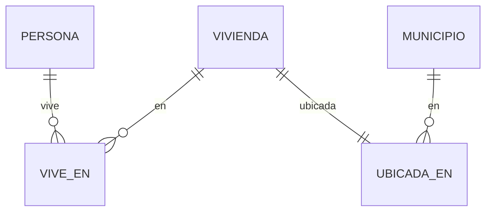

**Solución:** Eliminamos la relación RESIDE_EN. El municipio se obtiene a través de la vivienda.

---

### Método de Detección de Redundancia

**Pasos:**

1. **Identificar caminos alternativos** entre dos entidades
2. **Comparar información** que proporcionan
3. **Determinar si es derivable** una de otra
4. **Eliminar la ruta redundante**

**Pregunta clave:** ¿Puedo obtener esta información por otro camino?

---

### Redundancia Controlada

**¿Siempre es malo tener redundancia?**

❓ A veces se permite redundancia **controlada** por razones de rendimiento.

**Ejemplo:** Atributo derivado `Total_Pedido`
- Se puede calcular sumando líneas de detalle
- Pero guardarlo evita recalcular en cada consulta

**Criterios para permitirla:**
- ✅ Mejora significativa de rendimiento
- ✅ Datos que cambian muy poco
- ✅ Mecanismos de actualización automática (triggers)
- ✅ Decisión consciente y documentada

---

## 6. Modelo E/R Extendido

**Pregunta:** ¿Cómo modelamos situaciones donde entidades comparten características pero también tienen particularidades?

### Generalización y Especialización

**Conceptos:**
- **Supertipo:** Entidad general con características comunes
- **Subtipo:** Entidad especializada con características específicas
- **Relación IS-A:** "es un/a"

**Ejemplo:**

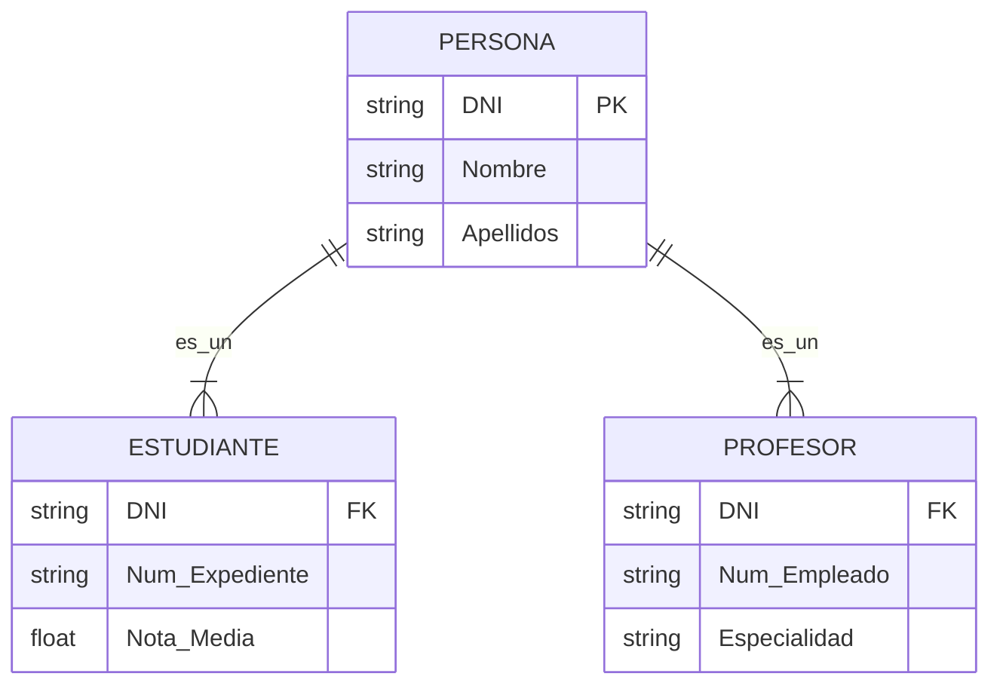

---

### Tipos de Jerarquías

**Dos dimensiones de clasificación:**

#### **1. Cobertura: Total vs Parcial**

- **Total:** Toda ocurrencia del supertipo pertenece a algún subtipo
  - Ejemplo: EMPLEADO → {FIJO, TEMPORAL} (todo empleado es fijo o temporal)
  
- **Parcial:** Algunas ocurrencias no pertenecen a ningún subtipo
  - Ejemplo: CLIENTE → {VIP, ESTÁNDAR} (puede haber clientes sin clasificar)

---

#### **2. Solapamiento: Exclusiva vs Superpuesta**

- **Exclusiva:** Una ocurrencia pertenece a máximo un subtipo
  - Ejemplo: VEHÍCULO → {COCHE, MOTO} (no puede ser ambos)
  
- **Superpuesta:** Una ocurrencia puede pertenecer a varios subtipos
  - Ejemplo: PERSONA → {ESTUDIANTE, TRABAJADOR} (puede ser ambos)

---

### Las 4 Combinaciones

| Cobertura | Solapamiento | Notación | Ejemplo |
|-----------|--------------|----------|---------|
| Total | Exclusiva | (t, e) | EMPLEADO → {FIJO, TEMPORAL} |
| Total | Superpuesta | (t, s) | PERSONA → {MENOR, MAYOR} y {NACIONAL, EXTRANJERO} |
| Parcial | Exclusiva | (p, e) | PRODUCTO → {PERECEDERO, NO_PERECEDERO} |
| Parcial | Superpuesta | (p, s) | DEPORTISTA → {FEDERADO, AMATEUR} |

---

### Herencia en E/R Extendido

**Regla fundamental:** Los subtipos heredan todos los atributos y relaciones del supertipo.

**Ejemplo:**

```
EMPLEADO (DNI, Nombre, Salario)
├─ COMERCIAL (Comisión, Zona)
└─ TÉCNICO (Especialidad, Certificaciones)
```

**COMERCIAL hereda:**
- Atributos: DNI, Nombre, Salario
- Relaciones: todas las de EMPLEADO
- Añade: Comisión, Zona

**TÉCNICO hereda:**
- Atributos: DNI, Nombre, Salario
- Relaciones: todas las de EMPLEADO
- Añade: Especialidad, Certificaciones

---

## 7. Del Modelo E/R al Relacional

**Pregunta:** ¿Cómo pasamos del diseño conceptual a tablas SQL?

### Reglas de Transformación

#### **Regla 1: Entidades → Tablas**

```
CLIENTE(#DNI, Nombre, Telefono)
  ↓
CREATE TABLE CLIENTE (
    DNI VARCHAR(9) PRIMARY KEY,
    Nombre VARCHAR(100),
    Telefono VARCHAR(15)
);
```

---

#### **Regla 2: Relaciones 1:N → Clave Foránea**


```sql
CREATE TABLE EMPLEADO (
    DNI VARCHAR(9) PRIMARY KEY,
    Nombre VARCHAR(100),
    Cod_Dpto INT,
    FOREIGN KEY (Cod_Dpto) REFERENCES DEPARTAMENTO(Cod_Dpto)
);
```

**La FK va en el lado N**

---

#### **Regla 3: Relaciones N:M → Tabla Intermedia**


```sql
CREATE TABLE MATRICULA (
    Cod_Estudiante INT,
    Cod_Asignatura INT,
    Fecha_Matricula DATE,
    Nota_Final DECIMAL(4,2),
    PRIMARY KEY (Cod_Estudiante, Cod_Asignatura),
    FOREIGN KEY (Cod_Estudiante) REFERENCES ESTUDIANTE(Cod_Estudiante),
    FOREIGN KEY (Cod_Asignatura) REFERENCES ASIGNATURA(Cod_Asignatura)
);
```

---

#### **Regla 4: Entidades Débiles → Clave Compuesta**

```sql
CREATE TABLE HABITACION (
    Cod_Hotel INT,
    Num_Habitacion INT,
    Tipo VARCHAR(20),
    PRIMARY KEY (Cod_Hotel, Num_Habitacion),
    FOREIGN KEY (Cod_Hotel) REFERENCES HOTEL(Cod_Hotel)
);
```

---

#### **Regla 5: Jerarquías → 3 Estrategias**

**Estrategia 1:** Una tabla por jerarquía completa
- Una sola tabla con todos los atributos
- Campo discriminador para tipo
- Campos NULL para atributos no aplicables

**Estrategia 2:** Una tabla por subtipo
- Tabla para cada subtipo con sus atributos + los heredados
- No hay tabla para el supertipo

**Estrategia 3:** Una tabla por entidad (supertipo + subtipos)
- Tabla para supertipo con atributos comunes
- Tabla para cada subtipo con atributos específicos
- FKs de subtipos a supertipo

**La estrategia 3 es generalmente la más recomendada.**

---

## 🎯 Resumen Final

### Conceptos Clave Aprendidos

1. **Modelo E/R:** Diseño conceptual de bases de datos
2. **Entidades:** Objetos del mundo real (fuertes y débiles)
3. **Atributos:** Propiedades (simples, compuestos, multivaluados, derivados)
4. **Relaciones:** Asociaciones con grado y cardinalidad
5. **Claves:** Identificadores únicos (PK, FK, candidatas)
6. **Redundancia:** Información duplicada a evitar
7. **E/R Extendido:** Jerarquías con herencia
8. **Transformación:** Reglas para convertir a modelo relacional

---

### ¿Por qué es tan importante?

✅ **Un buen diseño E/R es la base de un sistema de información exitoso**

**El tiempo invertido en diseñar se recupera con creces en:**
- Implementación más rápida
- Menos errores
- Mantenimiento sencillo
- Escalabilidad natural
- Datos consistentes

**"Semanas de programación pueden ahorrarte horas de planificación"** 😄

---

## 📚 Próximos Pasos

**En las siguientes sesiones:**

1. **Práctica:** Diseño E/R de sistemas completos
2. **Transformación:** Conversión a modelo relacional
3. **Normalización:** Garantizar calidad del diseño
4. **SQL:** Implementación física de nuestros diseños

**Recursos:**
- Ejercicios propuestos en el documento completo
- Herramientas: ERDPlus, MySQL Workbench, Draw.io
- Casos prácticos de sistemas reales

---

## ❓ Preguntas Frecuentes

**P: ¿Siempre hay que hacer el modelo E/R antes de programar?**  
R: Sí, para proyectos serios. Es como construir una casa sin planos.

**P: ¿Qué pasa si me equivoco en el diseño E/R?**  
R: Es mucho más fácil corregir un diagrama que cambiar tablas con datos.

**P: ¿Los SGBD NoSQL también usan E/R?**  
R: Los conceptos son útiles, aunque la implementación es diferente.

**P: ¿Cuánto tiempo se dedica al diseño E/R en proyectos reales?**  
R: Entre el 20-30% del tiempo total del proyecto.

---

## 💡 Consejos Prácticos

**Para hacer un buen diseño E/R:**

1. 📝 Empieza identificando entidades principales
2. 🔗 Define relaciones entre ellas
3. 📊 Especifica cardinalidades con cuidado
4. 🔍 Busca y elimina redundancias
5. ✅ Valida con ejemplos reales
6. 👥 Revisa con usuarios del sistema
7. 🔄 Itera: el primer diseño nunca es perfecto

**Errores comunes a evitar:**
- Confundir atributos con entidades
- Ignorar entidades débiles
- No especificar cardinalidades
- Crear redundancias innecesarias

---

## 🎓 Para Reflexionar

**Pregunta final:**

*"¿Preferirías pasar 2 horas diseñando un buen modelo E/R o 2 semanas corrigiendo problemas en producción?"*

**El diseño de bases de datos es una inversión, no un gasto.**

---

**¡Gracias!**

**¿Preguntas?**

---

*Material didáctico para 1º DAW - Bases de Datos*  
*Versión 2.0 - 2024*
