# TEMA 2. BASES DE DATOS RELACIONALES  
## El Modelo Entidad / Relación (E/R)

---

### ÍNDICE

1. [Introducción](#introducción)  
2. [Elementos del modelo Entidad/Relación](#elementos-del-modelo-entidadrelación)  
   2.1. Entidad  
   2.2. Atributos  
   2.3. Relaciones  
   2.4. Grado de una relación  
   2.5. Cardinalidad y participación  
   2.6. Atributos propios de una relación  
3. [Entidades fuertes y débiles (Relación de dependencia)](#entidades-fuertes-y-débil-relación-de-dependencia)  
   3.1. Dependencia en existencia  
   3.2. Dependencia en identificación  
4. [Relaciones N-arias](#relaciones-n-arias)  
5. [Control de redundancia](#control-de-redundancia)  
6. [Modelo Entidad/Relación Extendida (E/R-E)](#modelo-er-extendida)  
   6.1. Generalización o jerarquía de entidades  
   6.2. Tipos de jerarquías  
   6.3. Herencia de atributos y relaciones  
7. [Ejercicios prácticos resueltos](#ejercicios-prácticos-resueltos)  
8. [Ejercicios propuestos](#ejercicios-propuestos)

---

## Introducción

El **modelo Entidad/Relación (E/R)** fue propuesto por **Peter Chen en 1976** como una forma de representar los datos y las relaciones entre ellos de manera independiente de cualquier sistema gestor de bases de datos (SGBD).  

Su objetivo es construir un **modelo conceptual** del problema que refleje el mundo real de forma estructurada y comprensible. Este modelo se emplea como base para construir el modelo lógico relacional que será implementado en SQL.

### 1.1. Contexto histórico y evolución

Antes de la propuesta de Peter Chen, el diseño de bases de datos carecía de una metodología estandarizada y visual. Los programadores trabajaban directamente con modelos físicos dependientes del SGBD, lo que dificultaba:

- La **comunicación** entre equipos técnicos y usuarios finales.
- La **portabilidad** de diseños entre diferentes sistemas gestores.
- La **detección temprana** de errores de modelado.

El modelo E/R surgió como respuesta a estas limitaciones, proporcionando:

1. **Abstracción:** Separación del "qué" (datos a almacenar) del "cómo" (implementación física).
2. **Visualización:** Representación gráfica mediante diagramas comprensibles.
3. **Estandarización:** Notación universal adoptada por la industria.

### 1.2. Los tres niveles de modelado de datos

Para comprender mejor el papel del modelo E/R en el diseño de bases de datos, es fundamental conocer los tres niveles de abstracción:

| Nivel | Descripción | Herramientas | Ejemplo |
|-------|-------------|--------------|---------|
| **Conceptual** | Representación abstracta del mundo real | Modelo E/R, UML | Diagrama E/R de una biblioteca |
| **Lógico** | Adaptación a un modelo de datos específico | Modelo Relacional, Modelo de Objetos | Tablas con claves primarias y foráneas |
| **Físico** | Implementación en un SGBD concreto | SQL, índices, vistas | CREATE TABLE en MySQL/PostgreSQL |

**Flujo de trabajo típico:**

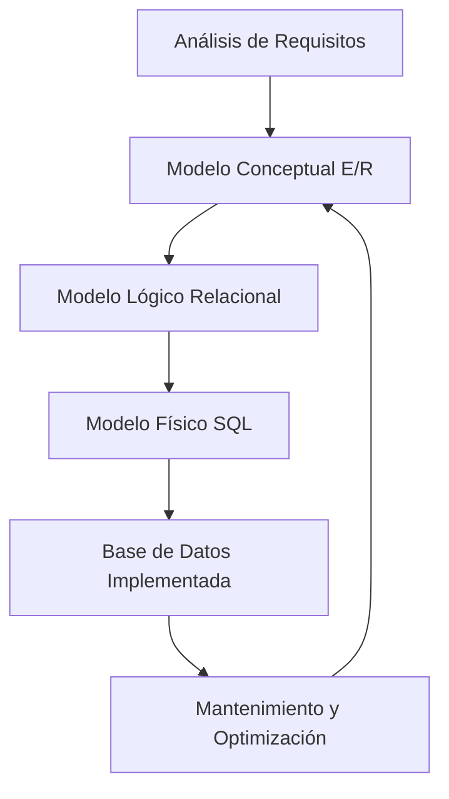

### 1.3. Ventajas del modelo E/R

El modelo E/R se ha consolidado como el estándar de facto para el diseño conceptual de bases de datos por múltiples razones:

#### **1.3.1. Facilita la comprensión global del sistema**
- Proporciona una **vista panorámica** de todas las entidades y sus interrelaciones.
- Permite a los usuarios no técnicos validar el diseño antes de la implementación.
- Reduce malentendidos entre analistas, desarrolladores y clientes.

#### **1.3.2. Detecta errores de diseño tempranamente**
- **Redundancias:** Identificación de información duplicada.
- **Omisiones:** Detección de entidades o relaciones faltantes.
- **Dependencias incorrectas:** Validación de cardinalidades y participaciones.
- **Anomalías de actualización:** Prevención de inconsistencias futuras.

#### **1.3.3. Favorece la comunicación multidisciplinar**
El lenguaje gráfico del modelo E/R sirve como "lengua franca" entre:
- **Analistas de negocio:** Validan que el modelo refleje procesos reales.
- **Diseñadores de BD:** Traducen el modelo a esquemas relacionales.
- **Programadores:** Implementan la lógica de negocio sobre la estructura.
- **Usuarios finales:** Verifican que el sistema cubrirá sus necesidades.

#### **1.3.4. Independencia del SGBD**
Un diagrama E/R puede implementarse en:
- **MySQL / MariaDB:** Bases de datos relacionales open source.
- **PostgreSQL:** Sistema avanzado con soporte completo de ACID.
- **Oracle Database:** Solución empresarial de alto rendimiento.
- **Microsoft SQL Server:** Integración con ecosistema Microsoft.
- **SQLite:** Base de datos embebida para aplicaciones locales.

#### **1.3.5. Reutilización y mantenimiento**
- Los diagramas E/R sirven como **documentación viva** del sistema.
- Facilitan la **evolución** de la base de datos cuando cambian los requisitos.
- Permiten **auditorías** de diseño y optimizaciones futuras.

### 1.4. Notación y simbología básica

Aunque existen varias notaciones (Chen, Crow's Foot, IDEF1X, UML), la notación clásica de Chen utiliza:

| Elemento | Símbolo | Descripción |
|----------|---------|-------------|
| **Entidad** | Rectángulo | Representa un conjunto de objetos |
| **Atributo** | Óvalo | Propiedad de una entidad o relación |
| **Relación** | Rombo | Asociación entre entidades |
| **Atributo clave** | Óvalo subrayado | Identificador único |
| **Atributo multivaluado** | Óvalo doble | Puede tener varios valores |
| **Atributo derivado** | Óvalo punteado | Se calcula a partir de otros |
| **Entidad débil** | Rectángulo doble | Depende de otra entidad |
| **Relación identificadora** | Rombo doble | Relaciona entidad débil con fuerte |

### 1.5. Ejemplo inicial ampliado: Tienda Online

Supongamos una tienda online que gestiona **clientes, pedidos y productos**. En este sistema:

#### **Análisis de requisitos:**

1. Un **cliente** puede realizar varios **pedidos** a lo largo del tiempo.
2. Cada **pedido** pertenece a un único **cliente**.
3. Un **pedido** incluye varios **productos** (líneas de pedido).
4. Un **producto** puede aparecer en múltiples **pedidos**.
5. Cada línea de pedido tiene una **cantidad** y un **precio** específico (que puede variar del precio actual del producto).

#### **Identificación de elementos E/R:**

**Entidades identificadas:**
- **CLIENTE:** Representa a los compradores registrados.
- **PEDIDO:** Representa cada transacción de compra.
- **PRODUCTO:** Representa los artículos disponibles en el catálogo.

**Relaciones identificadas:**
- **REALIZA:** Relaciona CLIENTE con PEDIDO (1:N).
- **CONTIENE:** Relaciona PEDIDO con PRODUCTO (N:M).

**Atributos de entidades:**
- CLIENTE: `#Cod_Cliente`, `Nombre`, `Email`, `Dirección`, `Teléfono`, `Fecha_Registro`
- PEDIDO: `#Num_Pedido`, `Fecha`, `Estado`, `Total`
- PRODUCTO: `#Cod_Producto`, `Nombre`, `Descripción`, `Precio_Actual`, `Stock`

**Atributos de relaciones:**
- CONTIENE: `Cantidad`, `Precio_Unitario` (precio al momento del pedido)

#### **Diagrama E/R completo:**

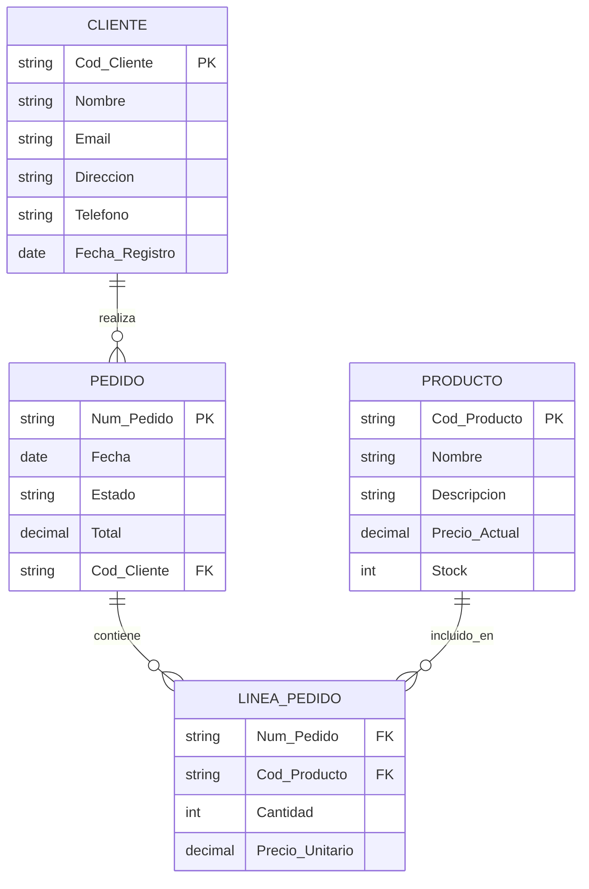

#### **Interpretación del diagrama:**

1. **Cardinalidad 1:N (CLIENTE-PEDIDO):**
   - Cada cliente puede tener cero o muchos pedidos.
   - Cada pedido pertenece exactamente a un cliente.

2. **Cardinalidad N:M (PEDIDO-PRODUCTO):**
   - Se resuelve mediante la entidad intermedia `LINEA_PEDIDO`.
   - Esta entidad almacena la cantidad y precio unitario de cada producto en cada pedido.

3. **Atributos derivados:**
   - El campo `Total` en PEDIDO podría calcularse sumando `Cantidad × Precio_Unitario` de todas sus líneas.
   - Esta es una decisión de diseño: almacenar el total o calcularlo dinámicamente.

### 1.6. Proceso completo de diseño con E/R

El diseño de una base de datos usando el modelo E/R sigue un proceso sistemático:

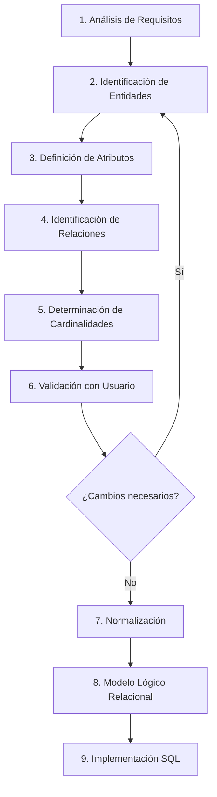

#### **Fase 1: Análisis de requisitos**
- Entrevistas con usuarios y stakeholders.
- Revisión de documentación existente.
- Identificación de procesos de negocio.
- Listado de datos a almacenar.

#### **Fase 2: Identificación de entidades**
Criterios para identificar entidades:
- **Sustantivos relevantes:** Cliente, Producto, Pedido.
- **Colecciones de información:** Conjunto de atributos relacionados.
- **Existencia independiente:** Pueden existir sin otras entidades (entidades fuertes).

#### **Fase 3: Definición de atributos**
Para cada entidad identificada:
- Listar todas las propiedades necesarias.
- Identificar el **atributo clave** (identificador único).
- Clasificar atributos (simples, compuestos, multivaluados, derivados).
- Definir tipos de datos y restricciones.

#### **Fase 4: Identificación de relaciones**
- **Verbos significativos:** "realiza", "contiene", "pertenece a".
- **Asociaciones lógicas:** ¿Qué entidades interactúan?
- **Reglas de negocio:** ¿Qué restricciones existen?

#### **Fase 5: Determinación de cardinalidades**
Para cada relación, determinar:
- **Cardinalidad máxima:** 1:1, 1:N, N:M.
- **Participación mínima:** Total (obligatoria) o parcial (opcional).

#### **Fase 6: Validación**
- Revisión del diagrama con usuarios.
- Verificación de que se cubren todos los requisitos.
- Confirmación de reglas de negocio.

### 1.7. Ejemplo práctico guiado: Sistema de Biblioteca

**Enunciado:**  
Diseñar la base de datos para una biblioteca que gestiona libros, socios, préstamos y autores. 

**Requisitos funcionales:**
1. La biblioteca tiene múltiples **libros**, cada uno con ISBN, título, editorial y año de publicación.
2. Cada libro puede tener uno o varios **autores**.
3. Los **socios** se registran con DNI, nombre, dirección, teléfono y email.
4. Los socios pueden tomar prestados varios libros simultáneamente.
5. Se debe registrar la fecha de préstamo y fecha de devolución de cada libro.
6. Un libro puede ser prestado múltiples veces a lo largo del tiempo (historial).

**Paso 1: Identificar entidades**
- LIBRO
- AUTOR  
- SOCIO
- PRÉSTAMO

**Paso 2: Definir atributos**

| Entidad | Atributos |
|---------|-----------|
| LIBRO | #ISBN, Título, Editorial, Año_Publicación, Número_Páginas |
| AUTOR | #Cod_Autor, Nombre, Apellidos, Nacionalidad, Fecha_Nacimiento |
| SOCIO | #DNI, Nombre, Apellidos, Dirección, Teléfono, Email, Fecha_Inscripción |
| PRÉSTAMO | #Cod_Préstamo, Fecha_Préstamo, Fecha_Devolución_Prevista, Fecha_Devolución_Real |

**Paso 3: Identificar relaciones**
- ESCRITO_POR (LIBRO - AUTOR): Un libro tiene varios autores, un autor escribe varios libros → **N:M**
- REALIZA (SOCIO - PRÉSTAMO): Un socio realiza varios préstamos, cada préstamo lo realiza un socio → **1:N**
- SE_PRESTA (LIBRO - PRÉSTAMO): Un libro se presta en varios préstamos, cada préstamo es de un libro → **1:N**

**Paso 4: Diagrama E/R**

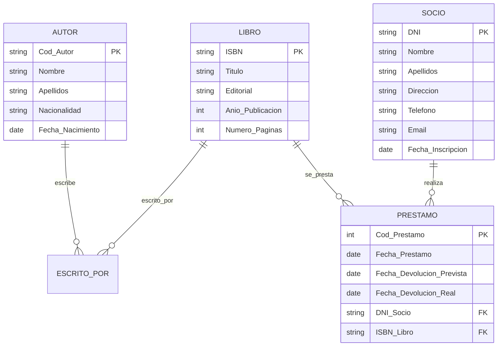

**Paso 5: Reglas de negocio**
1. Un socio no puede tener más de 3 préstamos activos simultáneamente.
2. El periodo máximo de préstamo es de 15 días.
3. Un libro no puede prestarse si no ha sido devuelto.
4. Se aplica una penalización por retraso en la devolución.

Estas reglas se implementarán posteriormente mediante **restricciones** (CONSTRAINTS) y **triggers** en SQL.

Este diagrama expresa claramente las dependencias entre las entidades y permite deducir las cardinalidades.

---

## Elementos del modelo Entidad/Relación

El modelo E/R se compone de tres elementos fundamentales que permiten representar la estructura de los datos y sus interrelaciones: **entidades**, **atributos** y **relaciones**. Cada uno de estos elementos tiene características y tipos específicos que veremos en detalle.

### 2.1. Entidad

Una **entidad** representa un conjunto de objetos reales o conceptuales sobre los que se desea almacenar información en la base de datos. Es el componente principal del modelo E/R.

#### **2.1.1. Definición formal**

> **Entidad:** Conjunto de elementos u objetos del mundo real, concretos o abstractos, que tienen características comunes y sobre los cuales deseamos almacenar información.

**Características de una entidad:**
- Tiene **existencia propia** (puede existir independientemente).
- Posee **atributos** que la describen.
- Tiene un **identificador único** que distingue cada ocurrencia.
- Agrupa **ocurrencias** (instancias concretas).

#### **2.1.2. Diferencia entre entidad y ocurrencia**

Es fundamental distinguir entre el concepto de entidad (tipo) y las ocurrencias (instancias):

| Concepto | Definición | Ejemplo |
|----------|------------|---------|
| **Entidad (Tipo)** | Concepto abstracto, conjunto | CLIENTE |
| **Ocurrencia (Instancia)** | Elemento concreto del conjunto | Cliente "Marta López" con DNI 12345678A |

**Analogía con programación orientada a objetos:**
- **Entidad** ≈ **Clase**
- **Ocurrencia** ≈ **Objeto** (instancia de la clase)

#### **2.1.3. Ejemplos de entidades**

Cada entidad tiene **atributos** (sus propiedades) y **ocurrencias** (sus elementos concretos).

**Ejemplo 1: Gestión académica**

| Entidad | Ocurrencias |
|----------|-------------|
| ESTUDIANTE | Ana García (12345), Pedro Sánchez (12346), Laura Martín (12347) |
| ASIGNATURA | Bases de Datos, Programación, Sistemas Informáticos |
| PROFESOR | Juan López, María Rodríguez, Carlos Fernández |
| AULA | D202, A106, B305 |

**Ejemplo 2: Sistema hospitalario**

| Entidad | Ocurrencias |
|----------|-------------|
| PACIENTE | Juan Pérez (historia clínica 1001), Ana Ruiz (historia clínica 1002) |
| MÉDICO | Dr. García (colegiado 28456), Dra. López (colegiado 28457) |
| TRATAMIENTO | Antibiótico, Fisioterapia, Cirugía menor |
| CONSULTA | Consulta del 15/01/2025 a las 10:00, Consulta del 16/01/2025 a las 12:30 |

**Ejemplo 3: E-commerce**

| Entidad | Ocurrencias |
|----------|-------------|
| CLIENTE | Marta López, Javier Ramos, Sara Jiménez |
| PRODUCTO | Ordenador HP Pavilion, Ratón Logitech MX Master, Monitor LG 27" |
| CATEGORÍA | Informática, Electrónica, Hogar |
| PROVEEDOR | Tech Supplies S.L., Global Electronics Inc. |

#### **2.1.4. Representación gráfica**

Una entidad se representa mediante un **rectángulo** con el nombre en mayúsculas:

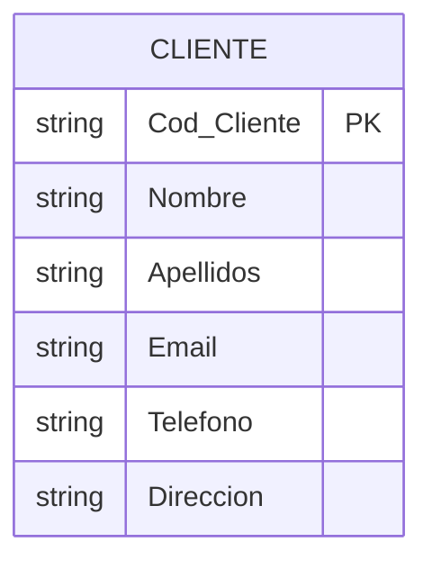

#### **2.1.5. Tipos de entidades**

Las entidades se clasifican en dos categorías principales según su independencia:

##### **A) Entidades Fuertes (Regulares)**

Son aquellas que **existen por sí mismas** y no dependen de otras entidades para su identificación o existencia.

**Características:**
- Tienen su propia **clave primaria** independiente.
- Pueden existir sin necesidad de otras entidades.
- Se representan con un **rectángulo simple**.

**Ejemplos:**
- CLIENTE (identificado por DNI o Cod_Cliente)
- PRODUCTO (identificado por Cod_Producto o ISBN)
- EMPLEADO (identificado por DNI o Num_Empleado)
- DEPARTAMENTO (identificado por Cod_Departamento)

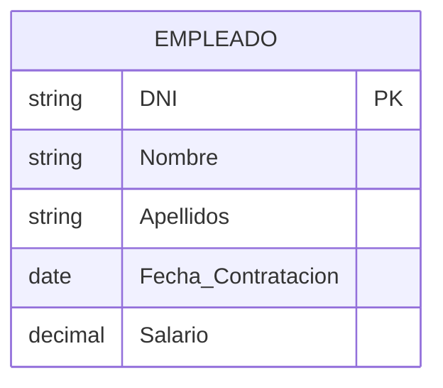

##### **B) Entidades Débiles**

Son aquellas que **dependen de otra entidad** para su existencia o identificación. No pueden existir sin la entidad de la que dependen.

**Características:**
- **No tienen clave primaria propia** suficiente.
- Su identificador se forma **combinando** su clave parcial con la clave de la entidad fuerte.
- Se representan con un **rectángulo doble**.
- La relación con la entidad fuerte se representa con un **rombo doble**.

**Ejemplos:**
- HIJO (depende de EMPLEADO)
- HABITACIÓN (depende de HOTEL)
- LÍNEA_PEDIDO (depende de PEDIDO)

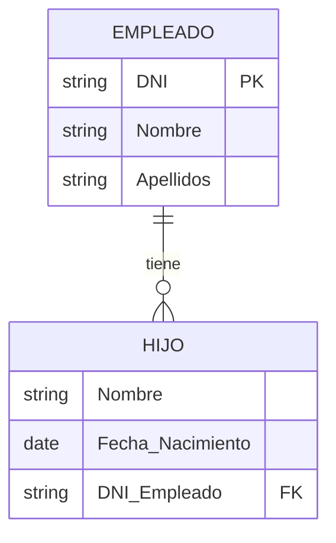

**Nota:** HIJO se identifica por (DNI_Empleado, Nombre), ya que dos empleados diferentes pueden tener hijos con el mismo nombre.

#### **2.1.6. Requisitos de una entidad válida**

Para que un concepto se considere entidad válida debe cumplir:

1. **Tener múltiples ocurrencias:** Si solo existe un elemento, probablemente sea un atributo.
2. **Tener varios atributos:** Una entidad con un solo atributo suele ser un atributo de otra entidad.
3. **Tener identificador único:** Debe poder distinguirse cada ocurrencia.
4. **Ser relevante para el sistema:** Debe aportar información necesaria.

#### **2.1.7. Errores comunes al identificar entidades**

##### **Error 1: Definir atributos como entidades**

❌ **Incorrecto:**
```
Entidad: TELÉFONO
Atributos: Número
```

✅ **Correcto:**
```
Entidad: CLIENTE
Atributos: #Cod_Cliente, Nombre, Teléfono
```

**Excepción:** Si un cliente puede tener múltiples teléfonos y necesitamos almacenar información adicional (tipo: móvil/fijo, principal/secundario), entonces TELÉFONO sí sería una entidad débil:

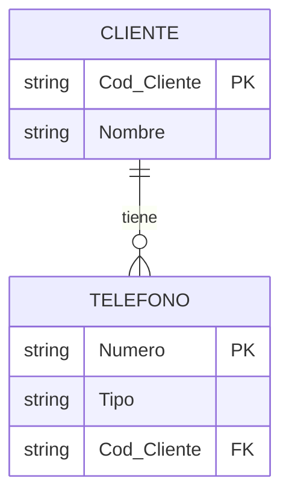

##### **Error 2: No incluir un identificador único**

❌ **Incorrecto:**
```
Entidad: PRODUCTO
Atributos: Nombre, Precio
```

✅ **Correcto:**
```
Entidad: PRODUCTO
Atributos: #Cod_Producto, Nombre, Precio
```

##### **Error 3: Mezclar entidades con relaciones**

❌ **Incorrecto:**
```
Entidad: MATRÍCULA
(Confunde la acción de matricularse con los datos de estudiante o asignatura)
```

✅ **Correcto:**
```
Entidad: ESTUDIANTE
Entidad: ASIGNATURA
Relación: SE_MATRICULA (con atributos: Fecha_Matrícula, Nota)
```

##### **Error 4: Crear entidades con una sola ocurrencia**

❌ **Incorrecto:**
```
Entidad: EMPRESA
Ocurrencias: Mi Empresa S.A. (solo una)
```

✅ **Correcto:**
Los datos únicos de la empresa se almacenan como configuración del sistema, no como entidad.

#### **2.1.8. Notación de entidades**

Formato textual para documentar entidades:

```
ENTIDAD(atributo_clave, atributo1, atributo2, ...)
```

**Ejemplos:**
```
CLIENTE(#Cod_Cliente, Nombre, Apellidos, Email, Teléfono, Dirección)
PRODUCTO(#Cod_Producto, Nombre, Descripción, Precio, Stock)
EMPLEADO(#DNI, Nombre, Apellidos, Fecha_Contratación, Salario, Cod_Departamento)
DEPARTAMENTO(#Cod_Departamento, Nombre, Ubicación)
```

#### **2.1.9. Ejercicio resuelto: Identificación de entidades**

**Enunciado:**  
Una universidad desea gestionar información sobre sus estudiantes, las asignaturas que cursan, los profesores que las imparten y las aulas donde se realizan las clases. Cada estudiante tiene un código único, nombre, apellidos, fecha de nacimiento y dirección. Las asignaturas tienen un código, nombre, créditos y curso. Los profesores se identifican por DNI y tienen nombre, apellidos, especialidad y departamento. Las aulas tienen un código, capacidad y ubicación.

**Solución:**

**Entidades identificadas:**
1. **ESTUDIANTE:** Representa a los alumnos matriculados.
2. **ASIGNATURA:** Representa las materias que se imparten.
3. **PROFESOR:** Representa al personal docente.
4. **AULA:** Representa los espacios físicos donde se imparten clases.

**Atributos de cada entidad:**

```
ESTUDIANTE(#Cod_Estudiante, Nombre, Apellidos, Fecha_Nacimiento, Dirección)
ASIGNATURA(#Cod_Asignatura, Nombre, Créditos, Curso)
PROFESOR(#DNI, Nombre, Apellidos, Especialidad, Departamento)
AULA(#Cod_Aula, Capacidad, Ubicación)
```

**Diagrama parcial:**

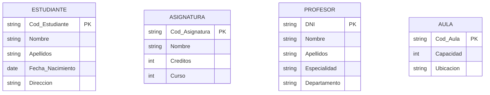

**Justificación:**
- Todas son entidades **fuertes** porque tienen existencia independiente.
- Cada una tiene su propio **identificador único**.
- Cada una agrupa **múltiples atributos** relevantes.
- Más adelante definiremos las **relaciones** entre ellas (SE_MATRICULA, IMPARTE, SE_IMPARTE_EN).

---

### 2.2. Atributos

Los **atributos** son las propiedades o características que describen las entidades o relaciones. Representan los datos específicos que queremos almacenar sobre cada ocurrencia.

#### **2.2.1. Definición y conceptos básicos**

> **Atributo:** Propiedad o característica que describe una entidad o relación. Cada atributo toma valores específicos para cada ocurrencia.

**Características de los atributos:**
- Tienen un **nombre** descriptivo (identificador del atributo).
- Tienen un **dominio** (conjunto de valores posibles).
- Pueden ser **obligatorios** u **opcionales**.
- Pueden ser **simples** o **complejos**.

**Ejemplo de dominios:**
| Atributo | Dominio | Ejemplos de valores |
|----------|---------|---------------------|
| Edad | Entero positivo [0..120] | 18, 25, 67 |
| Email | Cadena con formato email | juan@example.com |
| Estado_Civil | {'Soltero', 'Casado', 'Divorciado', 'Viudo'} | Soltero |
| Precio | Decimal positivo | 19.99, 1250.00 |
| Fecha_Nacimiento | Fecha válida | 15/03/1998 |

#### **2.2.2. Clasificación de atributos**

##### **A) Por su función**

| Tipo | Descripción | Notación | Ejemplo |
|------|-------------|----------|---------|
| **Identificador (Clave)** | Distingue unívocamente cada ocurrencia | Subrayado o # | #DNI, #Cod_Cliente |
| **Descriptor** | Proporciona información adicional | Normal | Nombre, Teléfono, Dirección |

**Ejemplo:**
```
CLIENTE(#Cod_Cliente, Nombre, Apellidos, Email, Teléfono)
         ↑                ↑       ↑         ↑       ↑
    Identificador    Descriptores
```

##### **B) Por su estructura**

###### **1. Atributos Simples (Atómicos)**

Son aquellos que **no se pueden dividir** en componentes más pequeños con significado propio.

**Ejemplos:**
- Edad: 25 (no tiene sentido dividirlo)
- Precio: 49.99 (es un valor único)
- DNI: 12345678A (se trata como un todo)

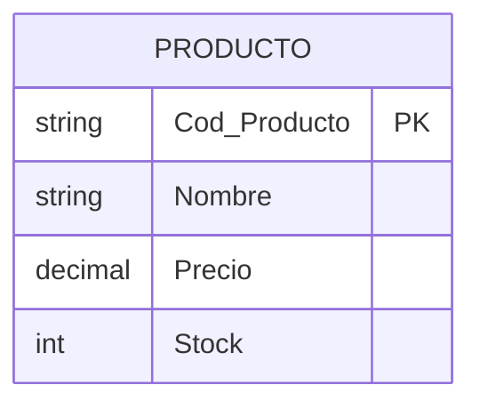

###### **2. Atributos Compuestos**

Son aquellos que **se pueden dividir** en subatributos con significado propio.

**Ejemplo 1: Dirección**
```
Dirección
    ├── Calle
    ├── Número
    ├── Piso
    ├── Código_Postal
    └── Ciudad
```

**Ejemplo 2: Nombre Completo**
```
Nombre_Completo
    ├── Nombre
    ├── Apellido1
    └── Apellido2
```

**Representación:**

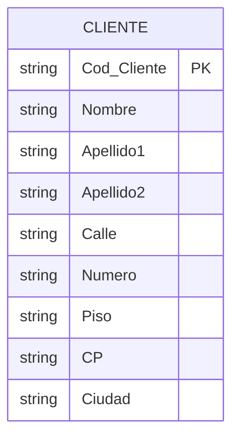

**Decisión de diseño:**  
- Si necesitamos hacer búsquedas por ciudad o código postal → **Dividir** el atributo compuesto.
- Si siempre usamos la dirección completa → Podemos mantenerla como **atributo simple**.

###### **3. Atributos Multivaluados**

Son aquellos que pueden tener **múltiples valores** para una misma ocurrencia.

**Ejemplos:**
- Teléfonos: Una persona puede tener móvil, fijo, trabajo.
- Idiomas: Un profesor puede hablar español, inglés, francés.
- Emails: Personal, profesional, secundario.
- Títulos universitarios: Grado, Máster, Doctorado.

**Representación gráfica:** Óvalo doble o entre llaves {}

**Notación textual:**
```
PROFESOR(#DNI, Nombre, {Teléfono}, {Idioma}, {Email})
```

**Problema:** Los atributos multivaluados **violan** la Primera Forma Normal (1FN) del modelo relacional.

**Solución:** Crear una **entidad débil** o tabla relacionada:

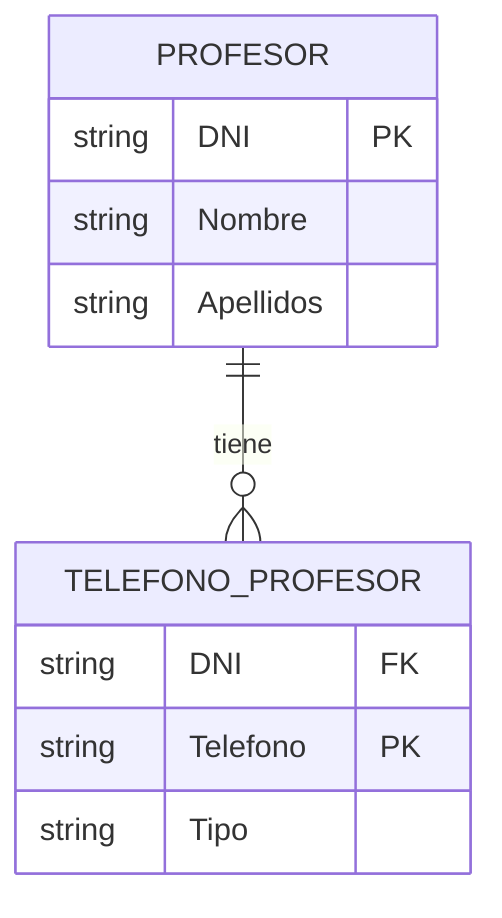

###### **4. Atributos Derivados**

Son aquellos cuyo valor se **calcula** a partir de otros atributos. No se almacenan físicamente (o se almacenan por rendimiento, pero son redundantes).

**Ejemplos:**

| Atributo Derivado | Cálculo | Atributos Base |
|-------------------|---------|----------------|
| Edad | Año_Actual - Año_Nacimiento | Fecha_Nacimiento |
| Total_Pedido | SUM(Cantidad × Precio) | Líneas de pedido |
| Antigüedad | Fecha_Actual - Fecha_Contratación | Fecha_Contratación |
| IMC | Peso / (Altura²) | Peso, Altura |

**Representación gráfica:** Óvalo con línea punteada o entre paréntesis ()

**Notación textual:**
```
PERSONA(#DNI, Nombre, Fecha_Nacimiento, (Edad))
PEDIDO(#Num_Pedido, Fecha, (Total))
```

**Ejemplo completo:**

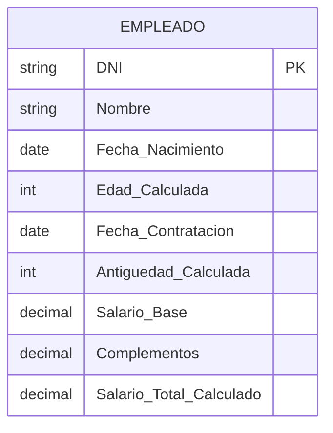

**Ventajas de NO almacenarlos:**
- Evita **redundancia**.
- Garantiza **consistencia** (siempre está actualizado).
- Ahorra **espacio** de almacenamiento.

**Ventajas de SÍ almacenarlos:**
- Mejora el **rendimiento** (no hay que calcular en cada consulta).
- Útil para **auditoría** (mantener valores históricos).
- Simplifica **consultas complejas**.

##### **C) Por su obligatoriedad**

| Tipo | Descripción | Ejemplo |
|------|-------------|---------|
| **Obligatorio (NOT NULL)** | Debe tener siempre un valor | Nombre, DNI |
| **Opcional (NULL)** | Puede estar vacío | Teléfono secundario, Email secundario |

#### **2.2.3. Dominios de atributos**

El **dominio** define el conjunto de valores válidos que puede tomar un atributo.

**Tipos de dominios:**

| Dominio | Descripción | Ejemplo |
|---------|-------------|---------|
| **Numérico entero** | Números sin decimales | Edad: [0..120], Stock: [0..10000] |
| **Numérico decimal** | Números con decimales | Precio: [0.00..99999.99], Nota: [0.0..10.0] |
| **Cadena fija** | Texto de longitud fija | DNI: CHAR(9), CP: CHAR(5) |
| **Cadena variable** | Texto de longitud variable | Nombre: VARCHAR(50), Email: VARCHAR(100) |
| **Fecha** | Fechas válidas | Fecha_Nacimiento: DATE |
| **Hora** | Horas del día | Hora_Inicio: TIME |
| **Fecha y hora** | Marca temporal | Fecha_Registro: DATETIME |
| **Booleano** | Verdadero o Falso | Activo: BOOLEAN |
| **Enumerado** | Lista cerrada de valores | Estado: {'Pendiente', 'Enviado', 'Entregado'} |

**Ejemplo de especificación de dominios:**

```
PRODUCTO(
    #Cod_Producto: VARCHAR(10),
    Nombre: VARCHAR(100) NOT NULL,
    Descripción: TEXT,
    Precio: DECIMAL(10,2) CHECK (Precio >= 0),
    Stock: INT CHECK (Stock >= 0),
    Fecha_Alta: DATE DEFAULT CURRENT_DATE,
    Activo: BOOLEAN DEFAULT TRUE,
    Categoría: ENUM('Electrónica', 'Informática', 'Hogar')
)
```

#### **2.2.4. Claves candidatas, primarias y alternativas**

##### **Clave Candidata**
Conjunto mínimo de atributos que **identifica unívocamente** cada ocurrencia.

**Propiedades:**
- **Unicidad:** No puede haber dos ocurrencias con los mismos valores.
- **Minimalidad:** No se puede eliminar ningún atributo sin perder la unicidad.

**Ejemplo:**
```
ESTUDIANTE(DNI, Num_Matrícula, Nombre, Email)
```
Claves candidatas:
- {DNI} → Único por persona
- {Num_Matrícula} → Único por estudiante
- {Email} → Si el sistema no permite emails duplicados

##### **Clave Primaria (Primary Key - PK)**
Es la **clave candidata elegida** como identificador principal de la entidad.

**Criterios de selección:**
1. **Estabilidad:** No debe cambiar con el tiempo.
2. **Simplicidad:** Preferir claves simples a compuestas.
3. **Tamaño reducido:** Mejor atributos pequeños (enteros > cadenas largas).
4. **Sin significado:** Mejor códigos autogenerados que datos con significado.

**Ejemplo:**
```
ESTUDIANTE(#Num_Matrícula, DNI, Nombre, Email)
```
- **Clave primaria:** Num_Matrícula (elegida por ser estable y simple)
- **Clave alternativa:** DNI

##### **Clave Alternativa (Alternate Key - AK)**
Son las claves candidatas **no elegidas** como clave primaria, pero que mantienen su restricción de unicidad.

**Implementación en SQL:**
```sql
CREATE TABLE ESTUDIANTE (
    Num_Matricula INT PRIMARY KEY,
    DNI VARCHAR(9) UNIQUE NOT NULL,    -- Clave alternativa
    Email VARCHAR(100) UNIQUE,          -- Clave alternativa
    Nombre VARCHAR(100) NOT NULL,
    Apellidos VARCHAR(100) NOT NULL
);
```

##### **Clave Compuesta**
Es una clave primaria formada por **dos o más atributos**.

**Ejemplo:**
```
MATRÍCULA(#Cod_Estudiante, #Cod_Asignatura, #Año_Académico, Fecha_Matrícula, Nota)
```

La combinación (Cod_Estudiante, Cod_Asignatura, Año_Académico) identifica unívocamente cada matrícula, ya que un estudiante puede matricularse en la misma asignatura en diferentes años.

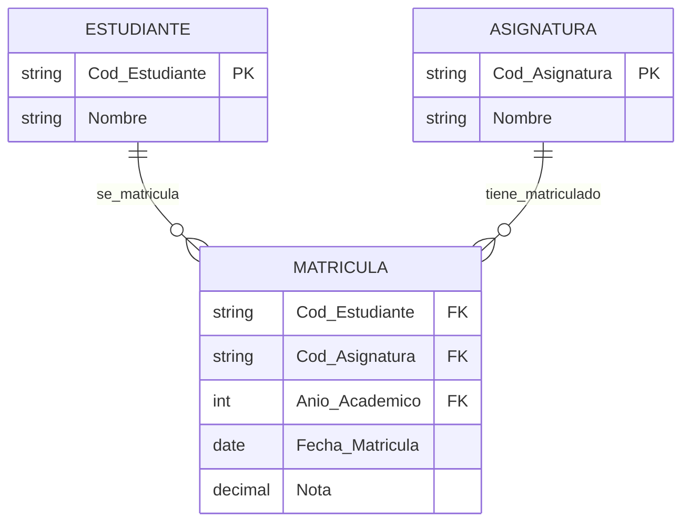

#### **2.2.5. Atributos en relaciones**

Las relaciones también pueden tener **atributos propios**, especialmente en relaciones N:M.

**Ejemplo 1: CLIENTE compra PRODUCTO**

La relación COMPRA puede tener:
- Fecha_Compra
- Cantidad
- Precio_Unitario (puede diferir del precio actual)
- Descuento_Aplicado

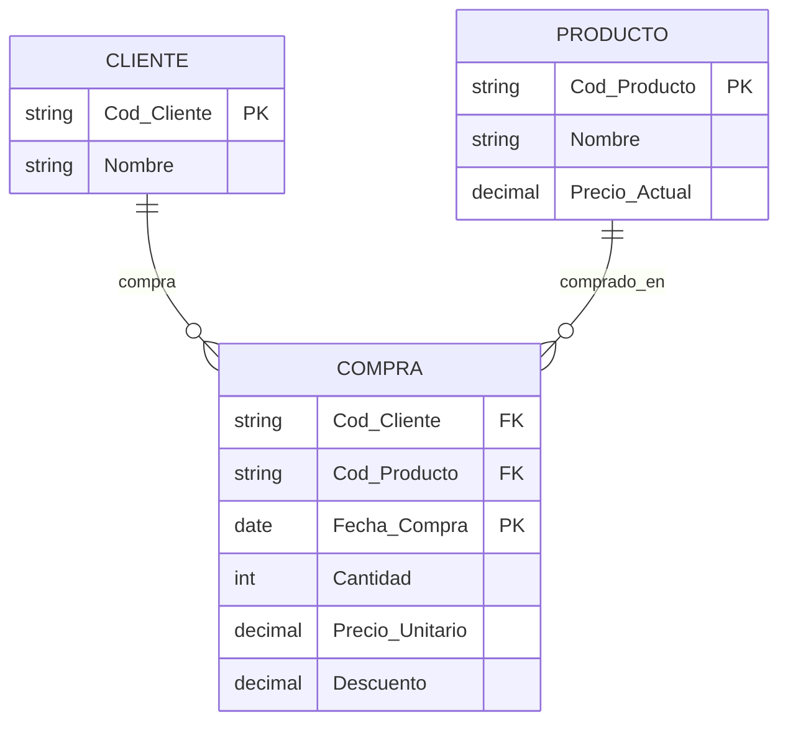

**Ejemplo 2: ACTOR actúa en PELÍCULA**

La relación ACTUACIÓN puede tener:
- Nombre_Personaje
- Tipo_Papel (principal, secundario, cameo)
- Cachê

#### **2.2.6. Errores comunes con atributos**

##### **Error 1: Atributos multivaluados sin normalizar**

❌ **Incorrecto:**
```
CLIENTE(#Cod_Cliente, Nombre, Teléfonos)
Ejemplo: ("001", "Juan Pérez", "666111222, 911333444")
```

✅ **Correcto:**
```
CLIENTE(#Cod_Cliente, Nombre)
TELÉFONO(#Cod_Cliente, #Teléfono, Tipo)
```

##### **Error 2: Atributos compuestos sin dividir cuando es necesario**

❌ **Incorrecto** (si necesitamos buscar por ciudad):
```
CLIENTE(#Cod_Cliente, Nombre, Dirección_Completa)
Ejemplo: "Calle Mayor 10, 3ºB, 28013, Madrid"
```

✅ **Correcto:**
```
CLIENTE(#Cod_Cliente, Nombre, Calle, Número, Piso, CP, Ciudad)
```

##### **Error 3: No identificar atributos derivados**

❌ **Incorrecto** (almacenar edad sin actualizar):
```
PERSONA(#DNI, Nombre, Fecha_Nacimiento, Edad)
```

✅ **Correcto:**
```
PERSONA(#DNI, Nombre, Fecha_Nacimiento, (Edad))
-- Edad se calcula: YEAR(CURDATE()) - YEAR(Fecha_Nacimiento)
```

##### **Error 4: Claves primarias inestables**

❌ **Incorrecto:**
```
CLIENTE(#Email, Nombre, Dirección)
-- El email puede cambiar
```

✅ **Correcto:**
```
CLIENTE(#Cod_Cliente, Nombre, Email, Dirección)
```

#### **2.2.7. Ejercicio resuelto: Clasificación de atributos**

**Enunciado:**  
Para la entidad EMPLEADO con los siguientes atributos, clasifícalos según su tipo:
- DNI
- Nombre
- Apellido1, Apellido2
- Fecha_Nacimiento
- Edad
- Calle, Número, Piso, CP, Ciudad
- Teléfono_Fijo, Teléfono_Móvil
- Email_Personal, Email_Corporativo
- Salario_Base
- Complementos
- Salario_Total
- Fecha_Contratación
- Antigüedad

**Solución:**

| Atributo | Clasificación | Justificación |
|----------|---------------|---------------|
| DNI | Identificador, Simple | Clave primaria, atómico |
| Nombre | Descriptor, Simple | No se divide |
| Apellido1, Apellido2 | Descriptor, Compuesto | Partes de "Apellidos" |
| Fecha_Nacimiento | Descriptor, Simple | Valor atómico |
| Edad | Descriptor, Derivado | Se calcula de Fecha_Nacimiento |
| Calle, Número, Piso, CP, Ciudad | Descriptor, Compuesto | Partes de "Dirección" |
| Teléfono_Fijo, Teléfono_Móvil | Descriptor, Multivaluado | Varios teléfonos posibles |
| Email_Personal, Email_Corporativo | Descriptor, Multivaluado | Varios emails posibles |
| Salario_Base | Descriptor, Simple | Valor atómico |
| Complementos | Descriptor, Simple | Valor atómico |
| Salario_Total | Descriptor, Derivado | Suma de Base + Complementos |
| Fecha_Contratación | Descriptor, Simple | Valor atómico |
| Antigüedad | Descriptor, Derivado | Se calcula de Fecha_Contratación |

**Modelo normalizado:**

```
EMPLEADO(#DNI, Nombre, Apellido1, Apellido2, Fecha_Nacimiento, 
         Calle, Número, Piso, CP, Ciudad, 
         Salario_Base, Complementos, Fecha_Contratación)

TELÉFONO_EMPLEADO(#DNI, #Teléfono, Tipo)

EMAIL_EMPLEADO(#DNI, #Email, Tipo)

-- Atributos derivados se calculan en consultas:
-- Edad = YEAR(CURDATE()) - YEAR(Fecha_Nacimiento)
-- Salario_Total = Salario_Base + Complementos
-- Antigüedad = DATEDIFF(CURDATE(), Fecha_Contratación) / 365
```

---

### 2.3. Relaciones

Una **relación** expresa una asociación o conexión significativa entre dos o más entidades. Representa cómo interactúan los objetos del mundo real que estamos modelando.

#### **2.3.1. Definición y conceptos fundamentales**

> **Relación:** Asociación o vínculo entre ocurrencias de una o más entidades que tiene significado en el contexto del sistema.

**Características de las relaciones:**
- Tienen un **nombre** (verbo o frase verbal).
- Conectan **dos o más entidades** (grado de la relación).
- Tienen **cardinalidad** (cuántas ocurrencias participan).
- Pueden tener **atributos propios**.
- Expresan **reglas de negocio** del sistema.

**Representación gráfica:** Se usa un **rombo** con el nombre del verbo o frase verbal.

#### **2.3.2. Elementos de una relación**

##### **A) Nombre de la relación**

Debe ser un **verbo** o **frase verbal** que describa la acción o asociación:

**Buenos nombres:**
- REALIZA (CLIENTE realiza PEDIDO)
- TRABAJA_EN (EMPLEADO trabaja_en DEPARTAMENTO)
- IMPARTE (PROFESOR imparte ASIGNATURA)
- PERTENECE_A (PRODUCTO pertenece_a CATEGORÍA)
- RESIDE_EN (PERSONA reside_en CIUDAD)

**Malos nombres:**
- ❌ CLIENTE_PEDIDO (no es verbo)
- ❌ RELACIÓN1 (no tiene significado)
- ❌ TIENE (demasiado genérico)

**Consejo:** El nombre debe tener sentido al leer: "Entidad1 **[RELACIÓN]** Entidad2"

##### **B) Entidades participantes**

Son las entidades que intervienen en la relación. Una relación puede conectar:
- **Dos entidades diferentes:** CLIENTE realiza PEDIDO
- **La misma entidad consigo misma (relación reflexiva):** EMPLEADO supervisa EMPLEADO

##### **C) Rol**

En relaciones reflexivas o cuando una entidad participa varias veces, se especifica el **rol** de cada participación:

**Ejemplo 1: EMPLEADO supervisa EMPLEADO**
- Rol 1: "Supervisor"
- Rol 2: "Supervisado"

**Ejemplo 2: PERSONA está_casada_con PERSONA**
- Rol 1: "Cónyuge 1"
- Rol 2: "Cónyuge 2"

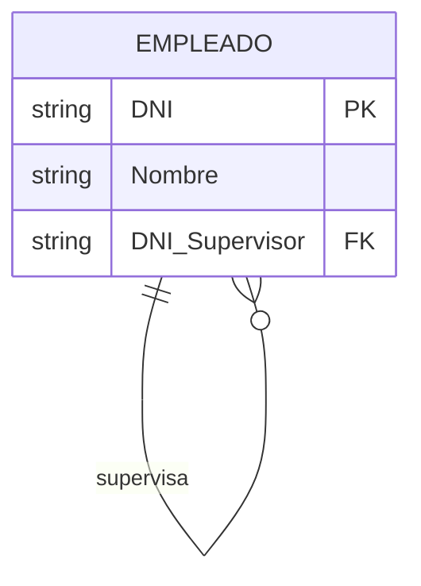

#### **2.3.3. Tipos de relaciones según participantes**

##### **A) Relaciones Binarias**

Conectan **dos entidades** (las más comunes).

**Ejemplo 1: CLIENTE realiza PEDIDO**

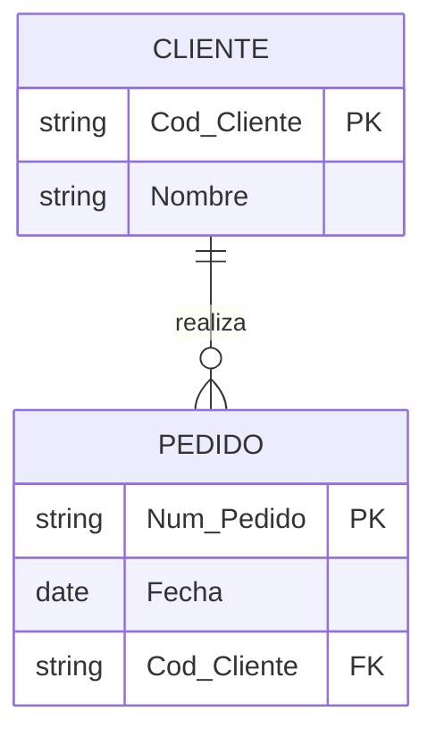

**Ejemplo 2: ESTUDIANTE cursa ASIGNATURA**

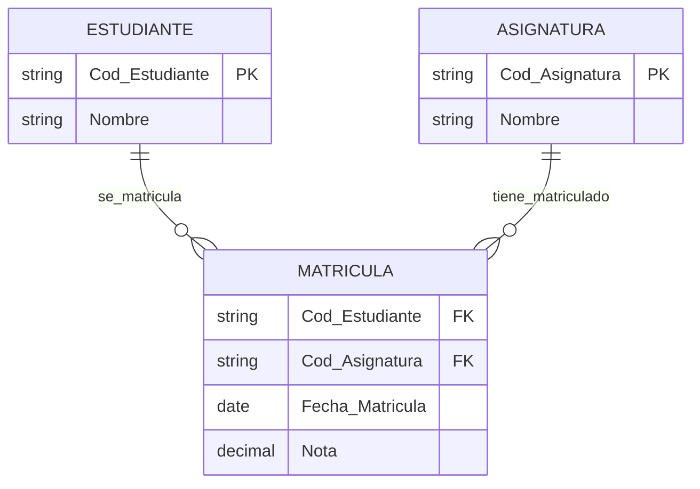

##### **B) Relaciones Ternarias**

Conectan **tres entidades** simultáneamente.

**Ejemplo: PROVEEDOR suministra PRODUCTO a PROYECTO**

No se puede descomponer en relaciones binarias sin perder información:
- No es lo mismo "PROVEEDOR suministra PRODUCTO" + "PRODUCTO usado en PROYECTO"
- La relación expresa: "¿Qué proveedor suministra qué producto para qué proyecto?"

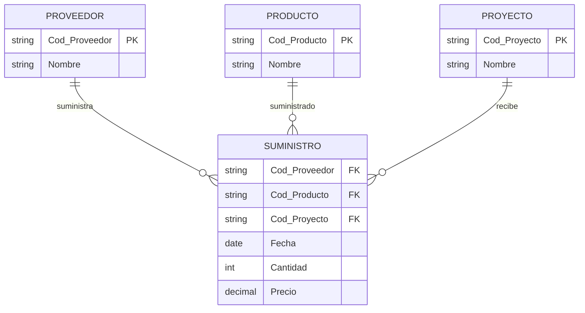

##### **C) Relaciones N-arias**

Conectan **cuatro o más entidades** (poco comunes, se recomienda descomponer si es posible).

**Ejemplo: MÉDICO prescribe MEDICAMENTO a PACIENTE en CONSULTA**

```
PRESCRIPCIÓN(#Cod_Médico, #Cod_Medicamento, #Cod_Paciente, #Fecha_Consulta, 
             Dosis, Duración_Tratamiento, Observaciones)
```

##### **D) Relaciones Reflexivas (Recursivas)**

Una entidad se relaciona **consigo misma**.

**Ejemplo 1: Jerarquía de empleados**

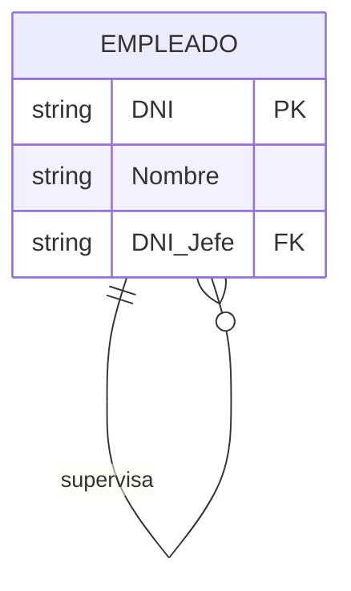

**Ejemplo 2: Componentes de producto (BOM - Bill of Materials)**

```mermaid
erDiagram
    COMPONENTE {
        string Cod_Componente PK
        string Nombre
    }
    COMPOSICION {
        string Cod_Componente_Padre FK
        string Cod_Componente_Hijo FK
        int Cantidad
    }
    COMPONENTE ||--o{ COMPOSICION : contiene
    COMPONENTE ||--o{ COMPOSICION : parte_de
```

**Ejemplo 3: Red social de amistades**

```mermaid
erDiagram
    USUARIO {
        string Id_Usuario PK
        string Nombre
    }
    AMISTAD {
        string Id_Usuario1 FK
        string Id_Usuario2 FK
        date Fecha_Amistad
        string Estado
    }
    USUARIO ||--o{ AMISTAD : amigo_de
```

#### **2.3.4. Atributos propios de relaciones**

Las relaciones pueden tener **atributos** que dependen de la asociación completa, no de una entidad individual.

##### **¿Cuándo una relación tiene atributos?**

Un atributo pertenece a la relación si:
- **No puede asociarse** a ninguna de las entidades individualmente.
- Su valor depende de la **combinación** de las entidades participantes.

**Ejemplo 1: EMPLEADO trabaja_en PROYECTO**

Atributos de la relación:
- `Fecha_Inicio`: Cuándo empezó el empleado en ese proyecto específico.
- `Fecha_Fin`: Cuándo terminó su participación.
- `Horas_Asignadas`: Horas dedicadas a ese proyecto.
- `Rol`: Rol del empleado en ese proyecto (líder, desarrollador, analista).

```mermaid
erDiagram
    EMPLEADO {
        string DNI PK
        string Nombre
    }
    PROYECTO {
        string Cod_Proyecto PK
        string Nombre
    }
    ASIGNACION {
        string DNI FK
        string Cod_Proyecto FK
        date Fecha_Inicio
        date Fecha_Fin
        int Horas_Asignadas
        string Rol
    }
    EMPLEADO ||--o{ ASIGNACION : trabaja_en
    PROYECTO ||--o{ ASIGNACION : tiene_asignado
```

**Ejemplo 2: ESTUDIANTE cursa ASIGNATURA**

Atributos de la relación:
- `Fecha_Matrícula`
- `Convocatoria`: Primera, segunda, tercera...
- `Nota`: Nota obtenida por ese estudiante en esa asignatura.

**Ejemplo 3: CLIENTE compra PRODUCTO**

Atributos de la relación:
- `Fecha_Compra`
- `Cantidad`
- `Precio_Unitario`: Puede diferir del precio actual del producto.
- `Descuento_Aplicado`

#### **2.3.5. Participación en relaciones**

La **participación** indica si la participación de una entidad en una relación es obligatoria u opcional.

##### **A) Participación Total (Obligatoria)**

**Toda** ocurrencia de la entidad **debe** participar en la relación.

**Notación:** Línea doble o "1" como mínimo.

**Ejemplo 1:** Todo PEDIDO debe tener un CLIENTE (no existen pedidos sin cliente).

```
CLIENTE ||--|| PEDIDO
```

**Ejemplo 2:** Todo EMPLEADO debe estar asignado a un DEPARTAMENTO.

```
DEPARTAMENTO ||--|| EMPLEADO
```

##### **B) Participación Parcial (Opcional)**

**Algunas** ocurrencias pueden no participar en la relación.

**Notación:** Línea simple o "0" como mínimo.

**Ejemplo 1:** Un CLIENTE puede no haber realizado ningún PEDIDO (clientes recién registrados).

```
CLIENTE ||--o{ PEDIDO
```

**Ejemplo 2:** Un PROFESOR puede no estar impartiendo ninguna ASIGNATURA actualmente.

```
PROFESOR ||--o{ ASIGNATURA
```

##### **C) Notación (mín, máx)**

Formato más preciso que indica:
- **Mínimo:** Número mínimo de participaciones (0 = opcional, 1 = obligatoria).
- **Máximo:** Número máximo de participaciones (1, N = muchos).

**Ejemplos:**

| Notación | Significado |
|----------|-------------|
| (0,1) | Opcional, máximo una vez |
| (1,1) | Obligatoria, exactamente una vez |
| (0,N) | Opcional, puede ser varias veces |
| (1,N) | Obligatoria, al menos una vez |
| (2,5) | Mínimo 2, máximo 5 veces |

**Ejemplo completo:**

```
CLIENTE (1,1) -- realiza -- (0,N) PEDIDO
```

Significa:
- Cada PEDIDO es realizado por **exactamente un** CLIENTE (1,1).
- Cada CLIENTE puede realizar **cero o muchos** PEDIDOS (0,N).

#### **2.3.6. Dependencias de existencia**

##### **A) Dependencia de Existencia**

Una entidad **no puede existir** sin la otra.

**Ejemplo:** PEDIDO depende de CLIENTE.
- Si se elimina un cliente, se deben eliminar (o marcar como huérfanos) sus pedidos.

##### **B) Independencia**

Las entidades pueden existir por separado.

**Ejemplo:** PROFESOR y ASIGNATURA.
- Pueden existir profesores sin asignaturas asignadas.
- Pueden existir asignaturas sin profesor aún.

#### **2.3.7. Relaciones múltiples entre las mismas entidades**

Dos entidades pueden estar relacionadas por **múltiples relaciones** diferentes.

**Ejemplo: PERSONA y CIUDAD**

```mermaid
erDiagram
    PERSONA {
        string DNI PK
        string Nombre
        string Ciudad_Nacimiento FK
        string Ciudad_Residencia FK
    }
    CIUDAD {
        string Cod_Ciudad PK
        string Nombre
    }
    PERSONA ||--o{ CIUDAD : nace_en
    PERSONA ||--o{ CIUDAD : reside_en
```

**Ejemplo: EMPLEADO y DEPARTAMENTO**

```
EMPLEADO (N,1) -- trabaja_en -- (1,N) DEPARTAMENTO
EMPLEADO (1,1) -- dirige -- (0,1) DEPARTAMENTO
```

Un empleado trabaja en un departamento, pero además un empleado puede dirigir un departamento.

#### **2.3.8. Errores comunes en relaciones**

##### **Error 1: Confundir entidades con relaciones**

❌ **Incorrecto:**
```
Entidad: MATRÍCULA
```

✅ **Correcto:**
```
Relación: SE_MATRICULA (entre ESTUDIANTE y ASIGNATURA)
Atributos de la relación: Fecha, Convocatoria, Nota
```

**Excepción:** Si MATRÍCULA tiene atributos complejos y relaciones con otras entidades, puede ser una entidad.

##### **Error 2: Relaciones sin significado claro**

❌ **Incorrecto:**
```
CLIENTE -- TIENE -- PEDIDO (demasiado genérico)
```

✅ **Correcto:**
```
CLIENTE -- REALIZA -- PEDIDO (expresa la acción específica)
```

##### **Error 3: Olvidar atributos de relaciones N:M**

❌ **Incorrecto:**
```
ESTUDIANTE -- CURSA -- ASIGNATURA
(sin guardar la nota o fecha de matrícula)
```

✅ **Correcto:**
```
MATRÍCULA(Cod_Estudiante, Cod_Asignatura, Fecha, Nota, Convocatoria)
```

##### **Error 4: Descomponer relaciones ternarias incorrectamente**

❌ **Incorrecto:**
Descomponer "PROVEEDOR suministra PRODUCTO a PROYECTO" en:
- PROVEEDOR suministra PRODUCTO
- PRODUCTO usado_en PROYECTO

Se pierde información: ¿Qué proveedor específico suministró qué producto para qué proyecto?

✅ **Correcto:**
```
SUMINISTRO(Cod_Proveedor, Cod_Producto, Cod_Proyecto, Fecha, Cantidad)
```

#### **2.3.9. Ejercicio resuelto: Identificación de relaciones**

**Enunciado:**  
En un hospital, los médicos atienden pacientes en consultas. Cada consulta se realiza en una fecha específica. Los médicos pueden especializarse en una o varias especialidades. Los pacientes pueden ser tratados por varios médicos a lo largo del tiempo. Identificar entidades, relaciones y atributos.

**Solución:**

**Entidades:**
1. **MÉDICO:** Cod_Médico, Nombre, Apellidos, Nº_Colegiado
2. **PACIENTE:** Nº_Historia, Nombre, Apellidos, Fecha_Nacimiento, Dirección
3. **ESPECIALIDAD:** Cod_Especialidad, Nombre
4. **CONSULTA:** Nº_Consulta, Fecha, Hora, Diagnóstico, Tratamiento

**Relaciones:**

1. **MÉDICO se_especializa_en ESPECIALIDAD (N:M)**
   - Un médico puede tener varias especialidades.
   - Una especialidad la tienen varios médicos.
   - Atributos: Fecha_Titulación

2. **MÉDICO atiende PACIENTE en CONSULTA (Ternaria)**
   - Opción 1: Relación ternaria.
   - Opción 2: CONSULTA como entidad relacionada con MÉDICO y PACIENTE.

**Diagrama E/R:**

```mermaid
erDiagram
    MEDICO {
        string Cod_Medico PK
        string Nombre
        string Apellidos
        string Num_Colegiado
    }
    PACIENTE {
        string Num_Historia PK
        string Nombre
        string Apellidos
        date Fecha_Nacimiento
        string Direccion
    }
    ESPECIALIDAD {
        string Cod_Especialidad PK
        string Nombre
    }
    CONSULTA {
        int Num_Consulta PK
        date Fecha
        time Hora
        string Diagnostico
        string Tratamiento
        string Cod_Medico FK
        string Num_Historia FK
    }
    
    MEDICO ||--o{ MEDICO_ESPECIALIDAD : tiene
    ESPECIALIDAD ||--o{ MEDICO_ESPECIALIDAD : especializado
    MEDICO ||--o{ CONSULTA : atiende
    PACIENTE ||--o{ CONSULTA : es_atendido
```

**Justificación:**
- **MÉDICO-ESPECIALIDAD:** N:M, requiere tabla intermedia con Fecha_Titulación.
- **CONSULTA:** Se modela como entidad porque tiene múltiples atributos propios y se relaciona con otras entidades.
- **Cardinalidades:**
  - Un médico atiende muchas consultas (1:N).
  - Un paciente tiene muchas consultas a lo largo del tiempo (1:N).

---

### 2.4. Grado de una relación

El **grado** de una relación indica cuántas entidades participan en ella. Es un concepto fundamental para comprender la complejidad de las asociaciones.

#### **2.4.1. Definición**

> **Grado de una relación:** Número de entidades que participan en la relación.

#### **2.4.2. Tipos según el grado**

| Tipo | Grado | Descripción | Frecuencia |
|------|-------|-------------|------------|
| **Unaria (Reflexiva)** | 1 | Una entidad relacionada consigo misma | Común |
| **Binaria** | 2 | Dos entidades diferentes | Muy común (90%) |
| **Ternaria** | 3 | Tres entidades | Poco común (8%) |
| **Cuaternaria** | 4 | Cuatro entidades | Rara (2%) |
| **N-aria** | N | N entidades | Muy rara (<1%) |

##### **A) Relaciones Unarias (Grado 1)**

También llamadas **reflexivas** o **recursivas**.

**Ejemplo 1: Jerarquía organizacional**

```mermaid
erDiagram
    EMPLEADO {
        string DNI PK
        string Nombre
        string Cargo
        string DNI_Supervisor FK
    }
    EMPLEADO ||--o{ EMPLEADO : supervisa
```

**Interpretación:**
- Un empleado (supervisor) supervisa a varios empleados (subordinados).
- Un empleado es supervisado por un empleado (su jefe).

**Ejemplo 2: Requisitos previos de asignaturas**

```mermaid
erDiagram
    ASIGNATURA {
        string Cod_Asignatura PK
        string Nombre
    }
    PREREQUISITO {
        string Cod_Asignatura FK
        string Cod_Asignatura_Previa FK
    }
    ASIGNATURA ||--o{ PREREQUISITO : requiere
    ASIGNATURA ||--o{ PREREQUISITO : es_requisito_de
```

**Interpretación:**
- Una asignatura puede requerir otras asignaturas previas.
- Una asignatura puede ser requisito de otras asignaturas.

**Ejemplo 3: Parentesco**

```
PERSONA -- es_padre_de -- PERSONA
```

Una persona puede ser padre de varias personas (sus hijos).

##### **B) Relaciones Binarias (Grado 2)**

Son las **más comunes** en el modelado de datos.

**Ejemplo 1: 1:N - Un cliente realiza varios pedidos**

```mermaid
erDiagram
    CLIENTE {
        string Cod_Cliente PK
        string Nombre
        string Email
    }
    PEDIDO {
        string Num_Pedido PK
        date Fecha
        string Cod_Cliente FK
    }
    CLIENTE ||--o{ PEDIDO : realiza
```

**Ejemplo 2: N:M - Estudiantes cursan asignaturas**

```mermaid
erDiagram
    ESTUDIANTE {
        string Cod_Estudiante PK
        string Nombre
    }
    ASIGNATURA {
        string Cod_Asignatura PK
        string Nombre
    }
    MATRICULA {
        string Cod_Estudiante FK
        string Cod_Asignatura FK
        date Fecha
        decimal Nota
    }
    ESTUDIANTE ||--o{ MATRICULA : se_matricula
    ASIGNATURA ||--o{ MATRICULA : tiene_matriculado
```

**Ejemplo 3: 1:1 - Persona tiene pasaporte**

```mermaid
erDiagram
    PERSONA {
        string DNI PK
        string Nombre
    }
    PASAPORTE {
        string Num_Pasaporte PK
        date Fecha_Expedicion
        date Fecha_Caducidad
        string DNI FK
    }
    PERSONA ||--|| PASAPORTE : tiene
```

##### **C) Relaciones Ternarias (Grado 3)**

Involucran **tres entidades** simultáneamente.

**Criterio clave:** Solo usar relaciones ternarias cuando la información **no pueda descomponerse** en relaciones binarias sin pérdida de significado.

**Ejemplo 1: Suministro de productos**

```
PROVEEDOR -- suministra --> PRODUCTO -- para --> PROYECTO
```

**Pregunta clave:** ¿Qué proveedor suministra qué producto para qué proyecto específico?

No se puede responder con:
- PROVEEDOR suministra PRODUCTO (no sabemos para qué proyecto)
- PRODUCTO usado_en PROYECTO (no sabemos qué proveedor)

**Solución correcta:**

```mermaid
erDiagram
    PROVEEDOR {
        string Cod_Proveedor PK
        string Nombre
    }
    PRODUCTO {
        string Cod_Producto PK
        string Nombre
    }
    PROYECTO {
        string Cod_Proyecto PK
        string Nombre
    }
    SUMINISTRO {
        string Cod_Proveedor FK
        string Cod_Producto FK
        string Cod_Proyecto FK
        date Fecha
        int Cantidad
        decimal Precio_Unitario
    }
    PROVEEDOR ||--o{ SUMINISTRO : suministra
    PRODUCTO ||--o{ SUMINISTRO : suministrado
    PROYECTO ||--o{ SUMINISTRO : recibe
```

**Ejemplo 2: Asignación de profesores**

```
PROFESOR -- imparte --> ASIGNATURA -- en --> AULA
```

**Pregunta:** ¿Qué profesor imparte qué asignatura en qué aula específica?

```mermaid
erDiagram
    PROFESOR {
        string Cod_Profesor PK
        string Nombre
    }
    ASIGNATURA {
        string Cod_Asignatura PK
        string Nombre
    }
    AULA {
        string Cod_Aula PK
        string Ubicacion
        int Capacidad
    }
    CLASE {
        string Cod_Profesor FK
        string Cod_Asignatura FK
        string Cod_Aula FK
        date Fecha
        time Hora_Inicio
        time Hora_Fin
    }
    PROFESOR ||--o{ CLASE : imparte
    ASIGNATURA ||--o{ CLASE : se_imparte
    AULA ||--o{ CLASE : ubicada_en
```

**Ejemplo 3: Consultas médicas**

```
MÉDICO -- atiende --> PACIENTE -- en --> CONSULTA
```

##### **D) Relaciones de Grado Superior (N > 3)**

**Recomendación:** Evitar relaciones de grado superior a 3, ya que:
- Son difíciles de comprender.
- Complejas de implementar.
- Pueden generar confusión.

**Alternativa:** Convertir la relación en una **entidad** relacionada con las demás.

**Ejemplo original (cuaternaria):**

```
MÉDICO -- prescribe --> MEDICAMENTO -- a --> PACIENTE -- en --> HOSPITAL
```

**Solución mejorada:**

```mermaid
erDiagram
    MEDICO {
        string Cod_Medico PK
        string Nombre
    }
    MEDICAMENTO {
        string Cod_Medicamento PK
        string Nombre
    }
    PACIENTE {
        string Num_Historia PK
        string Nombre
    }
    HOSPITAL {
        string Cod_Hospital PK
        string Nombre
    }
    PRESCRIPCION {
        int Num_Prescripcion PK
        string Cod_Medico FK
        string Cod_Medicamento FK
        string Num_Historia FK
        string Cod_Hospital FK
        date Fecha
        string Dosis
        int Duracion_Dias
    }
    MEDICO ||--o{ PRESCRIPCION : prescribe
    MEDICAMENTO ||--o{ PRESCRIPCION : prescrito
    PACIENTE ||--o{ PRESCRIPCION : recibe
    HOSPITAL ||--o{ PRESCRIPCION : en
```

#### **2.4.3. Cómo determinar el grado correcto**

**Pregunta clave:** ¿La información depende de la combinación de todas las entidades o puede dividirse?

**Test de descomposición:**
1. Intenta descomponer en relaciones binarias.
2. Si pierdes información específica → Necesitas relación de grado superior.
3. Si no pierdes información → Usa relaciones binarias (más simple).

**Ejemplo de test:**

**Caso:** Profesores imparten asignaturas en aulas.

**Opción 1: Relación ternaria**
```
PROFESOR-ASIGNATURA-AULA(Cod_Profesor, Cod_Asignatura, Cod_Aula, Horario)
```

**Opción 2: Relaciones binarias**
```
PROFESOR imparte ASIGNATURA
ASIGNATURA se_imparte_en AULA
```

**Análisis:**
- Si un profesor siempre imparte una asignatura en la misma aula → Opción 2 suficiente.
- Si un profesor puede impartir la misma asignatura en diferentes aulas → Opción 1 necesaria.

#### **2.4.4. Ejercicio resuelto: Determinación del grado**

**Enunciado:**  
Determinar el grado de las siguientes relaciones:

1. Los empleados trabajan en departamentos.
2. Los empleados tienen un jefe (que también es empleado).
3. Los proveedores suministran productos a tiendas.
4. Los autores escriben libros.
5. Las piezas están compuestas por otras piezas.

**Solución:**

| Nº | Descripción | Entidades participantes | Grado | Tipo |
|----|-------------|-------------------------|-------|------|
| 1 | Empleados-Departamentos | EMPLEADO, DEPARTAMENTO | 2 | Binaria |
| 2 | Empleado-Jefe | EMPLEADO | 1 | Unaria/Reflexiva |
| 3 | Proveedor-Producto-Tienda | PROVEEDOR, PRODUCTO, TIENDA | 3 | Ternaria |
| 4 | Autor-Libro | AUTOR, LIBRO | 2 | Binaria |
| 5 | Pieza-Pieza | PIEZA | 1 | Unaria/Reflexiva |

**Diagramas:**

**Relación 1: EMPLEADO trabaja_en DEPARTAMENTO (Binaria)**
```mermaid
erDiagram
    EMPLEADO ||--o{ DEPARTAMENTO : trabaja_en
```

**Relación 2: EMPLEADO supervisa EMPLEADO (Unaria)**
```mermaid
erDiagram
    EMPLEADO ||--o{ EMPLEADO : supervisa
```

**Relación 3: PROVEEDOR-PRODUCTO-TIENDA (Ternaria)**
```mermaid
erDiagram
    PROVEEDOR ||--o{ SUMINISTRO : suministra
    PRODUCTO ||--o{ SUMINISTRO : es_suministrado
    TIENDA ||--o{ SUMINISTRO : recibe
```

---

### 2.5. Cardinalidad y participación

La **cardinalidad** y la **participación** son conceptos fundamentales que definen **cuántas** ocurrencias de una entidad pueden relacionarse con ocurrencias de otra entidad.

#### **2.5.1. Definiciones**

> **Cardinalidad:** Número máximo de ocurrencias de una entidad que pueden estar relacionadas con una ocurrencia de otra entidad.

> **Participación (mínima):** Número mínimo de veces que una ocurrencia de una entidad debe participar en una relación.

#### **2.5.2. Tipos de cardinalidad**

##### **A) Cardinalidad 1:1 (Uno a Uno)**

Cada ocurrencia de la entidad A se relaciona con **máximo una** ocurrencia de la entidad B, y viceversa.

**Características:**
- Relación **biunívoca**.
- Poco común en la práctica.
- A menudo indica que las entidades podrían fusionarse.

**Ejemplo 1: PERSONA - PASAPORTE**

```mermaid
erDiagram
    PERSONA {
        string DNI PK
        string Nombre
        string Apellidos
    }
    PASAPORTE {
        string Num_Pasaporte PK
        date Fecha_Expedicion
        date Fecha_Caducidad
        string DNI FK
    }
    PERSONA ||--|| PASAPORTE : tiene
```

- Una persona tiene como máximo un pasaporte vigente.
- Un pasaporte pertenece a una única persona.

**Ejemplo 2: PAÍS - CAPITAL**

```mermaid
erDiagram
    PAIS {
        string Cod_Pais PK
        string Nombre
    }
    CIUDAD {
        string Cod_Ciudad PK
        string Nombre
        string Cod_Pais FK
    }
    PAIS ||--|| CIUDAD : tiene_capital
```

**Cuándo usar 1:1:**
- Información sensible separada (datos personales vs. datos médicos).
- Entidades opcionales (no todos tienen pasaporte).
- Razones de seguridad o permisos.

##### **B) Cardinalidad 1:N (Uno a Muchos)**

Cada ocurrencia de la entidad A puede relacionarse con **varias** ocurrencias de la entidad B, pero cada ocurrencia de B se relaciona con **una sola** de A.

**Es el tipo más común** en bases de datos relacionales.

**Ejemplo 1: CLIENTE - PEDIDO**

```mermaid
erDiagram
    CLIENTE {
        string Cod_Cliente PK
        string Nombre
    }
    PEDIDO {
        string Num_Pedido PK
        date Fecha
        string Cod_Cliente FK
    }
    CLIENTE ||--o{ PEDIDO : realiza
```

- Un cliente puede realizar **varios** pedidos.
- Cada pedido pertenece a **un solo** cliente.

**Ejemplo 2: DEPARTAMENTO - EMPLEADO**

```mermaid
erDiagram
    DEPARTAMENTO {
        string Cod_Departamento PK
        string Nombre
    }
    EMPLEADO {
        string DNI PK
        string Nombre
        string Cod_Departamento FK
    }
    DEPARTAMENTO ||--o{ EMPLEADO : tiene
```

- Un departamento tiene **varios** empleados.
- Cada empleado pertenece a **un solo** departamento.

**Ejemplo 3: AUTOR - LIBRO (si consideramos un solo autor por libro)**

```mermaid
erDiagram
    AUTOR {
        string Cod_Autor PK
        string Nombre
    }
    LIBRO {
        string ISBN PK
        string Titulo
        string Cod_Autor FK
    }
    AUTOR ||--o{ LIBRO : escribe
```

##### **C) Cardinalidad N:M (Muchos a Muchos)**

Cada ocurrencia de A puede relacionarse con **varias** ocurrencias de B, y cada ocurrencia de B puede relacionarse con **varias** ocurrencias de A.

**Características:**
- Requiere **tabla intermedia** en el modelo relacional.
- La tabla intermedia suele tener **atributos propios**.

**Ejemplo 1: ESTUDIANTE - ASIGNATURA**

```mermaid
erDiagram
    ESTUDIANTE {
        string Cod_Estudiante PK
        string Nombre
    }
    ASIGNATURA {
        string Cod_Asignatura PK
        string Nombre
    }
    MATRICULA {
        string Cod_Estudiante FK
        string Cod_Asignatura FK
        date Fecha_Matricula
        decimal Nota
        int Convocatoria
    }
    ESTUDIANTE ||--o{ MATRICULA : se_matricula
    ASIGNATURA ||--o{ MATRICULA : matriculado_en
```

- Un estudiante cursa **varias** asignaturas.
- Una asignatura es cursada por **varios** estudiantes.

**Ejemplo 2: ACTOR - PELÍCULA**

```mermaid
erDiagram
    ACTOR {
        string Cod_Actor PK
        string Nombre
    }
    PELICULA {
        string Cod_Pelicula PK
        string Titulo
    }
    ACTUACION {
        string Cod_Actor FK
        string Cod_Pelicula FK
        string Personaje
        string Tipo_Papel
        decimal Cache
    }
    ACTOR ||--o{ ACTUACION : actua_en
    PELICULA ||--o{ ACTUACION : tiene_actor
```

- Un actor actúa en **varias** películas.
- Una película tiene **varios** actores.

**Ejemplo 3: PRODUCTO - PROVEEDOR**

```mermaid
erDiagram
    PRODUCTO {
        string Cod_Producto PK
        string Nombre
    }
    PROVEEDOR {
        string Cod_Proveedor PK
        string Nombre
    }
    SUMINISTRO {
        string Cod_Producto FK
        string Cod_Proveedor FK
        decimal Precio
        int Tiempo_Entrega_Dias
    }
    PRODUCTO ||--o{ SUMINISTRO : suministrado_por
    PROVEEDOR ||--o{ SUMINISTRO : suministra
```

#### **2.5.3. Cómo determinar la cardinalidad**

**Método paso a paso:**

1. **Fija una ocurrencia** de la entidad A.
2. **Pregunta:** ¿Cuántas ocurrencias de B se pueden relacionar con esta A?
3. **Responde:** Una (1) o Varias (N).
4. **Repite** el proceso en sentido inverso (de B hacia A).
5. **Combina** las respuestas: 1:1, 1:N o N:M.

**Ejemplo práctico: CLIENTE - PEDIDO**

**Paso 1:** Fijo un cliente (ej: "Juan Pérez")  
**Pregunta:** ¿Cuántos pedidos puede hacer Juan Pérez?  
**Respuesta:** Varios (N)

**Paso 2:** Fijo un pedido (ej: "Pedido #1001")  
**Pregunta:** ¿A cuántos clientes pertenece el pedido #1001?  
**Respuesta:** Solo uno (1)

**Conclusión:** CLIENTE (1) -- realiza -- (N) PEDIDO → **1:N**

#### **2.5.4. Participación: Total vs. Parcial**

##### **A) Participación Total (Obligatoria)**

**Toda** ocurrencia de la entidad **debe** participar en la relación.

**Notación:** Línea doble (=) o especificar (1,N).

**Ejemplos:**
- Todo PEDIDO **debe** tener un CLIENTE.
- Todo EMPLEADO **debe** pertenecer a un DEPARTAMENTO.
- Toda FACTURA **debe** corresponder a un PEDIDO.

**Diagrama:**
```
CLIENTE ||--|| PEDIDO
        ══════
    (doble línea indica participación total desde PEDIDO)
```

##### **B) Participación Parcial (Opcional)**

**Algunas** ocurrencias pueden **no** participar en la relación.

**Notación:** Línea simple (-) o especificar (0,N).

**Ejemplos:**
- Un CLIENTE **puede no tener** ningún PEDIDO (recién registrado).
- Un PROFESOR **puede no impartir** ninguna ASIGNATURA (de baja/vacaciones).
- Un PRODUCTO **puede no estar** en ningún PEDIDO (sin ventas aún).

**Diagrama:**
```
CLIENTE ||--o{ PEDIDO
        ─────
    (línea simple indica participación parcial desde CLIENTE)
```

#### **2.5.5. Notación (mín, máx)**

Formato más preciso: **(cardinalidad mínima, cardinalidad máxima)**

| Notación | Significado |
|----------|-------------|
| **(0,1)** | Opcional, máximo una vez (participación parcial) |
| **(1,1)** | Obligatoria, exactamente una vez (participación total) |
| **(0,N)** | Opcional, puede ser muchas veces |
| **(1,N)** | Obligatoria, al menos una vez |
| **(2,5)** | Mínimo 2, máximo 5 |
| **(5,*)** | Mínimo 5, sin límite máximo |

**Ejemplo completo con notación (mín,máx):**

```
DEPARTAMENTO (1,1) ─── trabaja_en ─── (1,N) EMPLEADO
```

**Interpretación:**
- Cada EMPLEADO trabaja en **exactamente un** DEPARTAMENTO (1,1).
- Cada DEPARTAMENTO tiene **al menos un** EMPLEADO (1,N).

**Otro ejemplo:**

```
CLIENTE (0,N) ─── realiza ─── (1,1) PEDIDO
```

**Interpretación:**
- Cada PEDIDO es realizado por **exactamente un** CLIENTE (1,1).
- Cada CLIENTE puede tener **cero o muchos** PEDIDOS (0,N).

#### **2.5.6. Tabla resumen de cardinalidades**

| Relación | Ejemplo | Desde A | Desde B | Implementación |
|----------|---------|---------|---------|----------------|
| **1:1** | PERSONA-PASAPORTE | (0,1) | (1,1) | FK en cualquiera de las dos tablas |
| **1:N** | CLIENTE-PEDIDO | (0,N) | (1,1) | FK en el lado "N" (PEDIDO) |
| **N:M** | ESTUDIANTE-ASIGNATURA | (0,N) | (0,N) | Tabla intermedia MATRÍCULA |

#### **2.5.7. Errores comunes**

##### **Error 1: Confundir cardinalidad máxima con mínima**

❌ **Incorrecto:**
"Un cliente debe tener al menos un pedido" → (1,N)

✅ **Correcto:**
"Un cliente puede no tener pedidos" → (0,N)

##### **Error 2: No considerar casos extremos**

❌ **Incorrecto:**
Asumir que todo profesor siempre imparte asignaturas.

✅ **Correcto:**
Considerar profesores de baja, nuevos, administrativos → (0,N)

##### **Error 3: Cardinalidad mal determinada**

**Caso:** AUTOR - LIBRO

❌ **Si asumes un solo autor por libro:** 1:N  
✅ **En realidad (libros con coautores):** N:M

#### **2.5.8. Ejercicios resueltos**

**Ejercicio 1:**  
Determinar la cardinalidad entre MÉDICO y PACIENTE en un hospital.

**Análisis:**
- Un médico atiende a **muchos** pacientes → N
- Un paciente es atendido por **varios** médicos (diferentes especialidades) → M

**Solución:** **N:M**

Requiere tabla intermedia CONSULTA(Cod_Médico, Nº_Historia, Fecha, Diagnóstico).

**Ejercicio 2:**  
¿Cuál es la cardinalidad entre LIBRO y EDITORIAL?

**Análisis:**
- Un libro es publicado por **una sola** editorial → 1
- Una editorial publica **muchos** libros → N

**Solución:** **1:N** (EDITORIAL tiene muchos LIBROS)

**Ejercicio 3:**  
Determinar cardinalidad y participación: EMPLEADO - PROYECTO

**Contexto:** Los empleados trabajan en proyectos. No todos los empleados están asignados a proyectos actualmente.

**Análisis:**
- Un empleado trabaja en **varios** proyectos → (0,N)
- Un proyecto tiene **varios** empleados → (1,N) (al menos uno)

**Solución:** **N:M con participación parcial desde EMPLEADO y total desde PROYECTO**

Tabla intermedia: ASIGNACIÓN(DNI, Cod_Proyecto, Fecha_Inicio, Rol).

---

### 2.6. Atributos propios de una relación

Los atributos de las relaciones son propiedades que **dependen de la asociación completa** entre las entidades, no de las entidades individuales.

#### **2.6.1. ¿Cuándo un atributo pertenece a la relación?**

Un atributo pertenece a la relación (y no a ninguna entidad) cuando:

1. **No puede asignarse** a ninguna de las entidades participantes sin ambigüedad.
2. Su valor **depende de la combinación** de las entidades relacionadas.
3. **Pierde sentido** si se asocia a una sola entidad.

**Pregunta clave:** ¿Este atributo tiene un valor diferente para cada combinación de entidades?

#### **2.6.2. Ejemplos prácticos**

##### **Ejemplo 1: EMPLEADO trabaja_en PROYECTO**

**Atributos de la relación:**
- `Fecha_Incorporación`: Cuándo empezó el empleado en ese proyecto específico.
- `Rol`: Rol del empleado en ese proyecto (líder, desarrollador, analista).
- `Horas_Asignadas`: Horas dedicadas a ese proyecto.

```mermaid
erDiagram
    EMPLEADO {
        string DNI PK
        string Nombre
        decimal Salario_Base
    }
    PROYECTO {
        string Cod_Proyecto PK
        string Nombre
        decimal Presupuesto
    }
    ASIGNACION {
        string DNI FK
        string Cod_Proyecto FK
        date Fecha_Incorporacion
        date Fecha_Fin
        string Rol
        int Horas_Asignadas
    }
    EMPLEADO ||--o{ ASIGNACION : trabaja_en
    PROYECTO ||--o{ ASIGNACION : tiene_asignado
```

##### **Ejemplo 2: CLIENTE compra PRODUCTO**

**Atributos de la relación:**
- `Fecha_Compra`
- `Cantidad`
- `Precio_Venta`: Puede diferir del precio actual del producto.
- `Descuento_Aplicado`

```mermaid
erDiagram
    CLIENTE {
        string Cod_Cliente PK
        string Nombre
    }
    PRODUCTO {
        string Cod_Producto PK
        string Nombre
        decimal Precio_Actual
    }
    COMPRA {
        string Cod_Cliente FK
        string Cod_Producto FK
        date Fecha_Compra PK
        int Cantidad
        decimal Precio_Venta
        decimal Descuento
    }
    CLIENTE ||--o{ COMPRA : compra
    PRODUCTO ||--o{ COMPRA : comprado_en
```

#### **2.6.3. Reglas prácticas**

1. **En relaciones N:M:** Los atributos van siempre en la tabla intermedia.
2. **En relaciones 1:N:** Los atributos de la relación pueden migrar al lado "N".
3. **En relaciones 1:1:** Evaluar caso por caso según la lógica de negocio.

---

## Entidades fuertes y débiles (Relación de dependencia)

Las entidades débiles representan un concepto fundamental en el modelado E/R que permite capturar relaciones de dependencia existencial e identificativa entre entidades.

### 3.1. Conceptos fundamentales

#### **3.1.1. Definiciones**

> **Entidad Fuerte:** Entidad que existe por sí misma y tiene su propia clave primaria independiente. Puede ser identificada sin necesidad de otras entidades.

> **Entidad Débil:** Entidad cuya existencia depende de otra entidad (llamada entidad fuerte o propietaria). No puede ser identificada únicamente por sus propios atributos.

#### **3.1.2. Características de entidades débiles**

1. **Dependencia existencial:** No pueden existir sin la entidad fuerte.
2. **Identificación externa:** Su clave primaria incluye la clave de la entidad fuerte.
3. **Clave parcial:** Tienen un discriminante que las distingue dentro de su entidad propietaria.
4. **Notación especial:** Se representan con rectángulo doble.
5. **Relación identificadora:** Se conectan mediante un rombo doble.

#### **3.1.3. Representación gráfica**

**Notación de Chen:**
- Entidad débil: **Rectángulo doble**
- Relación identificadora: **Rombo doble**
- Clave parcial: Atributo **subrayado con línea discontinua**

### 3.2. Dependencia en existencia

La **dependencia en existencia** implica que una entidad no puede existir sin la presencia de otra entidad relacionada.

#### **3.2.1. Definición formal**

> Una entidad B tiene dependencia en existencia respecto a la entidad A si:
> - Toda ocurrencia de B **debe estar relacionada** con alguna ocurrencia de A.
> - Si se elimina una ocurrencia de A, se deben eliminar todas las ocurrencias de B relacionadas.

#### **3.2.2. Características**

- **Participación total:** La entidad débil siempre participa en la relación.
- **Cardinalidad:** Usualmente 1:N desde la entidad fuerte hacia la débil.
- **Integridad referencial:** Se implementa con restricción ON DELETE CASCADE.

#### **3.2.3. Ejemplos detallados**

##### **Ejemplo 1: EMPLEADO tiene HIJO**

Un hijo registrado en el sistema de la empresa **existe porque** su padre/madre es empleado.

```mermaid
erDiagram
    EMPLEADO {
        string DNI PK
        string Nombre
        string Apellidos
        date Fecha_Contratacion
    }
    HIJO {
        string DNI_Empleado FK
        string Nombre
        date Fecha_Nacimiento
        string Genero
    }
    EMPLEADO ||--o{ HIJO : tiene
```

**Análisis:**
- **Dependencia:** Si el empleado deja la empresa (se borra del sistema), sus hijos ya no tienen sentido en el contexto empresarial.
- **Identificación:** HIJO se identifica por (DNI_Empleado, Nombre) → Clave compuesta.
- **Clave parcial:** `Nombre` (distingue hijos del mismo empleado).

**Implementación SQL:**
```sql
CREATE TABLE EMPLEADO (
    DNI VARCHAR(9) PRIMARY KEY,
    Nombre VARCHAR(50) NOT NULL,
    Apellidos VARCHAR(100) NOT NULL,
    Fecha_Contratacion DATE
);

CREATE TABLE HIJO (
    DNI_Empleado VARCHAR(9),
    Nombre VARCHAR(50),
    Fecha_Nacimiento DATE,
    Genero CHAR(1),
    PRIMARY KEY (DNI_Empleado, Nombre),
    FOREIGN KEY (DNI_Empleado) REFERENCES EMPLEADO(DNI)
        ON DELETE CASCADE
);
```

##### **Ejemplo 2: EDIFICIO contiene APARTAMENTO**

```mermaid
erDiagram
    EDIFICIO {
        string Cod_Edificio PK
        string Direccion
        int Num_Plantas
        int Anio_Construccion
    }
    APARTAMENTO {
        string Cod_Edificio FK
        string Num_Apartamento PK
        int Planta
        int Metros_Cuadrados
        int Num_Habitaciones
    }
    EDIFICIO ||--o{ APARTAMENTO : contiene
```

**Análisis:**
- **Dependencia:** Un apartamento no existe sin el edificio que lo contiene.
- **Identificación:** (Cod_Edificio, Num_Apartamento).
- **Clave parcial:** `Num_Apartamento` (ej: "1A", "2B").

##### **Ejemplo 3: PEDIDO contiene LÍNEA_PEDIDO**

```mermaid
erDiagram
    PEDIDO {
        string Num_Pedido PK
        date Fecha
        string Cod_Cliente FK
        string Estado
    }
    LINEA_PEDIDO {
        string Num_Pedido FK
        int Num_Linea PK
        string Cod_Producto FK
        int Cantidad
        decimal Precio_Unitario
    }
    PEDIDO ||--o{ LINEA_PEDIDO : contiene
```

**Análisis:**
- **Dependencia:** Las líneas de pedido no tienen sentido sin el pedido principal.
- **Identificación:** (Num_Pedido, Num_Linea).
- **Clave parcial:** `Num_Linea` (1, 2, 3...).

#### **3.2.4. Reglas de integridad**

Al implementar dependencia en existencia:

1. **DELETE CASCADE:** Al borrar la entidad fuerte, se borran las débiles.
2. **UPDATE CASCADE:** Al actualizar la clave de la fuerte, se actualiza en las débiles.
3. **INSERT RESTRICT:** No se puede insertar una entidad débil sin referencia válida a la fuerte.

**Ejemplo SQL:**
```sql
FOREIGN KEY (DNI_Empleado) REFERENCES EMPLEADO(DNI)
    ON DELETE CASCADE
    ON UPDATE CASCADE
```

### 3.3. Dependencia en identificación

La **dependencia en identificación** es un tipo más fuerte de dependencia donde la entidad débil no solo depende existencialmente, sino que **necesita** la clave de la entidad fuerte para ser identificada.

#### **3.3.1. Definición formal**

> Una entidad B tiene dependencia en identificación respecto a A si:
> - B depende en existencia de A (no puede existir sin A).
> - La clave primaria de B está formada por: **clave de A + clave parcial de B**.

#### **3.3.2. Diferencia con dependencia en existencia**

| Aspecto | Dependencia en Existencia | Dependencia en Identificación |
|---------|---------------------------|-------------------------------|
| **Existencia** | Sí, depende | Sí, depende |
| **Identificación** | Puede tener clave propia | Necesita clave de la entidad fuerte |
| **Clave primaria** | Independiente o compuesta | Siempre compuesta (incluye FK) |
| **Fortaleza** | Dependencia débil | Dependencia fuerte |

#### **3.3.3. Ejemplos detallados**

##### **Ejemplo 1: PROVINCIA contiene MUNICIPIO**

```mermaid
erDiagram
    PROVINCIA {
        string Cod_Provincia PK
        string Nombre
        int Poblacion
    }
    MUNICIPIO {
        string Cod_Provincia FK
        string Nombre PK
        int Poblacion
        int Codigo_Postal
    }
    PROVINCIA ||--o{ MUNICIPIO : contiene
```

**Análisis:**
- **Problema:** Existen municipios con el mismo nombre en diferentes provincias (ej: "Villar").
- **Solución:** MUNICIPIO se identifica por (Cod_Provincia, Nombre).
- **Clave parcial:** `Nombre` del municipio.
- **Interpretación:** El municipio "Villar" en la provincia "28" (Madrid) es diferente del "Villar" en la provincia "19" (Guadalajara).

**Implementación SQL:**
```sql
CREATE TABLE PROVINCIA (
    Cod_Provincia VARCHAR(2) PRIMARY KEY,
    Nombre VARCHAR(50) NOT NULL,
    Poblacion INT
);

CREATE TABLE MUNICIPIO (
    Cod_Provincia VARCHAR(2),
    Nombre VARCHAR(50),
    Poblacion INT,
    Codigo_Postal VARCHAR(5),
    PRIMARY KEY (Cod_Provincia, Nombre),
    FOREIGN KEY (Cod_Provincia) REFERENCES PROVINCIA(Cod_Provincia)
        ON DELETE CASCADE
);
```

##### **Ejemplo 2: HOTEL tiene HABITACIÓN**

```mermaid
erDiagram
    HOTEL {
        string Cod_Hotel PK
        string Nombre
        string Ciudad
        int Estrellas
    }
    HABITACION {
        string Cod_Hotel FK
        string Num_Habitacion PK
        string Tipo
        int Capacidad
        decimal Precio_Noche
    }
    HOTEL ||--o{ HABITACION : tiene
```

**Análisis:**
- Cada hotel tiene habitaciones numeradas (101, 102, 201, etc.).
- La habitación "101" existe en múltiples hoteles.
- Para identificar una habitación específica necesitamos: (Cod_Hotel, Num_Habitacion).

##### **Ejemplo 3: CURSO tiene EXAMEN**

```mermaid
erDiagram
    CURSO {
        string Cod_Curso PK
        string Nombre
        int Anio_Academico
    }
    EXAMEN {
        string Cod_Curso FK
        int Num_Examen PK
        date Fecha
        string Tipo
        decimal Peso_Porcentaje
    }
    CURSO ||--o{ EXAMEN : tiene
```

**Análisis:**
- Los exámenes se numeran dentro de cada curso (Examen 1, Examen 2, Examen Final).
- Un "Examen 1" tiene sentido solo en el contexto de un curso específico.
- Clave: (Cod_Curso, Num_Examen).

#### **3.3.4. Dependencia en cadena**

Una entidad débil puede, a su vez, ser entidad fuerte de otra entidad débil, creando una **cadena de dependencias**.

**Ejemplo: UNIVERSIDAD → FACULTAD → DEPARTAMENTO**

```mermaid
erDiagram
    UNIVERSIDAD {
        string Cod_Universidad PK
        string Nombre
        string Ciudad
    }
    FACULTAD {
        string Cod_Universidad FK
        string Cod_Facultad PK
        string Nombre
    }
    DEPARTAMENTO {
        string Cod_Universidad FK
        string Cod_Facultad FK
        string Cod_Departamento PK
        string Nombre
    }
    UNIVERSIDAD ||--o{ FACULTAD : tiene
    FACULTAD ||--o{ DEPARTAMENTO : contiene
```

**Claves:**
- UNIVERSIDAD: (Cod_Universidad)
- FACULTAD: (Cod_Universidad, Cod_Facultad)
- DEPARTAMENTO: (Cod_Universidad, Cod_Facultad, Cod_Departamento)

### 3.4. Comparación y decisiones de diseño

#### **3.4.1. ¿Cuándo usar entidades débiles?**

**Usar entidad débil SI:**
- La entidad no tiene sentido sin su propietaria.
- La identificación natural incluye referencia a otra entidad.
- Existe una relación de composición fuerte (parte-todo).

**Usar entidad fuerte SI:**
- La entidad puede existir independientemente.
- Tiene identificador natural único globalmente.
- Puede participar en múltiples relaciones independientes.

#### **3.4.2. Ejemplo de decisión: EMPLEADO - DEPENDIENTE**

**Opción 1: DEPENDIENTE como entidad débil**
```
DEPENDIENTE(DNI_Empleado, Nombre, Fecha_Nacimiento)
PK: (DNI_Empleado, Nombre)
```

**Ventajas:**
- Refleja dependencia natural
- Clave compuesta simple
- Cascade automático

**Desventajas:**
- Si dos hijos tienen el mismo nombre → problema
- Dificulta relaciones con otras entidades

**Opción 2: DEPENDIENTE como entidad fuerte**
```
DEPENDIENTE(Cod_Dependiente, DNI_Empleado, Nombre, DNI_Propio, Fecha_Nacimiento)
PK: Cod_Dependiente
FK: DNI_Empleado
```

**Ventajas:**
- Identificación única global
- Permite relaciones independientes
- Más flexible para evolución futura

**Desventajas:**
- Código artificial
- No refleja dependencia natural

#### **3.4.3. Tabla comparativa completa**

| Criterio | Entidad Fuerte | Entidad Débil |
|----------|----------------|---------------|
| **Existencia** | Independiente | Dependiente |
| **Clave primaria** | Propia | Incluye FK de entidad fuerte |
| **Representación** | Rectángulo simple | Rectángulo doble |
| **Relación identificadora** | No aplica | Rombo doble |
| **ON DELETE** | NO ACTION o SET NULL | CASCADE |
| **Ejemplo** | CLIENTE, PRODUCTO | HIJO, HABITACIÓN |

### 3.5. Ejercicios resueltos

#### **Ejercicio 1: Identificar entidades débiles**

**Enunciado:**  
En las siguientes situaciones, determinar si hay entidades débiles y justificar:

a) Biblioteca con libros y ejemplares  
b) Blog con artículos y comentarios  
c) Empresa con empleados y departamentos

**Solución:**

**a) Biblioteca:**
```
LIBRO (entidad fuerte): (ISBN, Título, Autor)
EJEMPLAR (entidad débil): (ISBN, Num_Ejemplar, Estado, Ubicación)
```
**Justificación:** Un ejemplar es una copia física específica de un libro. No tiene sentido sin el libro al que pertenece.

**b) Blog:**
```
ARTICULO (entidad fuerte): (Cod_Articulo, Título, Fecha, Contenido)
COMENTARIO (entidad débil): (Cod_Articulo, Num_Comentario, Fecha, Texto, Autor)
```
**Justificación:** Los comentarios dependen del artículo. Si se borra el artículo, los comentarios pierden contexto.

**c) Empresa:**
```
DEPARTAMENTO (entidad fuerte): (Cod_Departamento, Nombre, Presupuesto)
EMPLEADO (entidad fuerte): (DNI, Nombre, Cod_Departamento)
```
**Justificación:** Los empleados NO son entidades débiles. Pueden existir sin departamento (en proceso de asignación) y tienen identificación propia (DNI).

#### **Ejercicio 2: Diseño completo con entidades débiles**

**Enunciado:**  
Diseñar la base de datos para una cadena hotelera que tiene hoteles en diferentes ciudades. Cada hotel tiene habitaciones. Se requiere controlar las reservas de habitaciones por clientes.

**Solución:**

```mermaid
erDiagram
    HOTEL {
        string Cod_Hotel PK
        string Nombre
        string Ciudad
        string Direccion
        int Estrellas
    }
    HABITACION {
        string Cod_Hotel FK
        string Num_Habitacion PK
        string Tipo
        int Capacidad
        decimal Precio_Noche
    }
    CLIENTE {
        string DNI PK
        string Nombre
        string Email
        string Telefono
    }
    RESERVA {
        int Cod_Reserva PK
        string Cod_Hotel FK
        string Num_Habitacion FK
        string DNI FK
        date Fecha_Entrada
        date Fecha_Salida
        decimal Precio_Total
    }
    HOTEL ||--o{ HABITACION : tiene
    HABITACION ||--o{ RESERVA : reservada_en
    CLIENTE ||--o{ RESERVA : realiza
```

**Análisis:**
- **HABITACIÓN** es entidad débil de HOTEL.
- **RESERVA** es entidad fuerte (tiene Cod_Reserva propio), pero referencia a la habitación mediante clave compuesta (Cod_Hotel, Num_Habitacion).
- **CLIENTE** es entidad fuerte independiente.

---

## Relaciones N-arias

Las **relaciones n-arias** son aquellas que involucran tres o más entidades simultáneamente. Representan asociaciones complejas que no pueden descomponerse en relaciones binarias sin pérdida de información.

### 4.1. Conceptos fundamentales

#### **4.1.1. Definición**

> **Relación N-aria:** Asociación que involucra N entidades (donde N ≥ 3), y en la que la información depende de la combinación completa de todas las entidades participantes.

#### **4.1.2. Características**

- **Grado N:** Involucran tres o más entidades.
- **Dependencia conjunta:** La información depende de todas las entidades simultáneamente.
- **No descomponible:** No se puede dividir en relaciones binarias sin perder semántica.
- **Menos comunes:** Aproximadamente el 8% de las relaciones en diseños reales.

#### **4.1.3. ¿Cuándo usar relaciones n-arias?**

**Usar relación n-aria SI:**
- La información depende de la **combinación completa** de las entidades.
- Al descomponer en relaciones binarias se pierde **semántica** o se introduce **ambigüedad**.

**Evitar SI:**
- Se puede descomponer sin pérdida de información.
- Hay una entidad principal que se relaciona individualmente con las demás.

### 4.2. Test de necesidad de relación ternaria

**Pregunta clave:** ¿Se puede responder la pregunta usando solo relaciones binarias?

#### **Ejemplo de test: PROVEEDOR-PRODUCTO-PROYECTO**

**Pregunta:** ¿Qué proveedor suministra qué producto para qué proyecto específico?

**Opción 1: Relaciones binarias**
```
PROVEEDOR suministra PRODUCTO
PRODUCTO usado_en PROYECTO
```

**Problema:**
- Sabemos que el Proveedor A suministra el Producto X.
- Sabemos que el Producto X se usa en el Proyecto 1.
- **NO sabemos** si el Proveedor A suministró el Producto X específicamente al Proyecto 1.
- Podría ser el Proveedor B quien suministró ese producto a ese proyecto.

**Opción 2: Relación ternaria (correcta)**
```
SUMINISTRO(Cod_Proveedor, Cod_Producto, Cod_Proyecto, Fecha, Cantidad, Precio)
```

**Solución:** Captura exactamente **quién suministró qué a quién**.

### 4.3. Relaciones ternarias

#### **4.3.1. Definición y estructura**

Una **relación ternaria** involucra exactamente **tres entidades**.

**Notación:**
```
RELACIÓN_TERNARIA(Entidad_A, Entidad_B, Entidad_C, Atributos_Relación)
```

#### **4.3.2. Ejemplos detallados**

##### **Ejemplo 1: PROVEEDOR suministra PRODUCTO a PROYECTO**

**Contexto:** Una empresa gestiona proveedores que suministran productos a proyectos específicos. Un mismo producto puede ser suministrado por diferentes proveedores a diferentes proyectos, con precios y cantidades variables.

```mermaid
erDiagram
    PROVEEDOR {
        string Cod_Proveedor PK
        string Nombre
        string Direccion
        string Telefono
    }
    PRODUCTO {
        string Cod_Producto PK
        string Nombre
        string Categoria
        string Unidad_Medida
    }
    PROYECTO {
        string Cod_Proyecto PK
        string Nombre
        date Fecha_Inicio
        date Fecha_Fin
        decimal Presupuesto
    }
    SUMINISTRO {
        string Cod_Proveedor FK
        string Cod_Producto FK
        string Cod_Proyecto FK
        date Fecha_Suministro
        int Cantidad
        decimal Precio_Unitario
        decimal Total
    }
    PROVEEDOR ||--o{ SUMINISTRO : suministra
    PRODUCTO ||--o{ SUMINISTRO : suministrado
    PROYECTO ||--o{ SUMINISTRO : recibe
```

**Instancias de ejemplo:**

| Cod_Proveedor | Cod_Producto | Cod_Proyecto | Fecha_Suministro | Cantidad | Precio_Unitario |
|---------------|--------------|--------------|------------------|----------|-----------------|
| P001 | PROD001 | PROY001 | 2025-01-15 | 100 | 25.50 |
| P001 | PROD001 | PROY002 | 2025-01-20 | 150 | 24.00 |
| P002 | PROD001 | PROY001 | 2025-01-18 | 80 | 26.00 |
| P001 | PROD002 | PROY001 | 2025-01-22 | 200 | 15.75 |

**Interpretación:**
- Proveedor P001 suministra Producto PROD001 al Proyecto PROY001 a 25.50€/unidad.
- El mismo proveedor suministra el mismo producto al Proyecto PROY002 a diferente precio (24.00€).
- Proveedor P002 suministra el mismo producto al mismo proyecto a diferente precio.

**Atributos de la relación:**
- `Fecha_Suministro`: Cuándo se realizó ese suministro específico.
- `Cantidad`: Cantidad suministrada en esa transacción.
- `Precio_Unitario`: Precio negociado para ese suministro específico (puede variar).

**Implementación SQL:**
```sql
CREATE TABLE SUMINISTRO (
    Cod_Proveedor VARCHAR(10),
    Cod_Producto VARCHAR(10),
    Cod_Proyecto VARCHAR(10),
    Fecha_Suministro DATE,
    Cantidad INT CHECK (Cantidad > 0),
    Precio_Unitario DECIMAL(10,2) CHECK (Precio_Unitario >= 0),
    Total DECIMAL(12,2) AS (Cantidad * Precio_Unitario) STORED,
    PRIMARY KEY (Cod_Proveedor, Cod_Producto, Cod_Proyecto, Fecha_Suministro),
    FOREIGN KEY (Cod_Proveedor) REFERENCES PROVEEDOR(Cod_Proveedor),
    FOREIGN KEY (Cod_Producto) REFERENCES PRODUCTO(Cod_Producto),
    FOREIGN KEY (Cod_Proyecto) REFERENCES PROYECTO(Cod_Proyecto)
);
```

##### **Ejemplo 2: PROFESOR imparte ASIGNATURA en AULA**

**Contexto:** En una universidad, los profesores imparten asignaturas en aulas específicas. Un profesor puede impartir la misma asignatura en diferentes aulas (grupos), y una asignatura puede ser impartida por diferentes profesores.

```mermaid
erDiagram
    PROFESOR {
        string Cod_Profesor PK
        string Nombre
        string Apellidos
        string Departamento
        string Especialidad
    }
    ASIGNATURA {
        string Cod_Asignatura PK
        string Nombre
        int Creditos
        int Curso
    }
    AULA {
        string Cod_Aula PK
        string Edificio
        int Planta
        int Capacidad
        string Tipo
    }
    CLASE {
        string Cod_Profesor FK
        string Cod_Asignatura FK
        string Cod_Aula FK
        string Dia_Semana
        time Hora_Inicio
        time Hora_Fin
        string Grupo
        int Num_Estudiantes
    }
    PROFESOR ||--o{ CLASE : imparte
    ASIGNATURA ||--o{ CLASE : se_imparte
    AULA ||--o{ CLASE : ubicada_en
```

**Instancias de ejemplo:**

| Cod_Profesor | Cod_Asignatura | Cod_Aula | Dia_Semana | Hora_Inicio | Hora_Fin | Grupo |
|--------------|----------------|----------|------------|-------------|----------|-------|
| PROF001 | BBDD | A201 | Lunes | 09:00 | 11:00 | A |
| PROF001 | BBDD | A202 | Miércoles | 09:00 | 11:00 | B |
| PROF002 | BBDD | A201 | Martes | 11:00 | 13:00 | C |
| PROF001 | PROG | A301 | Viernes | 15:00 | 17:00 | A |

**Interpretación:**
- El Profesor PROF001 imparte Bases de Datos en el aula A201 los lunes al grupo A.
- El mismo profesor imparte la misma asignatura en diferente aula los miércoles al grupo B.
- Profesor PROF002 también imparte Bases de Datos, pero en diferente horario al grupo C.

##### **Ejemplo 3: MÉDICO atiende PACIENTE en CONSULTA**

**Contexto:** En un hospital, los médicos atienden pacientes en consultas específicas (turnos/salas).

```mermaid
erDiagram
    MEDICO {
        string Cod_Medico PK
        string Nombre
        string Apellidos
        string Especialidad
        string Num_Colegiado
    }
    PACIENTE {
        string Num_Historia PK
        string Nombre
        string Apellidos
        date Fecha_Nacimiento
        string Telefono
    }
    CONSULTA_MEDICA {
        string Cod_Consulta PK
        string Nombre
        string Planta
        string Tipo
    }
    ATENCION {
        string Cod_Medico FK
        string Num_Historia FK
        string Cod_Consulta FK
        date Fecha
        time Hora
        string Motivo
        string Diagnostico
        string Tratamiento
    }
    MEDICO ||--o{ ATENCION : atiende
    PACIENTE ||--o{ ATENCION : atendido_en
    CONSULTA_MEDICA ||--o{ ATENCION : ubicacion
```

### 4.4. Determinación de cardinalidades en relaciones ternarias

La determinación de cardinalidades en relaciones ternarias es más compleja que en binarias.

#### **4.4.1. Método de análisis**

Para determinar la cardinalidad de cada entidad:

1. **Fijar dos entidades** con valores específicos.
2. **Preguntar:** ¿Cuántas ocurrencias de la tercera entidad pueden relacionarse?
3. **Responder:** Una (1) o Varias (N).
4. **Repetir** para cada combinación de dos entidades.

#### **4.4.2. Ejemplo: PROVEEDOR-PRODUCTO-PROYECTO**

**Análisis de cardinalidades:**

**Pregunta 1:** Fijando un proveedor y un producto, ¿en cuántos proyectos pueden suministrarse?
- **Respuesta:** Varios (N) → El mismo proveedor puede suministrar el mismo producto a múltiples proyectos.

**Pregunta 2:** Fijando un proveedor y un proyecto, ¿cuántos productos puede suministrar?
- **Respuesta:** Varios (N) → Un proveedor puede suministrar múltiples productos a un proyecto.

**Pregunta 3:** Fijando un producto y un proyecto, ¿cuántos proveedores pueden suministrarlo?
- **Respuesta:** Varios (N) → Un proyecto puede recibir el mismo producto de múltiples proveedores.

**Conclusión:** Cardinalidad **N:M:P** (todos a muchos).

**Notación:**
```
PROVEEDOR (0,N) ─── SUMINISTRO ─── (0,N) PRODUCTO ─── (0,N) PROYECTO
```

### 4.5. Conversión de relaciones ternarias a binarias

#### **4.5.1. Cuándo es posible**

Una relación ternaria se puede descomponer en binarias SI:
- Una de las entidades actúa como "intermediaria" natural.
- La información no depende de la triada completa.

#### **4.5.2. Método de conversión**

**Paso 1:** Convertir la relación ternaria en una **entidad asociativa**.  
**Paso 2:** Crear relaciones binarias entre la nueva entidad y cada entidad original.

**Ejemplo: SUMINISTRO como entidad**

```mermaid
erDiagram
    PROVEEDOR {
        string Cod_Proveedor PK
        string Nombre
    }
    PRODUCTO {
        string Cod_Producto PK
        string Nombre
    }
    PROYECTO {
        string Cod_Proyecto PK
        string Nombre
    }
    SUMINISTRO {
        int Cod_Suministro PK
        string Cod_Proveedor FK
        string Cod_Producto FK
        string Cod_Proyecto FK
        date Fecha
        int Cantidad
        decimal Precio
    }
    PROVEEDOR ||--o{ SUMINISTRO : realiza
    PRODUCTO ||--o{ SUMINISTRO : incluye
    PROYECTO ||--o{ SUMINISTRO : recibe
```

**Ventajas de la conversión:**
- Más fácil de comprender.
- Permite agregar identificador único (Cod_Suministro).
- Facilita relaciones adicionales con otras entidades.

### 4.6. Relaciones de grado superior (N > 3)

Las relaciones de grado 4 o superior son **muy raras** y generalmente indican problemas de diseño.

#### **4.6.1. Ejemplo cuaternario**

**Contexto:** MÉDICO prescribe MEDICAMENTO a PACIENTE en HOSPITAL

```
PRESCRIPCIÓN(Cod_Médico, Cod_Medicamento, Num_Historia, Cod_Hospital, 
             Fecha, Dosis, Duración)
```

**Recomendación:** Convertir en entidad asociativa:

```mermaid
erDiagram
    MEDICO ||--o{ PRESCRIPCION : prescribe
    MEDICAMENTO ||--o{ PRESCRIPCION : prescrito
    PACIENTE ||--o{ PRESCRIPCION : recibe
    HOSPITAL ||--o{ PRESCRIPCION : emitida_en
```

### 4.7. Errores comunes

#### **Error 1: Usar ternaria cuando binarias son suficientes**

❌ **Incorrecto:**
```
TRABAJADOR realiza TAREA en DEPARTAMENTO
```

Si la tarea está asignada a un departamento y el trabajador trabaja en ese departamento, no necesitamos ternaria.

✅ **Correcto:**
```
TRABAJADOR realiza TAREA (binaria)
TAREA asignada_a DEPARTAMENTO (binaria)
```

#### **Error 2: Descomponer erróneamente una ternaria necesaria**

❌ **Incorrecto:**
Descomponer PROVEEDOR-PRODUCTO-PROYECTO en:
```
PROVEEDOR suministra PRODUCTO
PRODUCTO va_a PROYECTO
```

Se pierde la información de qué proveedor específico suministró qué producto a qué proyecto.

### 4.8. Ejercicios resueltos

#### **Ejercicio 1: ¿Es necesaria una relación ternaria?**

**Enunciado:**  
En una clínica veterinaria, los veterinarios atienden mascotas que pertenecen a clientes. ¿Necesitamos una relación ternaria VETERINARIO-MASCOTA-CLIENTE?

**Análisis:**
- Las mascotas **pertenecen** a clientes (relación fija).
- Los veterinarios **atienden** mascotas (independiente del dueño).

**Solución:** NO necesitamos ternaria.

```mermaid
erDiagram
    CLIENTE ||--o{ MASCOTA : posee
    VETERINARIO ||--o{ CONSULTA : atiende
    MASCOTA ||--o{ CONSULTA : atendida
```

#### **Ejercicio 2: Diseño completo con relación ternaria**

**Enunciado:**  
En una distribuidora, los vendedores venden productos a clientes. Cada venta tiene fecha, cantidad y precio específicos que pueden variar según el vendedor, producto y cliente.

**Solución:**

```mermaid
erDiagram
    VENDEDOR {
        string Cod_Vendedor PK
        string Nombre
    }
    PRODUCTO {
        string Cod_Producto PK
        string Nombre
    }
    CLIENTE {
        string Cod_Cliente PK
        string Nombre
    }
    VENTA {
        string Cod_Vendedor FK
        string Cod_Producto FK
        string Cod_Cliente FK
        date Fecha
        int Cantidad
        decimal Precio_Unitario
        decimal Comision_Vendedor
    }
    VENDEDOR ||--o{ VENTA : vende
    PRODUCTO ||--o{ VENTA : vendido
    CLIENTE ||--o{ VENTA : compra
```

**Justificación:** La comisión del vendedor puede variar según el producto y cliente (descuentos especiales, negociaciones), requiriendo relación ternaria.

---

## Control de redundancia

La **redundancia** en un diagrama E/R ocurre cuando una relación o atributo puede derivarse de otros elementos del modelo. Eliminar la redundancia es crucial para mantener la integridad y eficiencia de la base de datos.

### 5.1. Conceptos fundamentales

#### **5.1.1. Definición de redundancia**

> **Redundancia:** Información que puede obtenerse a través de otras entidades o relaciones existentes en el modelo, sin necesidad de almacenarla explícitamente.

**Tipos de redundancia:**
1. **Redundancia de relaciones:** Relaciones que pueden inferirse de otras.
2. **Redundancia de atributos:** Atributos que pueden calcularse o derivarse.
3. **Redundancia derivada de transitividad:** Información que se obtiene por caminos alternativos.

#### **5.1.2. Problemas de la redundancia**

| Problema | Descripción | Ejemplo |
|----------|-------------|---------|
| **Anomalías de inserción** | Dificultad para insertar información incompleta | No puedo registrar un municipio sin su comunidad autónoma si ya sé su provincia |
| **Anomalías de modificación** | Necesidad de actualizar múltiples lugares | Si cambio la población de un municipio, también debe cambiar en viviendas |
| **Anomalías de eliminación** | Pérdida involuntaria de información | Al eliminar el último habitante de un municipio, se pierde información del municipio |
| **Inconsistencia** | Información contradictoria en diferentes partes | La misma persona con diferentes direcciones |
| **Desperdicio de espacio** | Almacenamiento innecesario de información duplicada | Repetir el nombre de la provincia en cada municipio |

### 5.2. Detección de redundancia

#### **5.2.1. Método de detección**

**Paso 1:** Identificar todos los caminos posibles entre dos entidades.  
**Paso 2:** Si hay múltiples caminos, verificar si uno puede derivarse del otro.  
**Paso 3:** Eliminar la relación redundante (generalmente la más directa).

#### **5.2.2. Criterios de redundancia**

Una relación R es redundante si:
1. Existe al menos **otro camino alternativo** entre las mismas entidades.
2. La información de R puede **obtenerse** siguiendo ese camino alternativo.
3. Eliminar R **no causa pérdida** de información.

### 5.3. Ejemplos clásicos de redundancia

#### **Ejemplo 1: PERSONA - VIVIENDA - MUNICIPIO**

**Situación inicial:**

```mermaid
erDiagram
    PERSONA {
        string DNI PK
        string Nombre
    }
    VIVIENDA {
        string Cod_Vivienda PK
        string Direccion
        string Cod_Municipio FK
    }
    MUNICIPIO {
        string Cod_Municipio PK
        string Nombre
    }
    PERSONA ||--o{ VIVIENDA : habita
    VIVIENDA ||--o{ MUNICIPIO : pertenece
    PERSONA ||--o{ MUNICIPIO : reside_REDUNDANTE
```

**Análisis de redundancia:**

**Camino 1 (directo - redundante):**
```
PERSONA ─── reside_en ──→ MUNICIPIO
```

**Camino 2 (a través de VIVIENDA):**
```
PERSONA ─── habita ──→ VIVIENDA ─── pertenece_a ──→ MUNICIPIO
```

**Conclusión:** La relación "reside_en" es REDUNDANTE porque:
- Si sabemos dónde habita una persona (VIVIENDA).
- Y sabemos a qué municipio pertenece esa vivienda (MUNICIPIO).
- Entonces podemos saber en qué municipio reside la persona.

**Modelo correcto (sin redundancia):**

```mermaid
erDiagram
    PERSONA {
        string DNI PK
        string Nombre
        string Apellidos
    }
    VIVIENDA {
        string Cod_Vivienda PK
        string Direccion
        int Numero
        string Cod_Municipio FK
    }
    MUNICIPIO {
        string Cod_Municipio PK
        string Nombre
        int Poblacion
    }
    PERSONA ||--o{ VIVIENDA : habita
    VIVIENDA ||--o{ MUNICIPIO : pertenece
```

**Consulta para obtener el municipio de una persona:**
```sql
SELECT M.Nombre AS Municipio
FROM PERSONA P
JOIN VIVIENDA V ON P.Cod_Vivienda = V.Cod_Vivienda
JOIN MUNICIPIO M ON V.Cod_Municipio = M.Cod_Municipio
WHERE P.DNI = '12345678A';
```

#### **Ejemplo 2: EMPLEADO - DEPARTAMENTO - SEDE**

**Situación inicial:**

```mermaid
erDiagram
    EMPLEADO {
        string DNI PK
        string Nombre
        string Cod_Departamento FK
        string Cod_Sede FK
    }
    DEPARTAMENTO {
        string Cod_Departamento PK
        string Nombre
        string Cod_Sede FK
    }
    SEDE {
        string Cod_Sede PK
        string Ciudad
        string Direccion
    }
    EMPLEADO ||--o{ DEPARTAMENTO : trabaja_en
    DEPARTAMENTO ||--o{ SEDE : ubicado_en
    EMPLEADO ||--o{ SEDE : trabaja_en_REDUNDANTE
```

**Análisis:**

Si los empleados trabajan en la misma sede que su departamento (siempre), entonces:

**Redundancia:** La relación directa EMPLEADO-SEDE es redundante.

**Modelo correcto:**

```mermaid
erDiagram
    EMPLEADO {
        string DNI PK
        string Nombre
        string Cod_Departamento FK
    }
    DEPARTAMENTO {
        string Cod_Departamento PK
        string Nombre
        string Cod_Sede FK
    }
    SEDE {
        string Cod_Sede PK
        string Ciudad
        string Direccion
    }
    EMPLEADO ||--o{ DEPARTAMENTO : trabaja_en
    DEPARTAMENTO ||--o{ SEDE : ubicado_en
```

**Excepción:** Si los empleados pueden trabajar en sedes diferentes a la de su departamento (teletrabajo, delegaciones), entonces NO es redundancia y debe mantenerse.

#### **Ejemplo 3: LIBRO - AUTOR - EDITORIAL - PAÍS**

**Situación inicial:**

```mermaid
erDiagram
    LIBRO {
        string ISBN PK
        string Titulo
    }
    AUTOR {
        string Cod_Autor PK
        string Nombre
    }
    EDITORIAL {
        string Cod_Editorial PK
        string Nombre
        string Cod_Pais FK
    }
    PAIS {
        string Cod_Pais PK
        string Nombre
    }
    LIBRO ||--o{ AUTOR : escrito_por
    LIBRO ||--o{ EDITORIAL : publicado_por
    EDITORIAL ||--o{ PAIS : ubicada_en
    LIBRO ||--o{ PAIS : editado_en_REDUNDANTE
```

**Análisis:**

Si "editado_en" significa el país de la editorial que publicó el libro, entonces:
- LIBRO → EDITORIAL (editorial que lo publica)
- EDITORIAL → PAÍS (país donde está la editorial)
- Por tanto: LIBRO → PAÍS (se deriva)

**Conclusión:** Relación LIBRO-PAÍS redundante.

### 5.4. Redundancia por transitividad

#### **5.4.1. Dependencia transitiva**

> Si A → B y B → C, entonces A → C (por transitividad).

**Ejemplo formal:**
```
EMPLEADO → DEPARTAMENTO (un empleado pertenece a un departamento)
DEPARTAMENTO → DIRECTOR (un departamento tiene un director)
Por transitividad: EMPLEADO → DIRECTOR
```

Si almacenamos directamente EMPLEADO-DIRECTOR, es redundante.

#### **5.4.2. Ejemplo: Jerarquía administrativa**

```
MUNICIPIO → PROVINCIA → COMUNIDAD_AUTÓNOMA → PAÍS
```

**Redundancias posibles:**
- MUNICIPIO → COMUNIDAD_AUTÓNOMA (se deriva vía PROVINCIA)
- MUNICIPIO → PAÍS (se deriva vía PROVINCIA → COM_AUTÓNOMA)

**Modelo correcto (solo relaciones directas):**

```mermaid
erDiagram
    MUNICIPIO {
        string Cod_Municipio PK
        string Nombre
        string Cod_Provincia FK
    }
    PROVINCIA {
        string Cod_Provincia PK
        string Nombre
        string Cod_CCAA FK
    }
    COMUNIDAD_AUTONOMA {
        string Cod_CCAA PK
        string Nombre
        string Cod_Pais FK
    }
    PAIS {
        string Cod_Pais PK
        string Nombre
    }
    MUNICIPIO ||--o{ PROVINCIA : pertenece
    PROVINCIA ||--o{ COMUNIDAD_AUTONOMA : pertenece
    COMUNIDAD_AUTONOMA ||--o{ PAIS : pertenece
```

### 5.5. Redundancia de atributos

#### **5.5.1. Atributos derivables**

Son aquellos que pueden calcularse a partir de otros atributos o relaciones.

**Ejemplos comunes:**

| Atributo Redundante | Cómo se deriva | Solución |
|---------------------|----------------|----------|
| Edad | Fecha_Nacimiento - Fecha_Actual | Calcular dinámicamente |
| Total_Pedido | SUM(Cantidad × Precio) de líneas | Calcular o almacenar con trigger |
| Num_Empleados_Dpto | COUNT(Empleados) del departamento | Vista o consulta |
| Saldo_Cliente | SUM(Ingresos) - SUM(Gastos) | Calcular dinámicamente |

#### **5.5.2. Ejemplo: Pedidos con total**

❌ **Con redundancia:**
```sql
CREATE TABLE PEDIDO (
    Num_Pedido INT PRIMARY KEY,
    Fecha DATE,
    Cod_Cliente INT,
    Total DECIMAL(10,2)  -- REDUNDANTE
);

CREATE TABLE LINEA_PEDIDO (
    Num_Pedido INT,
    Num_Linea INT,
    Cod_Producto INT,
    Cantidad INT,
    Precio_Unitario DECIMAL(10,2),
    PRIMARY KEY (Num_Pedido, Num_Linea)
);
```

**Problema:** Si cambio una línea de pedido, debo actualizar el total manualmente.

✅ **Sin redundancia (calculado):**
```sql
-- No almacenar Total en PEDIDO

-- Calcular cuando sea necesario:
SELECT P.Num_Pedido, P.Fecha, 
       SUM(L.Cantidad * L.Precio_Unitario) AS Total
FROM PEDIDO P
JOIN LINEA_PEDIDO L ON P.Num_Pedido = L.Num_Pedido
GROUP BY P.Num_Pedido, P.Fecha;
```

✅ **Con redundancia controlada (vista materializada o trigger):**
```sql
-- Mantener Total actualizado automáticamente con trigger
CREATE TRIGGER actualizar_total_pedido
AFTER INSERT OR UPDATE OR DELETE ON LINEA_PEDIDO
FOR EACH ROW
BEGIN
    UPDATE PEDIDO
    SET Total = (
        SELECT SUM(Cantidad * Precio_Unitario)
        FROM LINEA_PEDIDO
        WHERE Num_Pedido = NEW.Num_Pedido
    )
    WHERE Num_Pedido = NEW.Num_Pedido;
END;
```

### 5.6. Cuándo permitir redundancia

Aunque la redundancia generalmente debe eliminarse, hay casos donde se justifica:

#### **5.6.1. Razones para mantener redundancia controlada**

| Razón | Ejemplo | Medidas de control |
|-------|---------|-------------------|
| **Rendimiento** | Total de pedido calculado | Trigger para mantener sincronizado |
| **Consultas frecuentes** | Edad precalculada | Actualización periódica (batch) |
| **Históricos** | Precio de producto al momento de venta | Inmutable, refleja estado pasado |
| **Denormalización** | Reportes complejos | Tablas de resumen separadas |

#### **5.6.2. Ejemplo: Precio histórico**

```sql
CREATE TABLE PRODUCTO (
    Cod_Producto INT PRIMARY KEY,
    Nombre VARCHAR(100),
    Precio_Actual DECIMAL(10,2)  -- Precio actual del catálogo
);

CREATE TABLE VENTA (
    Cod_Venta INT PRIMARY KEY,
    Cod_Producto INT,
    Fecha DATE,
    Cantidad INT,
    Precio_Venta DECIMAL(10,2),  -- Precio al momento de la venta (NO redundante)
    FOREIGN KEY (Cod_Producto) REFERENCES PRODUCTO(Cod_Producto)
);
```

**Justificación:** `Precio_Venta` NO es redundante porque:
- Refleja el precio **en el momento histórico** de la venta.
- El `Precio_Actual` puede cambiar con el tiempo.
- Necesitamos el precio exacto que se cobró en cada venta para facturación y contabilidad.

### 5.7. Método sistemático para eliminar redundancia

**Algoritmo de detección y eliminación:**

1. **Listar todas las relaciones** del diagrama E/R.
2. **Para cada par de entidades**, identificar todos los caminos posibles.
3. **Si hay múltiples caminos:**
   - Analizar si uno se deriva del otro.
   - Verificar con ejemplos concretos.
4. **Eliminar la relación redundante:**
   - Generalmente la más directa.
   - Mantener las relaciones que aportan nueva semántica.
5. **Documentar** la decisión y el razonamiento.

### 5.8. Ejercicios resueltos

#### **Ejercicio 1: Detectar redundancia**

**Enunciado:**  
En una universidad:
- Los estudiantes se matriculan en asignaturas.
- Las asignaturas pertenecen a titulaciones.
- Los estudiantes están inscritos en una titulación.

**Diagrama inicial:**

```mermaid
erDiagram
    ESTUDIANTE {
        string Cod_Estudiante PK
        string Nombre
    }
    ASIGNATURA {
        string Cod_Asignatura PK
        string Nombre
        string Cod_Titulacion FK
    }
    TITULACION {
        string Cod_Titulacion PK
        string Nombre
    }
    ESTUDIANTE ||--o{ MATRICULA : se_matricula
    ASIGNATURA ||--o{ MATRICULA : matriculado_en
    ESTUDIANTE ||--o{ TITULACION : inscrito_en
    ASIGNATURA ||--o{ TITULACION : pertenece
```

**Análisis:**  
¿Es redundante alguna relación?

**Respuesta:** DEPENDE del contexto.

**Caso 1:** Si los estudiantes SOLO pueden matricularse en asignaturas de su propia titulación:
- La relación ESTUDIANTE-TITULACION sería redundante.
- Se puede derivar: ESTUDIANTE → MATRÍCULA → ASIGNATURA → TITULACIÓN.

**Caso 2:** Si los estudiantes pueden matricularse en asignaturas de otras titulaciones (asignaturas optativas, intercambios):
- La relación ESTUDIANTE-TITULACIÓN NO es redundante.
- Representa la titulación principal del estudiante.

**Conclusión:** Sin redundancia si se permite matrícula interdisciplinar.

#### **Ejercicio 2: Eliminar redundancia**

**Enunciado:**  
```
EMPLEADO trabaja_en DEPARTAMENTO
DEPARTAMENTO está_en EDIFICIO
EMPLEADO trabaja_en EDIFICIO
```

**Solución:**

La relación EMPLEADO-EDIFICIO es redundante si los empleados trabajan en el mismo edificio que su departamento.

**Modelo correcto:**

```mermaid
erDiagram
    EMPLEADO ||--o{ DEPARTAMENTO : trabaja_en
    DEPARTAMENTO ||--o{ EDIFICIO : ubicado_en
```

---

## Modelo Entidad/Relación Extendida (E/R-E)

El **Modelo Entidad/Relación Extendido (E/R-E o EER)** amplía el modelo E/R clásico con conceptos adicionales que permiten representar situaciones más complejas del mundo real, especialmente jerarquías y especializaciones.

### 6.1. Introducción y conceptos

#### **6.1.1. ¿Por qué extender el modelo E/R?**

El modelo E/R clásico tiene limitaciones para representar:
- **Jerarquías de clases:** Empleado → Ingeniero, Administrativo.
- **Herencia de atributos:** Los subtipos heredan propiedades del supertipo.
- **Especializaciones:** Características específicas de ciertos grupos.
- **Generalizaciones:** Abstracción de características comunes.

**Conceptos añadidos en E/R-E:**
1. **Especialización/Generalización:** Jerarquías IS-A (es-un).
2. **Herencia:** Subtipos heredan atributos y relaciones.
3. **Restricciones:** Total/Parcial, Exclusiva/Solapada.
4. **Agregación:** Tratar relaciones como entidades.

#### **6.1.2. Notación gráfica**

**Símbolos adicionales:**
- **Triángulo o círculo:** Representa la jerarquía (nodo de especialización).
- **Línea con etiqueta "ISA" o "es-un":** Conexión supertipo-subtipo.
- **"d" (disjoint/disjunta):** Especialización exclusiva.
- **"o" (overlapping/solapada):** Especialización con solapamiento.
- **Línea doble:** Especialización total.
- **Línea simple:** Especialización parcial.

### 6.2. Generalización y especialización

#### **6.2.1. Definiciones**

> **Especialización:** Proceso top-down de definir subconjuntos de una entidad con propiedades específicas.

> **Generalización:** Proceso bottom-up de abstraer características comunes de varias entidades en un supertipo.

**Analogía con POO:**
- Generalización ≈ Abstracción (definir clase base)
- Especialización ≈ Herencia (crear clases derivadas)

#### **6.2.2. Relación IS-A (es-un)**

La conexión entre supertipo y subtipo se llama relación **IS-A**:
- "Un Ingeniero **ES-UN** Empleado"
- "Un Libro **ES-UN** Documento"
- "Un Estudiante **ES-UNA** Persona"

**Características de IS-A:**
- No tiene atributos propios.
- Es una relación de **pertenencia**, no de asociación.
- Implica **herencia** automática.

### 6.3. Jerarquía de entidades (Generalización)

La **generalización** agrupa entidades con atributos comunes en una entidad superior (supertipo).

#### **6.3.1. Ejemplo básico: EMPLEADO**

**Contexto:** En una empresa hay diferentes tipos de empleados: ingenieros, administrativos y comerciales. Todos comparten información común pero cada tipo tiene atributos específicos.

**Modelo E/R-E:**

```mermaid
erDiagram
    EMPLEADO {
        string DNI PK
        string Nombre
        string Apellidos
        date Fecha_Contratacion
        decimal Salario
        string Telefono
    }
    INGENIERO {
        string DNI FK
        string Especialidad
        string Titulo
        int Anios_Experiencia
    }
    ADMINISTRATIVO {
        string DNI FK
        string Seccion
        string Turno
    }
    COMERCIAL {
        string DNI FK
        string Zona
        decimal Comision
        int Num_Clientes
    }
    EMPLEADO ||--|{ INGENIERO : es_un
    EMPLEADO ||--|{ ADMINISTRATIVO : es_un
    EMPLEADO ||--|{ COMERCIAL : es_un
```

**Interpretación:**
- **EMPLEADO:** Supertipo (entidad genérica).
- **INGENIERO, ADMINISTRATIVO, COMERCIAL:** Subtipos (especializaciones).
- **Herencia:** Los subtipos heredan todos los atributos de EMPLEADO.

**Ejemplo de ocurrencia:**

```
EMPLEADO:
DNI: 12345678A, Nombre: "Juan", Apellidos: "Pérez", Salario: 35000

INGENIERO (hereda de EMPLEADO 12345678A):
Especialidad: "Software", Título: "Ingeniero Informático", Años_Experiencia: 5
```

Juan Pérez es un empleado (tiene todos sus atributos) Y es un ingeniero (tiene atributos adicionales específicos).

#### **6.3.2. Ejemplo: VEHÍCULO**

```mermaid
erDiagram
    VEHICULO {
        string Matricula PK
        string Marca
        string Modelo
        int Anio
        string Color
    }
    COCHE {
        string Matricula FK
        int Num_Puertas
        string Tipo_Combustible
        int Potencia_CV
    }
    MOTO {
        string Matricula FK
        int Cilindrada
        string Tipo_Moto
    }
    CAMION {
        string Matricula FK
        decimal Carga_Maxima_Kg
        int Num_Ejes
        boolean Tiene_Remolque
    }
    VEHICULO ||--|{ COCHE : es_un
    VEHICULO ||--|{ MOTO : es_un
    VEHICULO ||--|{ CAMION : es_un
```

#### **6.3.3. Ventajas de la generalización**

1. **Elimina redundancia:** Atributos comunes se definen una sola vez.
2. **Facilita mantenimiento:** Cambios en atributos comunes se hacen en un solo lugar.
3. **Modelado más natural:** Refleja jerarquías reales.
4. **Reutilización:** Los subtipos heredan automáticamente.

### 6.4. Tipos de jerarquías

Las jerarquías se clasifican según dos criterios independientes que se pueden combinar:

#### **6.4.1. Criterio 1: Cobertura (Total vs. Parcial)**

##### **A) Especialización Total**

**Definición:** Toda ocurrencia del supertipo **debe** pertenecer a al menos un subtipo.

**Notación:** Línea **doble** desde el supertipo al nodo de jerarquía.

**Ejemplo:** EMPLEADO → DOCENTE / NO_DOCENTE

```mermaid
erDiagram
    EMPLEADO {
        string DNI PK
        string Nombre
        decimal Salario
    }
    DOCENTE {
        string DNI FK
        string Departamento
        int Horas_Docencia
    }
    NO_DOCENTE {
        string DNI FK
        string Seccion
        string Turno
    }
    EMPLEADO ||--|{ DOCENTE : es_un
    EMPLEADO ||--|{ NO_DOCENTE : es_un
```

**Interpretación:** Todo empleado ES o docente o no_docente. No hay empleados sin clasificar.

**Regla:** `COUNT(DOCENTE) + COUNT(NO_DOCENTE) = COUNT(EMPLEADO)`

##### **B) Especialización Parcial**

**Definición:** Algunas ocurrencias del supertipo pueden **no** pertenecer a ningún subtipo.

**Notación:** Línea **simple** desde el supertipo.

**Ejemplo:** PERSONA → ESTUDIANTE / EMPLEADO

```mermaid
erDiagram
    PERSONA {
        string DNI PK
        string Nombre
        date Fecha_Nacimiento
    }
    ESTUDIANTE {
        string DNI FK
        string Num_Matricula
        int Curso
    }
    EMPLEADO {
        string DNI FK
        string Num_Empleado
        decimal Salario
    }
    PERSONA ||--o{ ESTUDIANTE : es_un
    PERSONA ||--o{ EMPLEADO : es_un
```

**Interpretación:** Algunas personas son estudiantes, otras son empleados, pero otras pueden no ser ni una cosa ni otra (ej: jubilados, niños).

**Regla:** `COUNT(ESTUDIANTE) + COUNT(EMPLEADO) ≤ COUNT(PERSONA)`

#### **6.4.2. Criterio 2: Solapamiento (Exclusiva vs. Solapada)**

##### **A) Especialización Exclusiva (Disjunta)**

**Definición:** Una ocurrencia del supertipo puede pertenecer a **máximo un** subtipo.

**Notación:** Letra **"d"** (disjoint) o símbolo ⊕ en el nodo de jerarquía.

**Ejemplo:** VEHÍCULO → COCHE / MOTO / CAMIÓN

```mermaid
erDiagram
    VEHICULO {
        string Matricula PK
        string Marca
    }
    COCHE {
        string Matricula FK
        int Num_Puertas
    }
    MOTO {
        string Matricula FK
        int Cilindrada
    }
    CAMION {
        string Matricula FK
        decimal Carga_Maxima
    }
    VEHICULO ||--|{ COCHE : es_un_d
    VEHICULO ||--|{ MOTO : es_un_d
    VEHICULO ||--|{ CAMION : es_un_d
```

**Interpretación:** Un vehículo ES o coche o moto o camión, pero no puede ser dos cosas a la vez.

**Regla:** Los conjuntos de subtipos son **disjuntos** (sin intersección).

##### **B) Especialización Solapada (Overlapping)**

**Definición:** Una ocurrencia del supertipo puede pertenecer a **varios** subtipos simultáneamente.

**Notación:** Letra **"o"** (overlapping) en el nodo de jerarquía.

**Ejemplo:** PERSONA → ESTUDIANTE / EMPLEADO (con solapamiento)

```mermaid
erDiagram
    PERSONA {
        string DNI PK
        string Nombre
    }
    ESTUDIANTE {
        string DNI FK
        string Universidad
        string Carrera
    }
    EMPLEADO {
        string DNI FK
        string Empresa
        decimal Salario
    }
    PERSONA ||--|{ ESTUDIANTE : es_un_o
    PERSONA ||--|{ EMPLEADO : es_un_o
```

**Interpretación:** Una persona puede ser estudiante Y empleado a la vez (estudia y trabaja).

**Ejemplo de ocurrencia:**
```
Ana García (DNI: 12345678B)
- Es ESTUDIANTE (estudia Ingeniería en UAM)
- Es EMPLEADO (trabaja media jornada en Tech Corp)
```

**Regla:** Los conjuntos de subtipos pueden **solaparse** (intersección no vacía).

#### **6.4.3. Combinaciones posibles**

Las dos dimensiones se pueden combinar en **cuatro tipos** de jerarquías:

| Cobertura | Solapamiento | Notación | Descripción | Ejemplo |
|-----------|--------------|----------|-------------|---------|
| **Total** | **Exclusiva** | d, doble línea | Todo supertipo en exactamente un subtipo | EMPLEADO → DOCENTE XOR NO_DOCENTE |
| **Total** | **Solapada** | o, doble línea | Todo supertipo en al menos un subtipo | PERSONA → (ESTUDIANTE OR EMPLEADO) |
| **Parcial** | **Exclusiva** | d, línea simple | Algunos supertipos en máximo un subtipo | DOCUMENTO → LIBRO XOR ARTÍCULO |
| **Parcial** | **Solapada** | o, línea simple | Algunos supertipos en cero, uno o varios subtipos | PERSONA → ESTUDIANTE, EMPLEADO |

#### **6.4.4. Ejemplos completos**

##### **Ejemplo 1: Total y Exclusiva**

**CUENTA BANCARIA → CUENTA_CORRIENTE / CUENTA_AHORRO**

```mermaid
erDiagram
    CUENTA {
        string Num_Cuenta PK
        decimal Saldo
        date Fecha_Apertura
    }
    CUENTA_CORRIENTE {
        string Num_Cuenta FK
        decimal Limite_Descubierto
        boolean Tiene_Tarjeta
    }
    CUENTA_AHORRO {
        string Num_Cuenta FK
        decimal Interes_Anual
        int Plazo_Meses
    }
    CUENTA ||--|{ CUENTA_CORRIENTE : es_un_d
    CUENTA ||--|{ CUENTA_AHORRO : es_un_d
```

- **Total:** Toda cuenta es corriente O ahorro (sin cuentas sin tipo).
- **Exclusiva:** Una cuenta no puede ser ambos tipos a la vez.

##### **Ejemplo 2: Parcial y Exclusiva**

**PUBLICACIÓN → LIBRO / REVISTA**

```mermaid
erDiagram
    PUBLICACION {
        string ISBN PK
        string Titulo
        int Anio
    }
    LIBRO {
        string ISBN FK
        string Autor
        string Editorial
        int Num_Paginas
    }
    REVISTA {
        string ISBN FK
        int Num_Edicion
        string Periodicidad
    }
    PUBLICACION ||--o{ LIBRO : es_un_d
    PUBLICACION ||--o{ REVISTA : es_un_d
```

- **Parcial:** Hay publicaciones que no son ni libro ni revista (ej: folletos, catálogos).
- **Exclusiva:** Una publicación es libro O revista, no ambas.

##### **Ejemplo 3: Total y Solapada**

**EMPLEADO → DOCENTE / INVESTIGADOR**

```mermaid
erDiagram
    EMPLEADO {
        string DNI PK
        string Nombre
        decimal Salario_Base
    }
    DOCENTE {
        string DNI FK
        int Horas_Docencia
        string Departamento
    }
    INVESTIGADOR {
        string DNI FK
        string Proyecto
        decimal Presupuesto
    }
    EMPLEADO ||--|{ DOCENTE : es_un_o
    EMPLEADO ||--|{ INVESTIGADOR : es_un_o
```

- **Total:** Todo empleado universitario es docente, investigador o ambos.
- **Solapada:** Puede ser docente E investigador simultáneamente.

##### **Ejemplo 4: Parcial y Solapada**

**PERSONA → DEPORTISTA / MÚSICO**

```mermaid
erDiagram
    PERSONA {
        string DNI PK
        string Nombre
    }
    DEPORTISTA {
        string DNI FK
        string Deporte
        string Nivel
    }
    MUSICO {
        string DNI FK
        string Instrumento
        string Estilo
    }
    PERSONA ||--o{ DEPORTISTA : es_un_o
    PERSONA ||--o{ MUSICO : es_un_o
```

- **Parcial:** No todas las personas son deportistas ni músicos.
- **Solapada:** Una persona puede ser deportista Y músico.

### 6.5. Herencia de atributos y relaciones

#### **6.5.1. Herencia de atributos**

Los subtipos **heredan automáticamente** todos los atributos del supertipo.

**Ejemplo:**

```
EMPLEADO(DNI, Nombre, Apellidos, Salario, Fecha_Contratación)
  ↓ hereda
INGENIERO(DNI, Nombre, Apellidos, Salario, Fecha_Contratación, Especialidad, Título)
```

#### **6.5.2. Herencia de relaciones**

Los subtipos también heredan las **relaciones** del supertipo.

**Ejemplo:**

```mermaid
erDiagram
    EMPLEADO {
        string DNI PK
        string Nombre
    }
    DEPARTAMENTO {
        string Cod_Departamento PK
        string Nombre
    }
    PROYECTO {
        string Cod_Proyecto PK
        string Nombre
    }
    INGENIERO {
        string DNI FK
        string Especialidad
    }
    EMPLEADO ||--o{ DEPARTAMENTO : trabaja_en
    EMPLEADO ||--o{ PROYECTO : participa_en
    EMPLEADO ||--|{ INGENIERO : es_un
```

**Interpretación:**
- Todo EMPLEADO trabaja_en un DEPARTAMENTO.
- Por herencia, todo INGENIERO también trabaja_en un DEPARTAMENTO.
- Todo EMPLEADO puede participar_en PROYECTOs.
- Por herencia, todo INGENIERO puede participar_en PROYECTOs.

#### **6.5.3. Relaciones propias de subtipos**

Los subtipos pueden tener **relaciones adicionales** propias:

```mermaid
erDiagram
    EMPLEADO {
        string DNI PK
        string Nombre
    }
    INGENIERO {
        string DNI FK
        string Especialidad
    }
    CERTIFICACION {
        string Cod_Certificacion PK
        string Nombre
        string Organismo
    }
    EMPLEADO ||--|{ INGENIERO : es_un
    INGENIERO ||--o{ CERTIFICACION : tiene
```

Solo los INGENIEROs tienen relación con CERTIFICACIONes.

### 6.6. Jerarquías múltiples y multinivel

#### **6.6.1. Jerarquías multinivel**

Un subtipo puede ser supertipo de otros subtipos (jerarquía en cascada).

**Ejemplo: PERSONA → EMPLEADO → INGENIERO → INGENIERO_SOFTWARE**

```mermaid
erDiagram
    PERSONA {
        string DNI PK
        string Nombre
        date Fecha_Nacimiento
    }
    EMPLEADO {
        string DNI FK
        decimal Salario
        date Fecha_Contratacion
    }
    INGENIERO {
        string DNI FK
        string Titulo
        string Colegio_Profesional
    }
    INGENIERO_SOFTWARE {
        string DNI FK
        string Lenguajes
        int Anios_Exp_SW
    }
    PERSONA ||--|{ EMPLEADO : es_un
    EMPLEADO ||--|{ INGENIERO : es_un
    INGENIERO ||--|{ INGENIERO_SOFTWARE : es_un
```

**Herencia transitiva:**
- INGENIERO_SOFTWARE hereda de INGENIERO.
- INGENIERO hereda de EMPLEADO.
- EMPLEADO hereda de PERSONA.
- Por tanto, INGENIERO_SOFTWARE hereda todo de PERSONA.

#### **6.6.2. Jerarquías múltiples**

Una entidad puede tener **varias especializaciones independientes**.

**Ejemplo: EMPLEADO según tipo Y según contrato**

```mermaid
erDiagram
    EMPLEADO {
        string DNI PK
        string Nombre
    }
    INGENIERO {
        string DNI FK
        string Especialidad
    }
    ADMINISTRATIVO {
        string DNI FK
        string Seccion
    }
    INDEFINIDO {
        string DNI FK
        date Fecha_Fijo
    }
    TEMPORAL {
        string DNI FK
        date Fecha_Fin_Contrato
    }
    EMPLEADO ||--|{ INGENIERO : tipo_d
    EMPLEADO ||--|{ ADMINISTRATIVO : tipo_d
    EMPLEADO ||--|{ INDEFINIDO : contrato_d
    EMPLEADO ||--|{ TEMPORAL : contrato_d
```

**Dos dimensiones independientes:**
1. Por tipo: Ingeniero / Administrativo (exclusiva)
2. Por contrato: Indefinido / Temporal (exclusiva)

**Combinaciones posibles:**
- Ingeniero con contrato indefinido
- Ingeniero con contrato temporal
- Administrativo con contrato indefinido
- Administrativo con contrato temporal

### 6.7. Implementación en el modelo relacional

#### **6.7.1. Estrategias de implementación**

Hay **tres estrategias** principales para implementar jerarquías en tablas relacionales:

##### **Estrategia 1: Tabla única**

**Descripción:** Una sola tabla con todos los atributos de supertipo y subtipos.

**Ventajas:**
- Consultas simples (sin JOINs).
- Rápido acceso.

**Desventajas:**
- Muchos valores NULL.
- Dificulta validación de restricciones.

**Ejemplo:**
```sql
CREATE TABLE EMPLEADO (
    DNI VARCHAR(9) PRIMARY KEY,
    Nombre VARCHAR(50),
    Salario DECIMAL(10,2),
    Tipo VARCHAR(20), -- 'Ingeniero', 'Administrativo', 'Comercial'
    -- Atributos de INGENIERO:
    Especialidad VARCHAR(50),
    Titulo VARCHAR(100),
    -- Atributos de ADMINISTRATIVO:
    Seccion VARCHAR(50),
    Turno VARCHAR(20),
    -- Atributos de COMERCIAL:
    Zona VARCHAR(50),
    Comision DECIMAL(5,2)
);
```

##### **Estrategia 2: Tabla por subtipo**

**Descripción:** Una tabla para cada subtipo incluyendo los atributos heredados.

**Ventajas:**
- Sin valores NULL.
- Cada tabla es independiente.

**Desventajas:**
- Duplicación de atributos comunes.
- Consultas sobre supertipo requieren UNION.

**Ejemplo:**
```sql
CREATE TABLE INGENIERO (
    DNI VARCHAR(9) PRIMARY KEY,
    Nombre VARCHAR(50),
    Salario DECIMAL(10,2),
    Especialidad VARCHAR(50),
    Titulo VARCHAR(100)
);

CREATE TABLE ADMINISTRATIVO (
    DNI VARCHAR(9) PRIMARY KEY,
    Nombre VARCHAR(50),
    Salario DECIMAL(10,2),
    Seccion VARCHAR(50),
    Turno VARCHAR(20)
);
```

##### **Estrategia 3: Tabla por entidad (RECOMENDADA)**

**Descripción:** Una tabla para el supertipo y una tabla para cada subtipo con solo sus atributos específicos.

**Ventajas:**
- Sin duplicación.
- Sin NULLs innecesarios.
- Refleja fielmente el modelo E/R-E.

**Desventajas:**
- Requiere JOINs para consultas completas.

**Ejemplo:**
```sql
CREATE TABLE EMPLEADO (
    DNI VARCHAR(9) PRIMARY KEY,
    Nombre VARCHAR(50),
    Apellidos VARCHAR(100),
    Salario DECIMAL(10,2),
    Fecha_Contratacion DATE
);

CREATE TABLE INGENIERO (
    DNI VARCHAR(9) PRIMARY KEY,
    Especialidad VARCHAR(50),
    Titulo VARCHAR(100),
    Anios_Experiencia INT,
    FOREIGN KEY (DNI) REFERENCES EMPLEADO(DNI) ON DELETE CASCADE
);

CREATE TABLE ADMINISTRATIVO (
    DNI VARCHAR(9) PRIMARY KEY,
    Seccion VARCHAR(50),
    Turno VARCHAR(20),
    FOREIGN KEY (DNI) REFERENCES EMPLEADO(DNI) ON DELETE CASCADE
);
```

**Consulta de un ingeniero completo:**
```sql
SELECT E.*, I.*
FROM EMPLEADO E
JOIN INGENIERO I ON E.DNI = I.DNI
WHERE E.DNI = '12345678A';
```

### 6.8. Ejercicios resueltos

#### **Ejercicio 1: Modelar jerarquía académica**

**Enunciado:**  
En una universidad hay personas que pueden ser estudiantes, profesores o ambos (estudiantes de doctorado que también imparten clases). Diseñar usando E/R-E.

**Solución:**

```mermaid
erDiagram
    PERSONA {
        string DNI PK
        string Nombre
        string Apellidos
        date Fecha_Nacimiento
        string Email
    }
    ESTUDIANTE {
        string DNI FK
        string Num_Matricula
        string Titulacion
        int Curso
    }
    PROFESOR {
        string DNI FK
        string Num_Empleado
        string Departamento
        string Categoria
    }
    PERSONA ||--|{ ESTUDIANTE : es_un_o
    PERSONA ||--|{ PROFESOR : es_un_o
```

**Análisis:**
- **Parcial:** No todas las personas son estudiantes o profesores (personal administrativo, visitantes).
- **Solapada:** Una persona puede ser estudiante Y profesor (doctorandos que dan clases).

---

---

## 7. Ejercicios prácticos resueltos

Esta sección presenta ejercicios completos que integran todos los conceptos del modelo E/R estudiados.

### 7.1. Ejercicio completo: Sistema de gestión de biblioteca

**Enunciado:**

Una biblioteca municipal desea informatizar su sistema de gestión. Se requiere:

1. **Libros:** ISBN, título, editorial, año de publicación, categoría, número de páginas.
2. **Autores:** Cada libro puede tener varios autores. De cada autor: código, nombre, apellidos, nacionalidad, fecha de nacimiento.
3. **Ejemplares:** Cada libro puede tener varios ejemplares físicos identificados por un número de ejemplar. Estado: disponible, prestado, en reparación, perdido.
4. **Socios:** DNI, nombre, apellidos, dirección, teléfono, email, fecha de inscripción.
5. **Préstamos:** Un socio puede tener prestados varios ejemplares. Registrar fecha de préstamo, fecha de devolución prevista y fecha de devolución real.
6. **Empleados:** DNI, nombre, apellidos, cargo (bibliotecario, auxiliar, director). Solo los bibliotecarios gestionan préstamos.

**Solución:**

**Paso 1: Identificar entidades**
- LIBRO (fuerte)
- AUTOR (fuerte)
- EJEMPLAR (débil, depende de LIBRO)
- SOCIO (fuerte)
- PRÉSTAMO (fuerte, pero relaciona socio y ejemplar)
- EMPLEADO (fuerte)
- BIBLIOTECARIO (subtipo de EMPLEADO)

**Paso 2: Identificar relaciones**
- ESCRITO_POR: LIBRO - AUTOR (N:M)
- TIENE: LIBRO - EJEMPLAR (1:N, identificadora)
- SOLICITA: SOCIO - PRÉSTAMO (1:N)
- INCLUYE: EJEMPLAR - PRÉSTAMO (1:N)
- GESTIONA: BIBLIOTECARIO - PRÉSTAMO (1:N)

**Diagrama E/R completo:**

```mermaid
erDiagram
    LIBRO {
        string ISBN PK
        string Titulo
        string Editorial
        int Anio_Publicacion
        string Categoria
        int Num_Paginas
    }
    AUTOR {
        string Cod_Autor PK
        string Nombre
        string Apellidos
        string Nacionalidad
        date Fecha_Nacimiento
    }
    EJEMPLAR {
        string ISBN FK
        int Num_Ejemplar PK
        string Estado
        string Ubicacion
    }
    SOCIO {
        string DNI PK
        string Nombre
        string Apellidos
        string Direccion
        string Telefono
        string Email
        date Fecha_Inscripcion
    }
    PRESTAMO {
        int Cod_Prestamo PK
        string DNI_Socio FK
        string ISBN FK
        int Num_Ejemplar FK
        string DNI_Bibliotecario FK
        date Fecha_Prestamo
        date Fecha_Devolucion_Prevista
        date Fecha_Devolucion_Real
    }
    EMPLEADO {
        string DNI PK
        string Nombre
        string Apellidos
        string Cargo
    }
    BIBLIOTECARIO {
        string DNI FK
        string Turno
        int Num_Prestamos_Gestionados
    }
    
    LIBRO ||--o{ ESCRITO_POR : escrito_por
    AUTOR ||--o{ ESCRITO_POR : escribe
    LIBRO ||--o{ EJEMPLAR : tiene
    SOCIO ||--o{ PRESTAMO : solicita
    EJEMPLAR ||--o{ PRESTAMO : incluye
    BIBLIOTECARIO ||--o{ PRESTAMO : gestiona
    EMPLEADO ||--|{ BIBLIOTECARIO : es_un
```

**Implementación SQL:**

```sql
-- Entidades fuertes
CREATE TABLE LIBRO (
    ISBN VARCHAR(13) PRIMARY KEY,
    Titulo VARCHAR(200) NOT NULL,
    Editorial VARCHAR(100),
    Anio_Publicacion INT,
    Categoria VARCHAR(50),
    Num_Paginas INT
);

CREATE TABLE AUTOR (
    Cod_Autor INT PRIMARY KEY AUTO_INCREMENT,
    Nombre VARCHAR(50) NOT NULL,
    Apellidos VARCHAR(100) NOT NULL,
    Nacionalidad VARCHAR(50),
    Fecha_Nacimiento DATE
);

CREATE TABLE SOCIO (
    DNI VARCHAR(9) PRIMARY KEY,
    Nombre VARCHAR(50) NOT NULL,
    Apellidos VARCHAR(100) NOT NULL,
    Direccion VARCHAR(200),
    Telefono VARCHAR(15),
    Email VARCHAR(100) UNIQUE,
    Fecha_Inscripcion DATE DEFAULT CURRENT_DATE
);

CREATE TABLE EMPLEADO (
    DNI VARCHAR(9) PRIMARY KEY,
    Nombre VARCHAR(50) NOT NULL,
    Apellidos VARCHAR(100) NOT NULL,
    Cargo VARCHAR(30) NOT NULL
);

-- Relación N:M LIBRO-AUTOR
CREATE TABLE ESCRITO_POR (
    ISBN VARCHAR(13),
    Cod_Autor INT,
    Orden_Autor INT,
    PRIMARY KEY (ISBN, Cod_Autor),
    FOREIGN KEY (ISBN) REFERENCES LIBRO(ISBN) ON DELETE CASCADE,
    FOREIGN KEY (Cod_Autor) REFERENCES AUTOR(Cod_Autor) ON DELETE CASCADE
);

-- Entidad débil EJEMPLAR
CREATE TABLE EJEMPLAR (
    ISBN VARCHAR(13),
    Num_Ejemplar INT,
    Estado VARCHAR(20) DEFAULT 'disponible',
    Ubicacion VARCHAR(50),
    PRIMARY KEY (ISBN, Num_Ejemplar),
    FOREIGN KEY (ISBN) REFERENCES LIBRO(ISBN) ON DELETE CASCADE,
    CHECK (Estado IN ('disponible', 'prestado', 'reparacion', 'perdido'))
);

-- Subtipo BIBLIOTECARIO
CREATE TABLE BIBLIOTECARIO (
    DNI VARCHAR(9) PRIMARY KEY,
    Turno VARCHAR(20),
    Num_Prestamos_Gestionados INT DEFAULT 0,
    FOREIGN KEY (DNI) REFERENCES EMPLEADO(DNI) ON DELETE CASCADE
);

-- Entidad PRÉSTAMO
CREATE TABLE PRESTAMO (
    Cod_Prestamo INT PRIMARY KEY AUTO_INCREMENT,
    DNI_Socio VARCHAR(9) NOT NULL,
    ISBN VARCHAR(13) NOT NULL,
    Num_Ejemplar INT NOT NULL,
    DNI_Bibliotecario VARCHAR(9) NOT NULL,
    Fecha_Prestamo DATE NOT NULL DEFAULT CURRENT_DATE,
    Fecha_Devolucion_Prevista DATE NOT NULL,
    Fecha_Devolucion_Real DATE,
    FOREIGN KEY (DNI_Socio) REFERENCES SOCIO(DNI),
    FOREIGN KEY (ISBN, Num_Ejemplar) REFERENCES EJEMPLAR(ISBN, Num_Ejemplar),
    FOREIGN KEY (DNI_Bibliotecario) REFERENCES BIBLIOTECARIO(DNI),
    CHECK (Fecha_Devolucion_Prevista > Fecha_Prestamo)
);
```

### 7.2. Ejercicio completo: Sistema de gestión hospitalaria

**Enunciado:**

Diseñar el modelo E/R para un hospital:

1. **Pacientes:** Número historia clínica, DNI, nombre, apellidos, fecha nacimiento, teléfono, dirección, tipo sangre.
2. **Médicos:** Código, DNI, nombre, apellidos, especialidad, número colegiado. Los médicos pueden tener varias especialidades.
3. **Consultas:** Registrar cuando un médico atiende a un paciente. Fecha, hora, motivo, diagnóstico, tratamiento prescrito.
4. **Habitaciones:** Número habitación, planta, tipo (individual, doble), precio por noche.
5. **Ingresos:** Cuando un paciente ingresa en una habitación. Fecha ingreso, fecha alta, médico responsable.
6. **Personal:** El hospital tiene médicos, enfermeros y administrativos. Todos tienen: DNI, nombre, turno, salario.

**Solución (diagrama simplificado):**

```mermaid
erDiagram
    PACIENTE {
        string Num_Historia PK
        string DNI
        string Nombre
        string Apellidos
        date Fecha_Nacimiento
        string Tipo_Sangre
    }
    MEDICO {
        string Cod_Medico PK
        string DNI
        string Nombre
        string Num_Colegiado
    }
    ESPECIALIDAD {
        string Cod_Especialidad PK
        string Nombre
    }
    CONSULTA {
        int Cod_Consulta PK
        string Num_Historia FK
        string Cod_Medico FK
        date Fecha
        time Hora
        string Motivo
        string Diagnostico
        string Tratamiento
    }
    HABITACION {
        int Num_Habitacion PK
        int Planta
        string Tipo
        decimal Precio_Noche
    }
    INGRESO {
        int Cod_Ingreso PK
        string Num_Historia FK
        int Num_Habitacion FK
        string Cod_Medico_Responsable FK
        date Fecha_Ingreso
        date Fecha_Alta
    }
    PERSONAL {
        string DNI PK
        string Nombre
        string Turno
        decimal Salario
    }
    ENFERMERO {
        string DNI FK
        string Planta_Asignada
    }
    ADMINISTRATIVO {
        string DNI FK
        string Seccion
    }
    
    MEDICO ||--o{ TIENE_ESPECIALIDAD : tiene
    ESPECIALIDAD ||--o{ TIENE_ESPECIALIDAD : de
    PACIENTE ||--o{ CONSULTA : atendido_en
    MEDICO ||--o{ CONSULTA : atiende
    PACIENTE ||--o{ INGRESO : ingresado
    HABITACION ||--o{ INGRESO : aloja
    MEDICO ||--o{ INGRESO : responsable
    PERSONAL ||--|{ MEDICO : es_un
    PERSONAL ||--|{ ENFERMERO : es_un
    PERSONAL ||--|{ ADMINISTRATIVO : es_un
```

---

## 8. Ejercicios propuestos

### 8.1. Ejercicio 1: Red social

**Enunciado:**  
Diseñar el modelo E/R para una red social con las siguientes características:
- Usuarios con perfil (nombre, email, fecha registro, biografía).
- Publicaciones con texto, fecha y autor.
- Comentarios en publicaciones.
- Amistades entre usuarios (bidireccional).
- Me gusta en publicaciones y comentarios.
- Grupos a los que pueden pertenecer usuarios.

**Tareas:**
1. Identificar entidades y relaciones.
2. Determinar cardinalidades.
3. Especificar atributos de cada entidad.
4. Dibujar el diagrama E/R completo.

### 8.2. Ejercicio 2: Agencia de viajes

**Enunciado:**  
Una agencia de viajes desea gestionar:
- Clientes con datos personales.
- Destinos turísticos con información del lugar.
- Paquetes turísticos (incluyen varios destinos, hoteles, actividades).
- Reservas de clientes para paquetes específicos.
- Hoteles en diferentes ciudades con categoría y precios.
- Guías turísticos con idiomas que hablan.
- Asignación de guías a paquetes turísticos.

**Tareas:**
1. Modelo E/R completo.
2. Identificar entidades débiles si las hay.
3. Especificar relaciones N:M con sus atributos.
4. Aplicar E/R extendido si es necesario.

### 8.3. Ejercicio 3: Plataforma de cursos online

**Enunciado:**  
Diseñar una plataforma de cursos online tipo Moodle:
- Cursos con título, descripción, precio.
- Módulos dentro de cada curso.
- Lecciones dentro de cada módulo (videos, textos, ejercicios).
- Instructores que crean cursos.
- Estudiantes que se inscriben en cursos.
- Certificados al completar cursos.
- Evaluaciones y calificaciones.
- Foros de discusión por curso.

### 8.4. Ejercicio 4: Sistema deportivo

**Enunciado:**  
Gestión de una liga deportiva:
- Equipos con nombre, ciudad, estadio.
- Jugadores con datos personales, posición, dorsal.
- Partidos entre equipos con fecha, hora, estadio.
- Árbitros asignados a partidos.
- Goles marcados por jugadores en partidos.
- Tarjetas (amarillas/rojas) a jugadores en partidos.
- Clasificación de equipos.

---

## 9. Del modelo E/R al modelo relacional

### 9.1. Reglas de transformación

#### **Regla 1: Entidades fuertes → Tablas**

Cada entidad fuerte se convierte en una tabla con sus atributos.

```
ENTIDAD(#Clave, Atributo1, Atributo2, ...)
  ↓
CREATE TABLE ENTIDAD (
    Clave TYPE PRIMARY KEY,
    Atributo1 TYPE,
    Atributo2 TYPE
);
```

#### **Regla 2: Relaciones 1:N → Clave foránea**

La clave primaria del lado "1" se añade como clave foránea en el lado "N".

```
CLIENTE (1) ─── realiza ─── (N) PEDIDO
  ↓
PEDIDO(..., Cod_Cliente FK)
```

#### **Regla 3: Relaciones N:M → Tabla intermedia**

Se crea una tabla con las claves primarias de ambas entidades más los atributos de la relación.

```
ESTUDIANTE (N) ─── cursa ─── (M) ASIGNATURA
  ↓
MATRÍCULA(Cod_Estudiante FK, Cod_Asignatura FK, Fecha, Nota)
```

#### **Regla 4: Relaciones 1:1 → Clave foránea en cualquiera**

Se elige una tabla y se añade la clave de la otra como FK.

#### **Regla 5: Entidades débiles → Clave compuesta**

La clave primaria incluye la clave de la entidad fuerte más la clave parcial.

```
HOTEL (1) ─── tiene ─── (N) HABITACIÓN
  ↓
HABITACIÓN(Cod_Hotel FK, Num_Habitacion, ..., PRIMARY KEY (Cod_Hotel, Num_Habitacion))
```

#### **Regla 6: Jerarquías E/R-E → Tablas según estrategia**

Ver sección 6.7 (Estrategia 1, 2 o 3).

### 9.2. Ejemplo completo de transformación

**Modelo E/R:**

```
DEPARTAMENTO(#Cod_Dpto, Nombre, Presupuesto)
EMPLEADO(#DNI, Nombre, Salario)
PROYECTO(#Cod_Proyecto, Nombre, Fecha_Inicio)

DEPARTAMENTO (1) ─── tiene ─── (N) EMPLEADO
EMPLEADO (N) ─── trabaja_en ─── (M) PROYECTO (atributos: Fecha_Asignación, Rol)
```

**Modelo Relacional:**

```sql
CREATE TABLE DEPARTAMENTO (
    Cod_Dpto INT PRIMARY KEY,
    Nombre VARCHAR(50),
    Presupuesto DECIMAL(12,2)
);

CREATE TABLE EMPLEADO (
    DNI VARCHAR(9) PRIMARY KEY,
    Nombre VARCHAR(100),
    Salario DECIMAL(10,2),
    Cod_Dpto INT,
    FOREIGN KEY (Cod_Dpto) REFERENCES DEPARTAMENTO(Cod_Dpto)
);

CREATE TABLE ASIGNACION (
    DNI VARCHAR(9),
    Cod_Proyecto INT,
    Fecha_Asignacion DATE,
    Rol VARCHAR(50),
    PRIMARY KEY (DNI, Cod_Proyecto),
    FOREIGN KEY (DNI) REFERENCES EMPLEADO(DNI),
    FOREIGN KEY (Cod_Proyecto) REFERENCES PROYECTO(Cod_Proyecto)
);

CREATE TABLE PROYECTO (
    Cod_Proyecto INT PRIMARY KEY,
    Nombre VARCHAR(100),
    Fecha_Inicio DATE
);
```

---

## 10. Glosario de términos

| Término | Definición |
|---------|------------|
| **Atributo** | Propiedad o característica de una entidad o relación |
| **Atributo clave** | Atributo que identifica unívocamente cada ocurrencia |
| **Atributo compuesto** | Atributo formado por varios subatributos |
| **Atributo derivado** | Atributo que se calcula a partir de otros |
| **Atributo multivaluado** | Atributo que puede tener múltiples valores |
| **Cardinalidad** | Número máximo de ocurrencias que pueden relacionarse |
| **Clave alternativa** | Clave candidata no elegida como primaria |
| **Clave candidata** | Conjunto mínimo de atributos que identifica unívocamente |
| **Clave compuesta** | Clave formada por dos o más atributos |
| **Clave foránea** | Atributo que referencia la clave primaria de otra tabla |
| **Clave parcial** | Discriminante de una entidad débil |
| **Clave primaria** | Clave candidata elegida como identificador principal |
| **Dependencia en existencia** | Entidad que no puede existir sin otra |
| **Dependencia en identificación** | Entidad cuya clave incluye la clave de otra |
| **Diagrama E/R** | Representación gráfica del modelo entidad/relación |
| **Entidad** | Conjunto de objetos con características comunes |
| **Entidad débil** | Entidad que depende de otra para existir o identificarse |
| **Entidad fuerte** | Entidad que existe independientemente |
| **Especialización** | Proceso de definir subtipos con propiedades específicas |
| **Generalización** | Proceso de abstraer características comunes en un supertipo |
| **Grado de relación** | Número de entidades que participan en una relación |
| **Herencia** | Los subtipos heredan atributos y relaciones del supertipo |
| **Jerarquía exclusiva** | Una ocurrencia pertenece a máximo un subtipo |
| **Jerarquía parcial** | Algunas ocurrencias no pertenecen a ningún subtipo |
| **Jerarquía solapada** | Una ocurrencia puede pertenecer a varios subtipos |
| **Jerarquía total** | Toda ocurrencia pertenece a al menos un subtipo |
| **Modelo conceptual** | Representación abstracta independiente del SGBD |
| **Modelo E/R** | Modelo Entidad/Relación propuesto por Peter Chen |
| **Modelo E/R-E** | Modelo E/R Extendido con jerarquías y herencia |
| **Modelo lógico** | Adaptación del conceptual a un modelo específico |
| **Modelo físico** | Implementación en un SGBD concreto |
| **Ocurrencia** | Instancia específica de una entidad |
| **Participación parcial** | Participación opcional en una relación |
| **Participación total** | Participación obligatoria en una relación |
| **Redundancia** | Información que puede derivarse de otros elementos |
| **Relación** | Asociación entre entidades |
| **Relación binaria** | Relaciona dos entidades |
| **Relación identificadora** | Relaciona entidad fuerte con débil |
| **Relación n-aria** | Relaciona tres o más entidades |
| **Relación reflexiva** | Entidad relacionada consigo misma |
| **Relación ternaria** | Relaciona tres entidades |
| **Subtipo** | Especialización de una entidad |
| **Supertipo** | Generalización de varias entidades |

---

## Conclusiones

### 11.1. Recapitulación de conceptos clave

El **Modelo Entidad/Relación** constituye una herramienta fundamental en el proceso de diseño de bases de datos y ha demostrado ser uno de los métodos más eficaces para representar la estructura conceptual de un sistema de información.

**Conceptos fundamentales aprendidos:**

1. **Entidades:** Representan objetos del mundo real con características comunes. Distinguimos entre entidades fuertes (existencia independiente) y débiles (dependencia de otras entidades).

2. **Atributos:** Propiedades que describen las entidades. Clasificamos atributos en simples, compuestos, multivaluados y derivados, cada uno con sus características y usos específicos.

3. **Relaciones:** Asociaciones entre entidades que capturan la forma en que los objetos interactúan en el mundo real. El grado (unarias, binarias, ternarias, n-arias) y la cardinalidad (1:1, 1:N, N:M) definen completamente estas asociaciones.

4. **Claves:** Identificadores únicos que garantizan la integridad referencial. Claves primarias, candidatas, alternativas y foráneas conforman el sistema de identificación.

5. **Redundancia:** Información duplicada o derivable que debe eliminarse para garantizar consistencia y eficiencia.

6. **Modelo E/R Extendido:** Incorpora jerarquías, herencia y especialización, permitiendo modelar situaciones complejas con mayor precisión.

### 11.2. Importancia en el desarrollo de software

El modelo E/R desempeña un papel crucial en el ciclo de vida del desarrollo de software:

#### **Fase de análisis de requisitos**
- Facilita la comunicación entre analistas y usuarios no técnicos mediante diagramas visuales comprensibles.
- Permite validar la comprensión de los requisitos antes de la implementación.
- Identifica inconsistencias y omisiones en las especificaciones funcionales.

#### **Fase de diseño**
- Proporciona una base sólida para el diseño lógico (modelo relacional).
- Reduce significativamente el tiempo de desarrollo al evitar retrabajos.
- Permite evaluar diferentes alternativas de diseño antes de la implementación.

#### **Fase de implementación**
- La transformación a modelo relacional es sistemática y bien definida.
- Las reglas de conversión garantizan integridad referencial.
- Facilita la generación automática de scripts SQL.

#### **Fase de mantenimiento**
- Documenta la estructura de la base de datos de forma comprensible.
- Facilita modificaciones y ampliaciones futuras.
- Permite evaluar el impacto de cambios propuestos.

### 11.3. Aplicaciones en el mundo real

El modelo E/R se utiliza en prácticamente todos los sectores:

**Sector empresarial:**
- Sistemas ERP (Enterprise Resource Planning)
- CRM (Customer Relationship Management)
- Gestión de recursos humanos
- Contabilidad y finanzas

**Sector sanitario:**
- Historias clínicas electrónicas
- Gestión hospitalaria
- Sistemas de citas y consultas
- Control de medicamentos

**Sector educativo:**
- Plataformas de e-learning
- Gestión académica
- Bibliotecas digitales
- Sistemas de evaluación

**Sector comercio electrónico:**
- Tiendas online
- Gestión de inventarios
- Sistemas de pedidos y logística
- Programas de fidelización

**Sector público:**
- Administración electrónica
- Gestión de padrón municipal
- Sistemas tributarios
- Registros civiles

### 11.4. Ventajas del modelo E/R

**Para diseñadores y desarrolladores:**
- Notación estándar y universalmente comprendida
- Independencia del SGBD específico a utilizar
- Facilita el trabajo en equipo con nomenclatura común
- Reduce drásticamente los errores de diseño
- Permite detectar problemas antes de la implementación

**Para organizaciones:**
- Reduce costes de desarrollo y mantenimiento
- Mejora la calidad del producto final
- Facilita la documentación del sistema
- Permite reutilización de componentes de diseño
- Facilita la integración de sistemas

**Para usuarios finales:**
- Mejora la consistencia de los datos
- Reduce errores y redundancias
- Acelera los tiempos de respuesta
- Facilita la generación de informes precisos

### 11.5. Limitaciones y extensiones

**Limitaciones del modelo E/R clásico:**
- No captura aspectos dinámicos (procesos, flujos de trabajo)
- No representa restricciones de integridad complejas
- Dificultad para modelar relaciones temporales
- No incluye aspectos de seguridad y permisos

**Extensiones desarrolladas:**
- **EER (Enhanced E/R):** Incluye herencia y jerarquías (estudiado en este documento)
- **Modelo temporal:** Incorpora dimensión temporal
- **Modelo activo:** Incluye triggers y eventos
- **Modelo difuso:** Permite incertidumbre en datos
- **Modelo orientado a objetos:** Integra conceptos de POO

### 11.6. Evolución hacia paradigmas modernos

El modelo E/R ha evolucionado y se ha integrado con nuevas tecnologías:

#### **UML (Unified Modeling Language)**
Los diagramas de clases de UML extienden el modelo E/R:
- Clases ≈ Entidades
- Atributos con tipos de datos y visibilidad
- Métodos y comportamiento
- Asociaciones con navegabilidad

#### **Bases de datos NoSQL**
Aunque NoSQL no utiliza el modelo relacional, los conceptos E/R siguen siendo válidos:
- **Documentales (MongoDB):** Diseño de colecciones basado en entidades
- **Grafos (Neo4j):** Relaciones nativas entre nodos (entidades)
- **Clave-valor (Redis):** Estructuración de claves basada en entidades

#### **Bases de datos objeto-relacionales**
Integran características de objetos en el modelo relacional:
- Tipos de datos complejos (objetos anidados)
- Herencia de tablas
- Métodos asociados a tipos

#### **Big Data y Data Warehouses**
El modelo E/R es la base para:
- Diseño de esquemas estrella y copo de nieve
- Identificación de tablas de hechos y dimensiones
- Modelos de datos analíticos (OLAP)

### 11.7. Buenas prácticas en el diseño E/R

**Recomendaciones generales:**

1. **Comenzar simple:** Identificar primero entidades principales y relaciones básicas.
2. **Iterar y refinar:** El diseño E/R es un proceso iterativo.
3. **Validar con usuarios:** Revisar el modelo con stakeholders no técnicos.
4. **Documentar decisiones:** Justificar por qué se eligió un diseño sobre otro.
5. **Normalizar conceptualmente:** Evitar redundancias desde el modelo conceptual.
6. **Pensar en el futuro:** Anticipar posibles ampliaciones del sistema.
7. **Mantener consistencia:** Usar convenciones de nomenclatura uniformes.
8. **Revisar cardinalidades:** Validar que reflejan correctamente las reglas de negocio.

**Errores comunes a evitar:**

- Confundir atributos con entidades
- Ignorar entidades débiles necesarias
- No especificar participación (total/parcial)
- Crear redundancias innecesarias
- Diseñar relaciones N:M sin atributos cuando los requieren
- No considerar restricciones de integridad

### 11.8. Recursos para profundizar

**Bibliografía fundamental:**
- Chen, P. (1976). "The Entity-Relationship Model: Toward a Unified View of Data"
- Elmasri, R. & Navathe, S. "Fundamentals of Database Systems"
- Date, C.J. "An Introduction to Database Systems"
- Silberschatz, A., Korth, H., Sudarshan, S. "Database System Concepts"

**Herramientas de diseño:**
- ERDPlus (online, gratuita)
- MySQL Workbench (gratuita)
- Oracle SQL Developer Data Modeler
- Microsoft Visio
- Lucidchart
- Draw.io (gratuita)

**Estándares relacionados:**
- ISO/IEC 9075 (SQL estándar)
- IDEF1X (Integration Definition for Information Modeling)
- UML 2.x (Unified Modeling Language)

### 11.9. Reflexión final

El modelo Entidad/Relación, propuesto por Peter Chen en 1976, ha resistido la prueba del tiempo y sigue siendo la base conceptual del diseño de bases de datos cinco décadas después. Su éxito radica en su capacidad para **abstraer la complejidad del mundo real** en un modelo comprensible, preciso y útil.

A lo largo de este documento hemos explorado:
- Los elementos fundamentales del modelo (entidades, atributos, relaciones)
- Conceptos avanzados (cardinalidades, entidades débiles, relaciones n-arias)
- Técnicas para garantizar calidad (control de redundancia)
- Extensiones del modelo (jerarquías, herencia, especialización)
- Transformación a modelo relacional implementable

Dominar el modelo E/R es **esencial** para cualquier profesional del desarrollo de software, administración de bases de datos o análisis de sistemas. No es simplemente una técnica más, sino la **base conceptual** sobre la que se construye todo el ecosistema de las bases de datos relacionales.

**El diseño de una base de datos determina en gran medida el éxito o fracaso de un sistema de información.** Un diseño deficiente genera:
- Datos inconsistentes y redundantes
- Consultas complejas e ineficientes
- Dificultades para el mantenimiento
- Problemas de escalabilidad
- Costes elevados de corrección

Por el contrario, un diseño bien fundamentado en el modelo E/R proporciona:
- Datos consistentes, precisos y fiables
- Consultas eficientes y mantenibles
- Facilidad de ampliación y modificación
- Escalabilidad natural
- Documentación clara y comprensible

**El tiempo invertido en un buen diseño conceptual E/R se recupera múltiples veces durante la implementación, mantenimiento y evolución del sistema.**

---

## Referencias bibliográficas

1. **Chen, P.P.** (1976). "The Entity-Relationship Model—Toward a Unified View of Data". *ACM Transactions on Database Systems*, 1(1), 9-36.

2. **Elmasri, R., & Navathe, S.B.** (2015). *Fundamentals of Database Systems* (7ª ed.). Pearson.

3. **Date, C.J.** (2004). *An Introduction to Database Systems* (8ª ed.). Addison-Wesley.

4. **Silberschatz, A., Korth, H.F., & Sudarshan, S.** (2019). *Database System Concepts* (7ª ed.). McGraw-Hill.

5. **Teorey, T.J., Lightstone, S.S., Nadeau, T., & Jagadish, H.V.** (2011). *Database Modeling and Design: Logical Design* (5ª ed.). Morgan Kaufmann.

6. **Connolly, T., & Begg, C.** (2014). *Database Systems: A Practical Approach to Design, Implementation, and Management* (6ª ed.). Pearson.

7. **Ramakrishnan, R., & Gehrke, J.** (2003). *Database Management Systems* (3ª ed.). McGraw-Hill.

8. **García-Molina, H., Ullman, J.D., & Widom, J.** (2008). *Database Systems: The Complete Book* (2ª ed.). Prentice Hall.

9. **Batini, C., Ceri, S., & Navathe, S.B.** (1992). *Conceptual Database Design: An Entity-Relationship Approach*. Benjamin/Cummings.

10. **ISO/IEC 9075:2016** - SQL Standard (todas las partes).

---

## Anexos

### Anexo A: Notaciones E/R alternativas

Existen múltiples notaciones para representar modelos E/R. Las más comunes:

#### **Notación de Chen (original)**
- Rectángulos para entidades
- Rombos para relaciones
- Óvalos para atributos
- Líneas con cardinalidades (1, N, M)

#### **Notación de patas de gallo (Crow's Foot)**
- Más visual para cardinalidades
- Usada en herramientas CASE modernas
- Símbolos: `|` (1), `<` (muchos), `○` (opcional)

#### **Notación UML**
- Clases en lugar de entidades
- Asociaciones en lugar de relaciones
- Multiplicidad: `0..1`, `1..1`, `0..*`, `1..*`

#### **Notación IDEF1X**
- Estándar federal estadounidense
- Distingue relaciones identificadoras y no identificadoras
- Muy precisa para ingeniería de datos

### Anexo B: Convenciones de nomenclatura

**Para entidades:**
- Sustantivos en singular: `CLIENTE`, `PEDIDO`
- Mayúsculas o CamelCase
- Nombres descriptivos y concisos

**Para atributos:**
- Sustantivos descriptivos
- Incluir tipo si es ambiguo: `Fecha_Nacimiento`
- Evitar abreviaturas crípticas

**Para relaciones:**
- Verbos en tercera persona: `realiza`, `contiene`
- Opcionales en diagramas simplificados
- Obligatorias en relaciones N:M

**Para tablas SQL resultantes:**
- Plural opcional: `CLIENTES` vs `CLIENTE`
- Consistencia en todo el esquema
- Prefijos para agrupación lógica

### Anexo C: Herramientas recomendadas

| Herramienta | Tipo | Coste | URL |
|-------------|------|-------|-----|
| **ERDPlus** | Online | Gratuita | erdplus.com |
| **Draw.io** | Online/Desktop | Gratuita | draw.io |
| **MySQL Workbench** | Desktop | Gratuita | mysql.com |
| **PostgreSQL pgModeler** | Desktop | Gratuita | pgmodeler.io |
| **Oracle SQL Developer** | Desktop | Gratuita | oracle.com |
| **Lucidchart** | Online | Freemium | lucidchart.com |
| **dbdiagram.io** | Online | Freemium | dbdiagram.io |
| **Vertabelo** | Online | De pago | vertabelo.com |
| **ER/Studio** | Desktop | De pago | idera.com |

---

**FIN DEL DOCUMENTO**

---

*Este material didáctico ha sido elaborado para el módulo de Bases de Datos del Ciclo Formativo de Grado Superior en Desarrollo de Aplicaciones Web (1º DAW).*

*Versión: 2.0 - Actualizado 2024*
*Autor: Material didáctico DAW*
*Licencia: Creative Commons BY-NC-SA 4.0*

